# Async Flow Diagram

**Document Status:** Draft — Pending Human Sign-off  
**Last Updated:** 2026-01-18  
**Version:** 1.0

---

## Overview

This document defines all asynchronous flows in the TrustCart Kenya e-commerce platform. It establishes queues, event triggers, retry logic, failure handling, and human approval points.

> [!NOTE]
> This is a conceptual async architecture document. Implementation details are intentionally excluded.

---

## 1. Async Architecture Overview

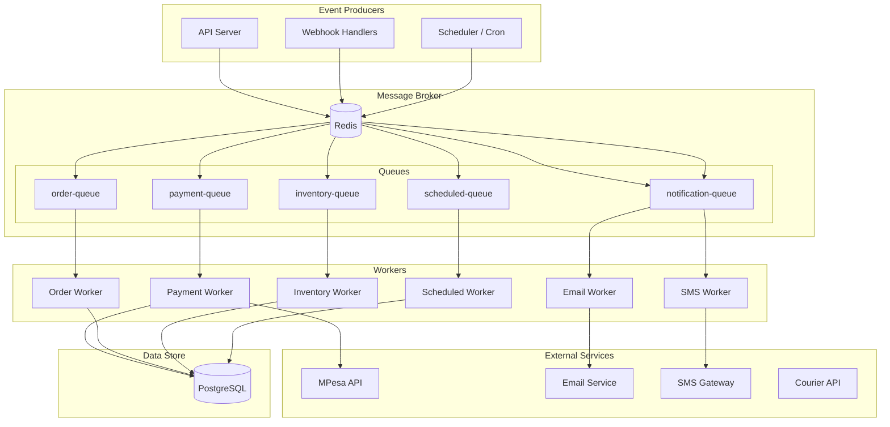

---

## 2. Queue Definitions

### 2.1 Queue Inventory

| Queue Name           | Purpose                                   | Priority    | Concurrency |
| -------------------- | ----------------------------------------- | ----------- | ----------- |
| `payment-queue`      | Payment verification, refund processing   | 🔴 Critical | 5           |
| `order-queue`        | Order state transitions, timeout handling | 🔴 Critical | 5           |
| `notification-queue` | Emails, SMS notifications                 | 🟡 Medium   | 10          |
| `inventory-queue`    | Reservation release, stock alerts         | 🟠 High     | 5           |
| `scheduled-queue`    | Scheduled jobs (cleanup, reports)         | 🟢 Low      | 2           |

### 2.2 Queue Configuration

| Queue                | Max Retries | Retry Delay                | Backoff     | TTL |
| -------------------- | ----------- | -------------------------- | ----------- | --- |
| `payment-queue`      | 5           | 30s, 60s, 120s, 300s, 600s | Exponential | 24h |
| `order-queue`        | 3           | 10s, 30s, 60s              | Exponential | 24h |
| `notification-queue` | 3           | 5s, 15s, 60s               | Exponential | 4h  |
| `inventory-queue`    | 3           | 5s, 15s, 60s               | Exponential | 1h  |
| `scheduled-queue`    | 1           | —                          | None        | 1h  |

---

## 3. Payment Async Flows

### 3.1 Payment Verification Flow

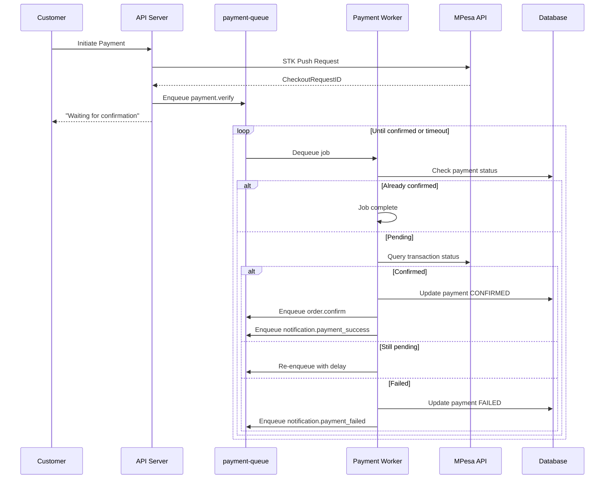

**Job Definition: `payment.verify`**

| Attribute   | Value                                                     |
| ----------- | --------------------------------------------------------- |
| **Trigger** | Payment initiated, MPesa callback received                |
| **Actor**   | System (Payment Worker)                                   |
| **Input**   | `{ orderId, paymentId, checkoutRequestId }`               |
| **Output**  | Payment status updated in DB                              |
| **Retry**   | 5 times, exponential backoff                              |
| **Failure** | Mark payment FAILED, notify customer, release reservation |

---

### 3.2 Refund Processing Flow

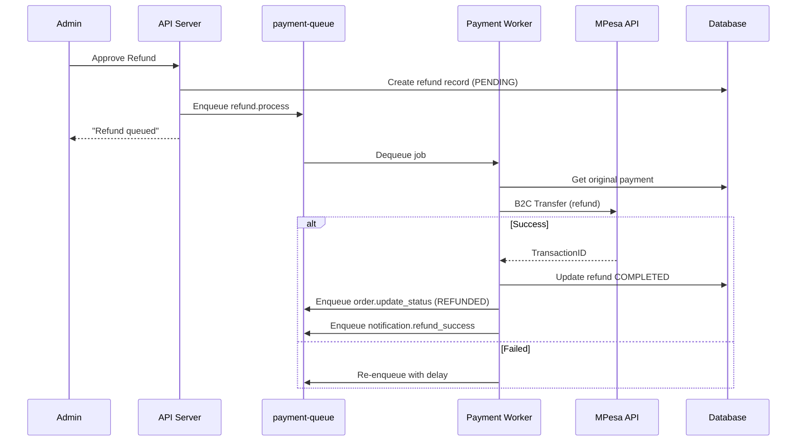

**Job Definition: `refund.process`**

| Attribute             | Value                                            |
| --------------------- | ------------------------------------------------ |
| **Trigger**           | Manager approval of refund request               |
| **Actor**             | System (Payment Worker)                          |
| **Approval Required** | ⚠️ Manager must approve before job is enqueued   |
| **Input**             | `{ refundId, orderId, amount, phone }`           |
| **Output**            | Refund processed via MPesa B2C                   |
| **Retry**             | 5 times, exponential backoff                     |
| **Failure**           | Alert Finance team, manual intervention required |

---

## 4. Order Async Flows

### 4.1 Order Confirmation Flow

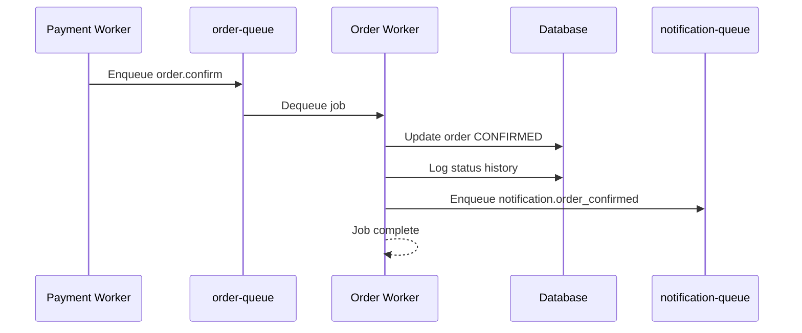

**Job Definition: `order.confirm`**

| Attribute        | Value                     |
| ---------------- | ------------------------- |
| **Trigger**      | Payment confirmed         |
| **Actor**        | System (Order Worker)     |
| **Input**        | `{ orderId }`             |
| **Output**       | Order status → CONFIRMED  |
| **Side Effects** | Email notification queued |

---

### 4.2 Order Timeout Flow

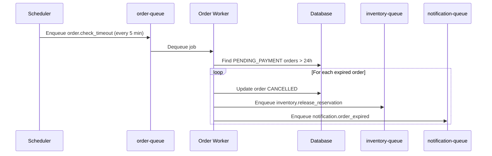

**Job Definition: `order.check_timeout`**

| Attribute        | Value                                     |
| ---------------- | ----------------------------------------- |
| **Trigger**      | Scheduler (every 5 minutes)               |
| **Actor**        | System (Scheduled Worker)                 |
| **Input**        | None                                      |
| **Output**       | Expired orders cancelled                  |
| **Side Effects** | Reservations released, customers notified |

---

### 4.3 Order State Change Flow

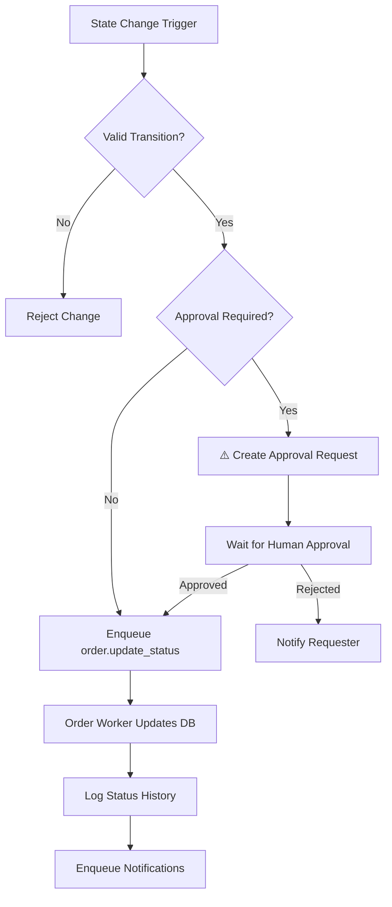

**Approval Required Transitions:**

| From State       | To State        | Approver      | Reason                   |
| ---------------- | --------------- | ------------- | ------------------------ |
| PROCESSING       | CANCELLED       | Manager       | Stock issue, operational |
| RETURN_REQUESTED | RETURN_APPROVED | Manager       | Return validation        |
| REFUND_PENDING   | REFUNDED        | Finance Admin | Money movement           |

---

## 5. Delivery Async Flows

### 5.1 Delivery Status Update Flow

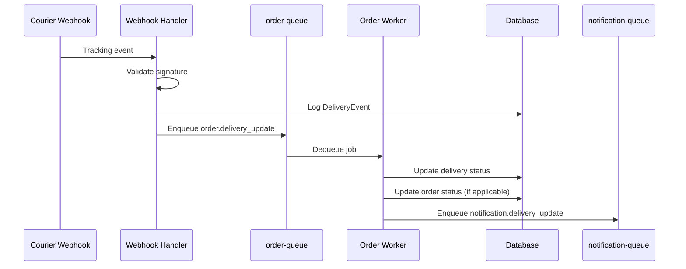

**Job Definition: `order.delivery_update`**

| Attribute        | Value                                            |
| ---------------- | ------------------------------------------------ |
| **Trigger**      | Courier webhook event                            |
| **Actor**        | System (Order Worker)                            |
| **Input**        | `{ deliveryId, eventType, timestamp, location }` |
| **Output**       | Delivery and order status updated                |
| **Side Effects** | SMS/Email notification queued                    |

---

### 5.2 Delivery Notification Flow

```mermaid
flowchart LR
    subgraph "Delivery Events"
        A[DISPATCHED]
        B[OUT_FOR_DELIVERY]
        C[DELIVERED]
        D[DELIVERY_FAILED]
    end

    subgraph "Notifications"
        E[SMS: "Your order is on the way"]
        F[SMS: "Arriving today"]
        G[SMS + Email: "Delivered"]
        H[SMS: "Delivery failed, retry scheduled"]
    end

    A --> E
    B --> F
    C --> G
    D --> H
```

---

## 6. Notification Async Flows

### 6.1 Email Notification Flow

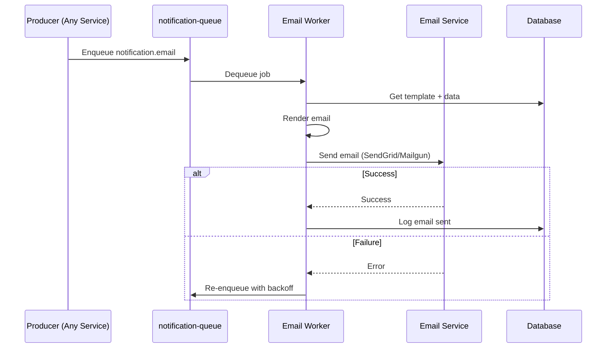

**Job Definition: `notification.email`**

| Attribute   | Value                                     |
| ----------- | ----------------------------------------- |
| **Trigger** | Various events (order, payment, delivery) |
| **Actor**   | System (Email Worker)                     |
| **Input**   | `{ template, recipientEmail, data }`      |
| **Output**  | Email sent                                |
| **Retry**   | 3 times                                   |
| **Failure** | Log error, alert ops (don't block flow)   |

---

### 6.2 SMS Notification Flow

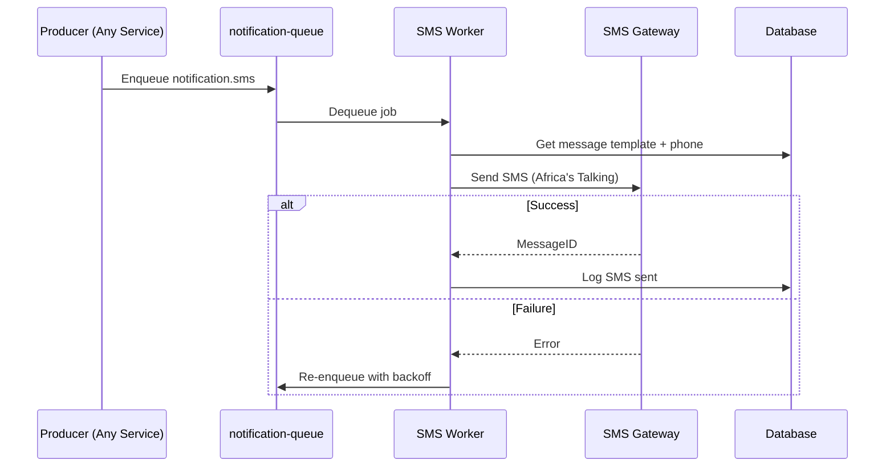

**Notification Events:**

| Event              | Template                                | Channel     |
| ------------------ | --------------------------------------- | ----------- |
| `order.confirmed`  | "Order #{{orderNumber}} confirmed"      | Email + SMS |
| `order.dispatched` | "Order shipped, tracking: {{tracking}}" | Email + SMS |
| `order.delivered`  | "Order delivered!"                      | Email + SMS |
| `payment.failed`   | "Payment failed, retry here"            | Email       |
| `refund.processed` | "Refund of KES {{amount}} processed"    | Email + SMS |
| `delivery.failed`  | "Delivery attempt failed"               | SMS         |

---

## 7. Inventory Async Flows

### 7.1 Reservation Release Flow

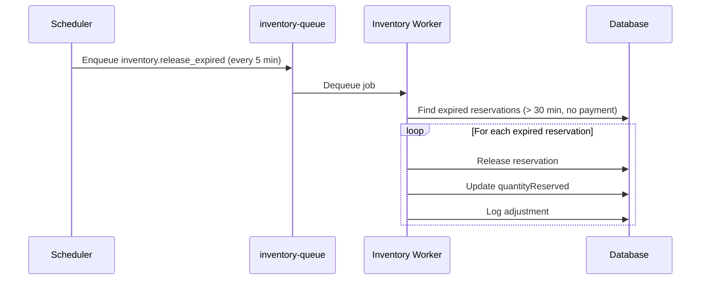

**Job Definition: `inventory.release_expired`**

| Attribute   | Value                         |
| ----------- | ----------------------------- |
| **Trigger** | Scheduler (every 5 minutes)   |
| **Actor**   | System (Inventory Worker)     |
| **Input**   | None                          |
| **Output**  | Expired reservations released |

---

### 7.2 Low Stock Alert Flow

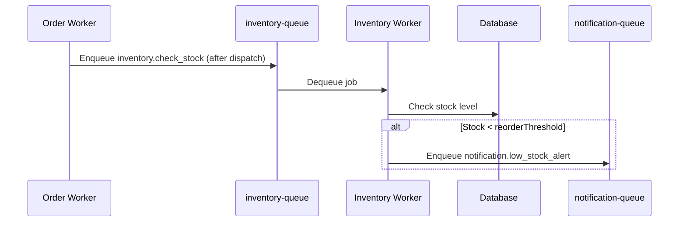

---

## 8. Scheduled Jobs

### 8.1 Job Schedule

| Job                         | Schedule       | Queue           | Description                    |
| --------------------------- | -------------- | --------------- | ------------------------------ |
| `order.check_timeout`       | Every 5 min    | scheduled-queue | Cancel expired pending orders  |
| `inventory.release_expired` | Every 5 min    | inventory-queue | Release expired reservations   |
| `cart.cleanup`              | Daily 3:00 AM  | scheduled-queue | Delete carts inactive > 7 days |
| `session.cleanup`           | Every 1 hour   | scheduled-queue | Expire old sessions            |
| `report.daily_sales`        | Daily 6:00 AM  | scheduled-queue | Generate daily sales report    |
| `report.weekly_inventory`   | Sunday 7:00 AM | scheduled-queue | Generate inventory report      |

### 8.2 Scheduler Flow

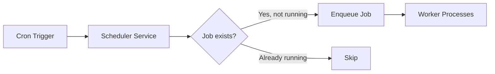

---

## 9. Retry & Failure Handling

### 9.1 Retry Strategy

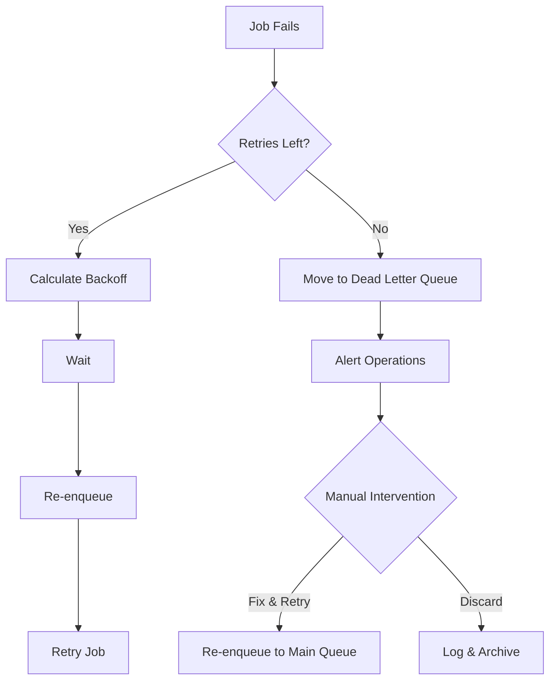

### 9.2 Backoff Calculation

| Attempt | Delay (Exponential)  |
| ------- | -------------------- |
| 1       | 30 seconds           |
| 2       | 60 seconds           |
| 3       | 120 seconds (2 min)  |
| 4       | 300 seconds (5 min)  |
| 5       | 600 seconds (10 min) |

### 9.3 Dead Letter Queue Handling

| Queue                | DLQ Action                      | Alert            |
| -------------------- | ------------------------------- | ---------------- |
| `payment-queue`      | Immediate escalation to Finance | 🔴 PagerDuty     |
| `order-queue`        | Escalation to Operations        | 🟠 Slack + Email |
| `notification-queue` | Log only, no block              | 🟢 Log           |
| `inventory-queue`    | Alert Warehouse                 | 🟡 Slack         |

---

## 10. Human Approval Points

### 10.1 Approval-Gated Async Jobs

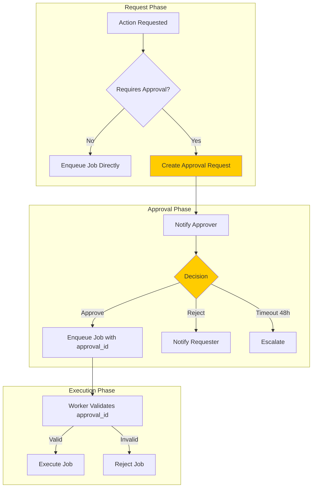

### 10.2 Approval Matrix

| Job                             | Requires Approval   | Approver          | Timeout |
| ------------------------------- | ------------------- | ----------------- | ------- |
| `refund.process`                | ⚠️ Yes              | Manager + Finance | 48h     |
| `order.cancel_after_processing` | ⚠️ Yes              | Manager           | 24h     |
| `order.force_transition`        | ⚠️ Yes              | Super Admin       | 4h      |
| `inventory.large_adjustment`    | ⚠️ Yes (>100 units) | Manager           | 24h     |
| `promotion.high_discount`       | ⚠️ Yes (>50%)       | CEO               | 48h     |

---

## 11. Event Catalog

### 11.1 Event Definitions

| Event Name            | Producer         | Consumers               | Payload                           |
| --------------------- | ---------------- | ----------------------- | --------------------------------- |
| `payment.initiated`   | Payment Service  | — (logged)              | `{ orderId, amount, method }`     |
| `payment.confirmed`   | Payment Worker   | Order, Notification     | `{ orderId, paymentId, receipt }` |
| `payment.failed`      | Payment Worker   | Order, Notification     | `{ orderId, reason }`             |
| `order.created`       | Order Service    | — (logged)              | `{ orderId, customerId }`         |
| `order.confirmed`     | Order Worker     | Notification, Inventory | `{ orderId }`                     |
| `order.dispatched`    | Order Service    | Notification, Inventory | `{ orderId, trackingNumber }`     |
| `order.delivered`     | Order Worker     | Notification            | `{ orderId }`                     |
| `order.cancelled`     | Order Worker     | Inventory, Notification | `{ orderId, reason }`             |
| `refund.requested`    | Order Service    | — (approval workflow)   | `{ refundId, orderId, amount }`   |
| `refund.processed`    | Payment Worker   | Order, Notification     | `{ refundId, transactionId }`     |
| `delivery.updated`    | Webhook Handler  | Order, Notification     | `{ deliveryId, status }`          |
| `inventory.low_stock` | Inventory Worker | Notification            | `{ productId, quantity }`         |

---

## 12. Monitoring & Observability

### 12.1 Queue Metrics

| Metric                | Alert Threshold | Action           |
| --------------------- | --------------- | ---------------- |
| Queue depth           | > 1000 jobs     | Scale workers    |
| Job age (oldest)      | > 5 minutes     | Investigate      |
| Failed jobs (hourly)  | > 10            | Alert ops        |
| DLQ depth             | > 0             | Immediate review |
| Processing time (p95) | > 30s           | Optimize         |

### 12.2 Async Dashboards

| Dashboard     | Metrics Shown                        |
| ------------- | ------------------------------------ |
| Queue Health  | Depth, throughput, latency per queue |
| Worker Status | Active workers, processing rate      |
| Failed Jobs   | Failure rate, failure reasons        |
| DLQ Monitor   | Jobs awaiting manual intervention    |

---

## Artefact Cross-References

| Async Flow Aspect   | Source Artefact                                                                                                                                    |
| ------------------- | -------------------------------------------------------------------------------------------------------------------------------------------------- |
| Order States        | [order-lifecycle-state-machine.md](file:///c:/Users/STEPH/Documents/Portfolio/Projects/modern-ecom/docs/planning/order-lifecycle-state-machine.md) |
| Payment Rules       | [business-model-revenue-flows.md](file:///c:/Users/STEPH/Documents/Portfolio/Projects/modern-ecom/docs/planning/business-model-revenue-flows.md)   |
| Approval Gates      | [agent-scope-authority.md](file:///c:/Users/STEPH/Documents/Portfolio/Projects/modern-ecom/docs/planning/agent-scope-authority.md)                 |
| Risk Points         | [risk-register-compliance.md](file:///c:/Users/STEPH/Documents/Portfolio/Projects/modern-ecom/docs/planning/risk-register-compliance.md)           |
| System Architecture | [system-architecture.md](file:///c:/Users/STEPH/Documents/Portfolio/Projects/modern-ecom/docs/architecture/system-architecture.md)                 |

---

## Document Approval

| Role                | Name | Status  | Date |
| ------------------- | ---- | ------- | ---- |
| Technical Architect | —    | Pending | —    |
| Tech Lead           | —    | Pending | —    |
| Operations Lead     | —    | Pending | —    |

---

_This document defines all asynchronous flows. All workers must implement proper retry, failure handling, and observability. Approval-gated jobs must validate approval before execution._
