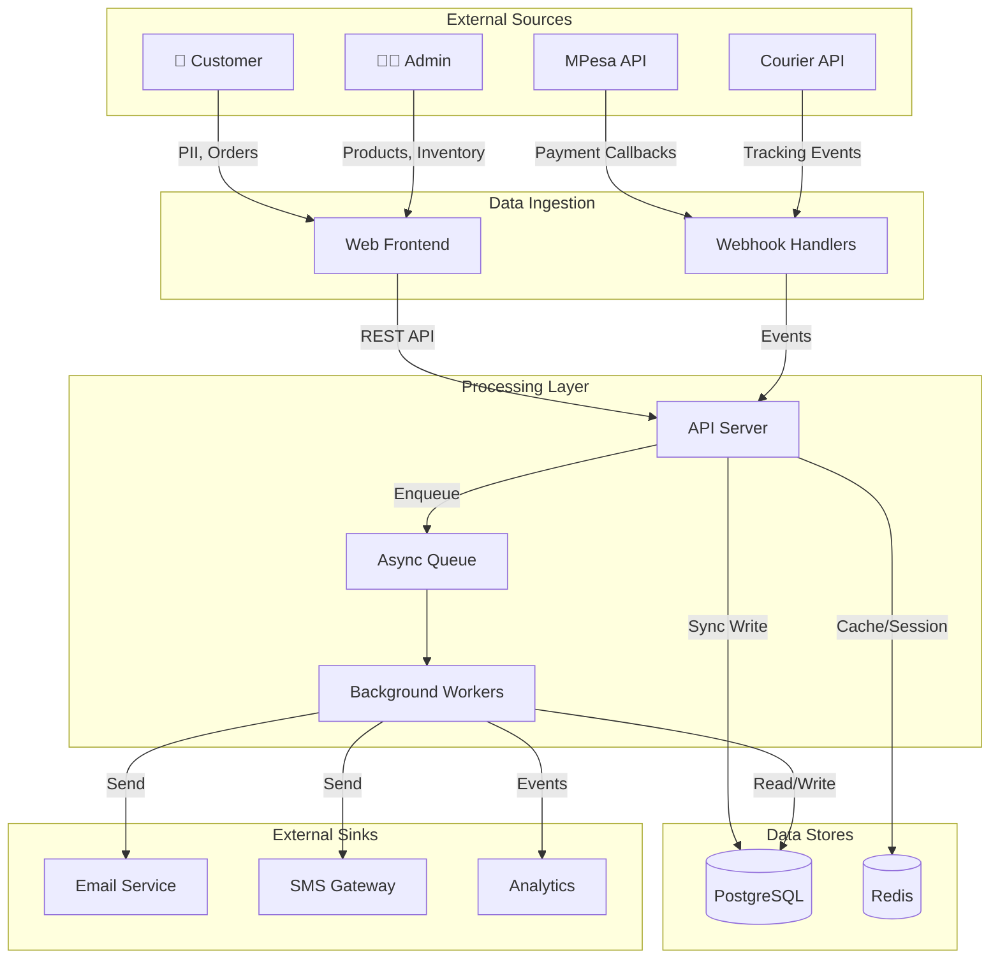
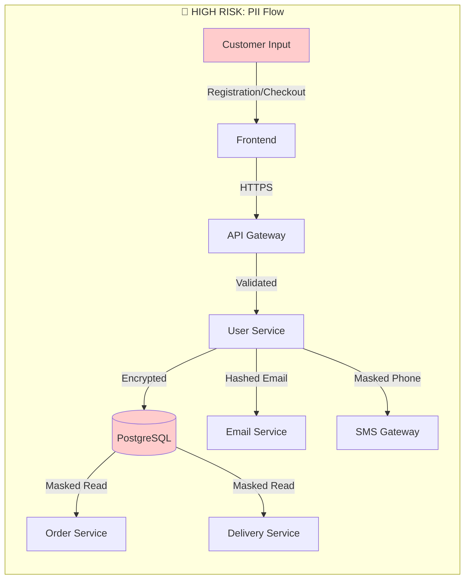
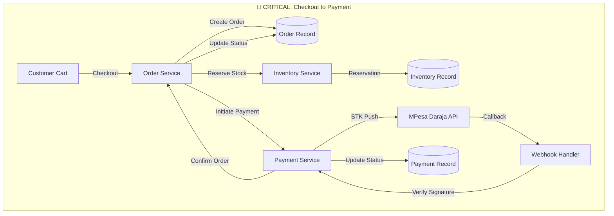
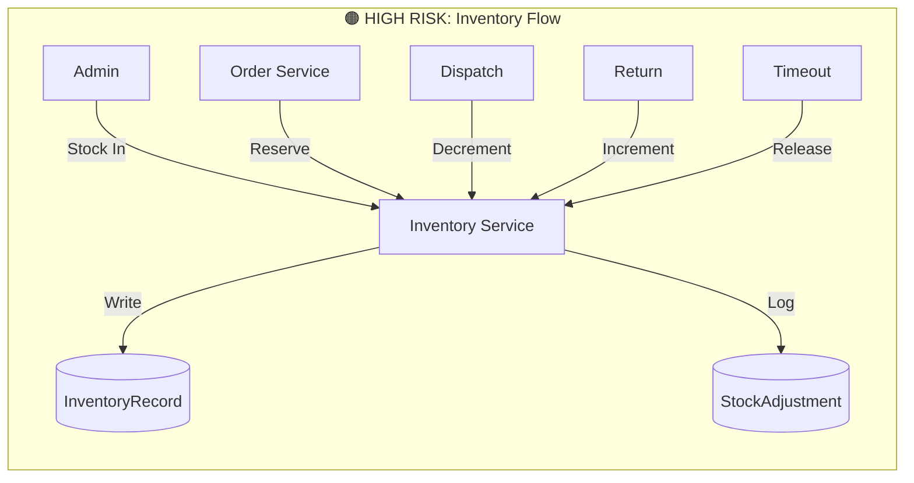
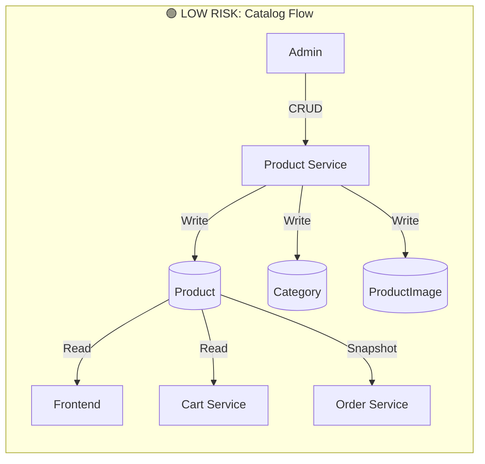
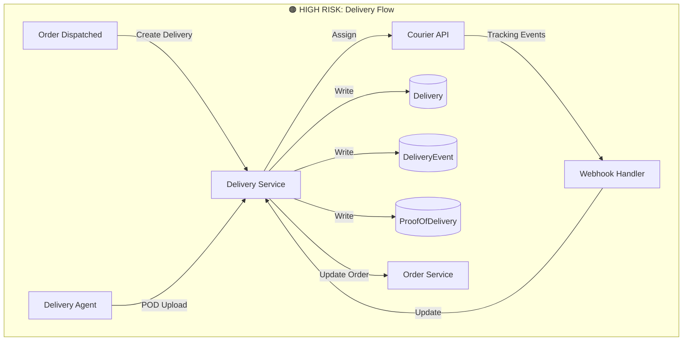
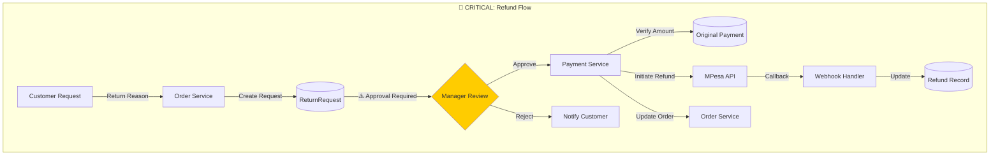
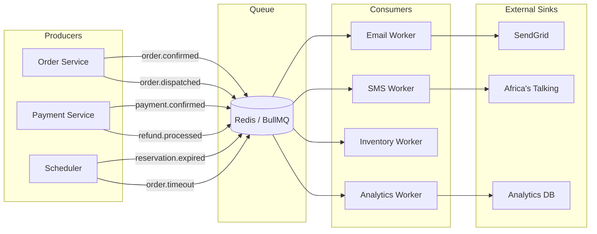
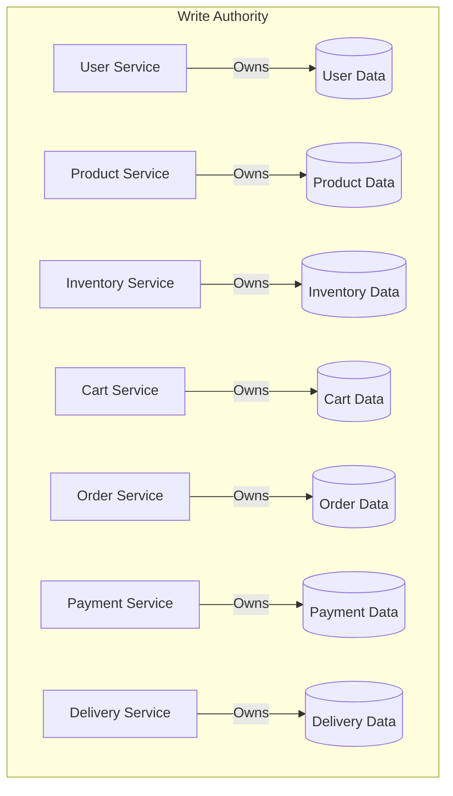

# Data Flow Diagram

**Document Status:** Draft — Pending Human Sign-off  
**Last Updated:** 2026-01-18  
**Version:** 1.0

---

## Overview

This document defines how data flows through the TrustCart Kenya e-commerce platform. It establishes data sources, sinks, transformations, ownership boundaries, and privacy control points.

> [!NOTE]
> This is a conceptual data flow document. Implementation details are intentionally excluded.

---

## 1. Data Flow Overview

### 1.1 High-Level Data Flow

---

## 2. Data Categories & Flows

### 2.1 Customer PII Flow

**PII Data Elements:**

| Data Element     | Source                | Owner         | Storage                             | Access Rules                    |
| ---------------- | --------------------- | ------------- | ----------------------------------- | ------------------------------- |
| Email            | Customer registration | User Service  | PostgreSQL (encrypted)              | Customer, Staff (masked), Admin |
| Phone            | Customer registration | User Service  | PostgreSQL (encrypted)              | Customer, Staff (masked), Admin |
| Full Name        | Customer registration | User Service  | PostgreSQL                          | Customer, Staff, Admin          |
| Password         | Customer registration | User Service  | PostgreSQL (hashed, never readable) | None (verification only)        |
| Delivery Address | Checkout              | Order Service | PostgreSQL                          | Customer, Staff, Delivery       |

**Privacy Control Points:**

| Point   | Control                    | Enforcement        |
| ------- | -------------------------- | ------------------ |
| Input   | Validation, sanitization   | Frontend + Backend |
| Transit | TLS 1.3 encryption         | Infrastructure     |
| Storage | AES-256 encryption at rest | Database           |
| Access  | RBAC, audit logging        | Application        |
| Output  | Masking for non-owners     | Application        |
| Logs    | PII scrubbing              | Logging middleware |

---

### 2.2 Order & Payment Data Flow

**Order Data Flow:**

| Stage              | Data Created       | Owner             | Flow Direction          |
| ------------------ | ------------------ | ----------------- | ----------------------- |
| Cart Checkout      | Order, OrderItems  | Order Service     | Frontend → API → DB     |
| Stock Reservation  | Reservation        | Inventory Service | Order → Inventory       |
| Payment Initiation | PaymentTransaction | Payment Service   | Order → Payment → MPesa |
| Payment Callback   | MpesaTransaction   | Payment Service   | MPesa → Webhook → DB    |
| Order Confirmation | StatusHistory      | Order Service     | Payment → Order → DB    |

**High-Risk Data Points:**

| Data Point     | Risk              | Control                      |
| -------------- | ----------------- | ---------------------------- |
| Payment Amount | Manipulation      | Server-side calculation only |
| MPesa Receipt  | Fake confirmation | Verify callback signature    |
| Order Total    | Price tampering   | Recalculate from DB prices   |
| Phone for STK  | Wrong recipient   | Validate against registered  |

---

### 2.3 Inventory Data Flow

**Inventory Data Transformations:**

| Trigger         | Source      | Transformation                  | Destination     |
| --------------- | ----------- | ------------------------------- | --------------- |
| Stock Receipt   | Admin Input | +quantity to quantityOnHand     | InventoryRecord |
| Checkout        | Order       | +quantity to quantityReserved   | Reservation     |
| Payment Timeout | Scheduler   | -quantity from quantityReserved | InventoryRecord |
| Dispatch        | Warehouse   | -quantity from quantityOnHand   | InventoryRecord |
| Return Received | Warehouse   | +quantity to quantityOnHand     | InventoryRecord |

**Invariant Enforcement:**

| Invariant                     | Enforcement Point   |
| ----------------------------- | ------------------- |
| Stock ≥ 0                     | Database constraint |
| Available = OnHand - Reserved | Computed field      |
| All adjustments logged        | Trigger on write    |

---

### 2.4 Product & Catalog Data Flow

**Product Data Flow:**

| Operation         | Source        | Flow                        | Destination              |
| ----------------- | ------------- | --------------------------- | ------------------------ |
| Create Product    | Admin         | API → Service → DB          | PostgreSQL               |
| Update Price      | Admin         | API → Service → DB          | PostgreSQL (+ audit log) |
| Activate Product  | Admin         | API → Service → DB          | PostgreSQL               |
| Read Catalog      | Customer      | DB → Cache → API → Frontend | Browser                  |
| Snapshot at Order | Order Service | Product → OrderItem         | PostgreSQL               |

---

### 2.5 Delivery Data Flow

**Delivery Data Flow:**

| Event              | Source          | Data                     | Destination     |
| ------------------ | --------------- | ------------------------ | --------------- |
| Dispatch           | Warehouse       | Order ID, Address        | Courier API     |
| Tracking Update    | Courier Webhook | Status, Location, Time   | DeliveryEvent   |
| POD Capture        | Delivery Agent  | Photo, Signature, Name   | ProofOfDelivery |
| Delivery Confirmed | Courier/Agent   | Timestamp, POD reference | Delivery, Order |

---

### 2.6 Refund Data Flow

**Refund Data Controls:**

| Control Point        | Check                      | Action on Failure    |
| -------------------- | -------------------------- | -------------------- |
| Request Validation   | Return window (14 days)    | Reject               |
| Amount Validation    | Refund ≤ Original payment  | Reject               |
| Approval Gate        | Manager approval           | Block until approved |
| Payment Verification | Original payment CONFIRMED | Reject               |
| MPesa Verification   | Callback received          | Retry or escalate    |

---

## 3. Async Data Flows

### 3.1 Queue-Based Flows

**Async Job Data:**

| Job Type                 | Trigger                | Data Payload             | Sink          |
| ------------------------ | ---------------------- | ------------------------ | ------------- |
| `email.order_confirmed`  | Order CONFIRMED        | Order ID, Customer email | Email Service |
| `email.order_dispatched` | Order DISPATCHED       | Order ID, Tracking       | Email Service |
| `sms.delivery_update`    | Delivery status change | Phone, Status            | SMS Gateway   |
| `inventory.release`      | Payment timeout        | Reservation ID           | Inventory DB  |
| `analytics.order_event`  | Any order event        | Order ID, Event type     | Analytics     |

---

### 3.2 Scheduled Jobs

| Job                   | Schedule    | Data Read            | Data Written             |
| --------------------- | ----------- | -------------------- | ------------------------ |
| `order.timeout_check` | Every 5 min | Pending orders > 24h | Order status → CANCELLED |
| `reservation.cleanup` | Every 5 min | Expired reservations | Release reservations     |
| `cart.cleanup`        | Daily 3 AM  | Carts > 7 days       | Delete carts             |
| `report.daily_sales`  | Daily 6 AM  | Orders, Payments     | Analytics aggregates     |

---

## 4. Data Ownership Boundaries

### 4.1 Write Boundaries

### 4.2 Cross-Boundary Access

| Requester        | Target Data | Access Type | Allowed Operations      |
| ---------------- | ----------- | ----------- | ----------------------- |
| Cart Service     | Product     | Read        | Get price, availability |
| Cart Service     | Inventory   | Read        | Check stock             |
| Order Service    | Product     | Snapshot    | Copy to OrderItem       |
| Order Service    | Inventory   | Write       | Reserve/Release         |
| Order Service    | Payment     | Read        | Get payment status      |
| Payment Service  | Order       | Write       | Update order status     |
| Delivery Service | Order       | Write       | Update order status     |

### 4.3 Forbidden Cross-Boundary Operations

| Requester     | Target        | Operation     | Reason                  |
| ------------- | ------------- | ------------- | ----------------------- |
| Order Service | Payment       | Create Refund | Must go through Payment |
| Frontend      | Inventory     | Write         | Admin only              |
| Cart Service  | Order         | Write         | Order creates order     |
| Any Service   | User Password | Read          | Never readable          |

---

## 5. Data Classification in Flow

### 5.1 Sensitivity Markers

| Classification        | Label | Data Types                        | Flow Restrictions                  |
| --------------------- | ----- | --------------------------------- | ---------------------------------- |
| **L0 - Public**       | 🟢    | Product names, prices, categories | No restrictions                    |
| **L1 - Internal**     | 🔵    | Inventory counts, order counts    | Internal only                      |
| **L2 - Confidential** | 🟡    | Order details, delivery addresses | Role-based access                  |
| **L3 - Restricted**   | 🔴    | PII, payment data, credentials    | Encrypted, audited, minimal access |

### 5.2 Flow Classification

| Flow               | Classification | Controls                             |
| ------------------ | -------------- | ------------------------------------ |
| Product Catalog    | 🟢 L0          | Cache-friendly, public               |
| Inventory Levels   | 🔵 L1          | Internal read, admin write           |
| Order Processing   | 🟡 L2          | RBAC, audit log                      |
| Payment Processing | 🔴 L3          | Encrypted, approval gates            |
| Customer PII       | 🔴 L3          | Encryption, masking, deletion rights |

---

## 6. External Data Flows

### 6.1 Outbound Data

| Destination   | Data Sent               | Classification | Purpose               |
| ------------- | ----------------------- | -------------- | --------------------- |
| MPesa         | Phone, Amount           | L3             | Payment initiation    |
| Courier       | Name, Phone, Address    | L2             | Delivery assignment   |
| Email Service | Email, Order details    | L2             | Notifications         |
| SMS Service   | Phone (partial), Status | L2             | Notifications         |
| Analytics     | Anonymized events       | L1             | Business intelligence |

### 6.2 Inbound Data

| Source          | Data Received           | Validation               | Storage            |
| --------------- | ----------------------- | ------------------------ | ------------------ |
| MPesa Callback  | Receipt, Status, Amount | Signature verification   | PaymentTransaction |
| Courier Webhook | Tracking events         | IP whitelist, signature  | DeliveryEvent      |
| Customer Input  | Form data               | Sanitization, validation | Various tables     |

---

## 7. Data Retention in Flow

### 7.1 Retention by Stage

| Data Stage                  | Retention          | After Retention         |
| --------------------------- | ------------------ | ----------------------- |
| Cart (abandoned)            | 30 days            | Deleted                 |
| Order (active)              | Indefinite         | —                       |
| Order (completed > 2 years) | 7 years from order | Archive to cold storage |
| Payment records             | 7 years            | Archive                 |
| Audit logs                  | 7 years            | Archive                 |
| Session data                | 24 hours           | Auto-expire             |
| Email logs                  | 90 days            | Delete                  |

---

## 8. Diagram Legend

| Symbol | Meaning                    |
| ------ | -------------------------- |
| 🔴     | Critical / High Risk       |
| 🟠     | High Risk                  |
| 🟡     | Medium Risk / Confidential |
| 🟢     | Low Risk / Public          |
| 🔵     | Internal Only              |
| ⚠️     | Approval Required          |
| →/→    | Synchronous flow           |
| ⟿      | Asynchronous flow          |

---

## Artefact Cross-References

| Data Flow Aspect    | Source Artefact                                                                                                                                    |
| ------------------- | -------------------------------------------------------------------------------------------------------------------------------------------------- |
| Data Classification | [data-ownership-privacy.md](file:///c:/Users/STEPH/Documents/Portfolio/Projects/modern-ecom/docs/planning/data-ownership-privacy.md)               |
| Domain Ownership    | [domain-model.md](file:///c:/Users/STEPH/Documents/Portfolio/Projects/modern-ecom/docs/planning/domain-model.md)                                   |
| Order States        | [order-lifecycle-state-machine.md](file:///c:/Users/STEPH/Documents/Portfolio/Projects/modern-ecom/docs/planning/order-lifecycle-state-machine.md) |
| Payment Rules       | [business-model-revenue-flows.md](file:///c:/Users/STEPH/Documents/Portfolio/Projects/modern-ecom/docs/planning/business-model-revenue-flows.md)   |
| Risk Points         | [risk-register-compliance.md](file:///c:/Users/STEPH/Documents/Portfolio/Projects/modern-ecom/docs/planning/risk-register-compliance.md)           |

---

## Document Approval

| Role                    | Name | Status  | Date |
| ----------------------- | ---- | ------- | ---- |
| Technical Architect     | —    | Pending | —    |
| Data Protection Officer | —    | Pending | —    |
| Tech Lead               | —    | Pending | —    |

---

_This document defines how data flows through the system. All implementations must respect ownership boundaries and privacy controls. Deviations require explicit approval._
