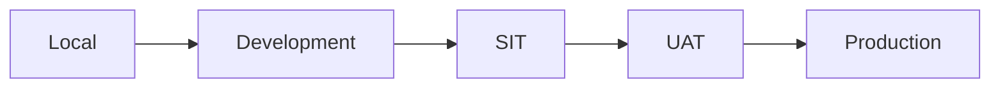
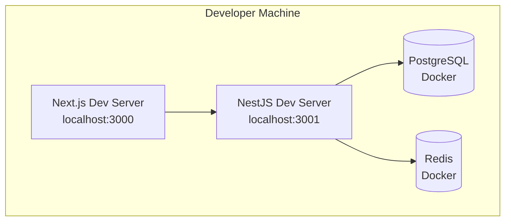
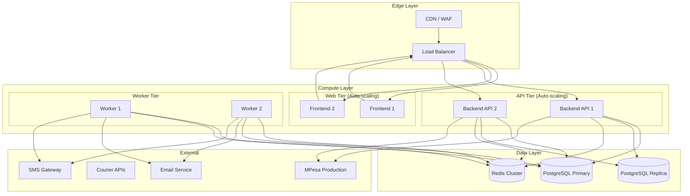
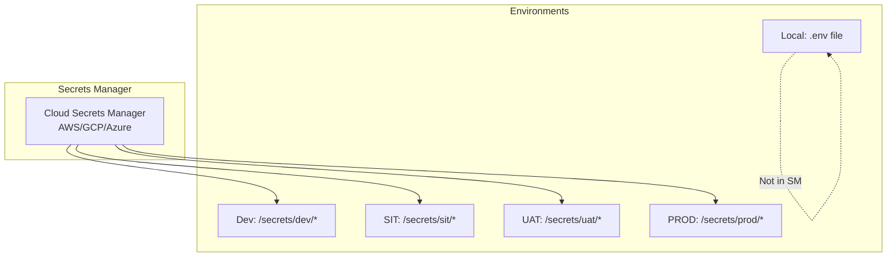
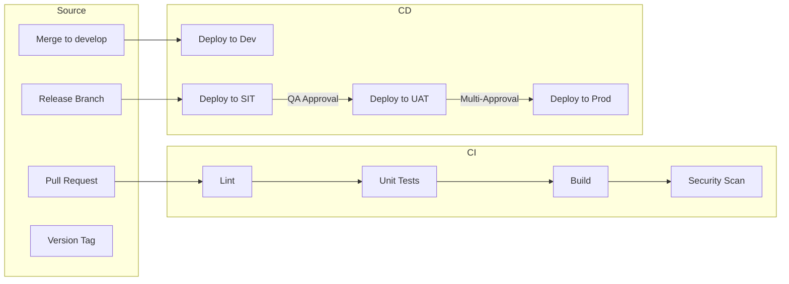
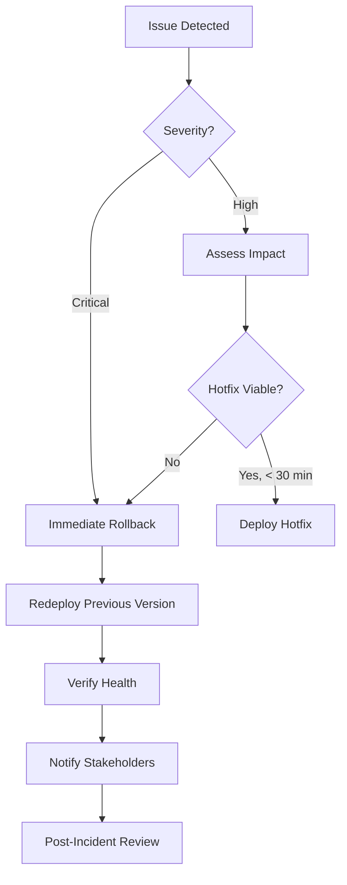
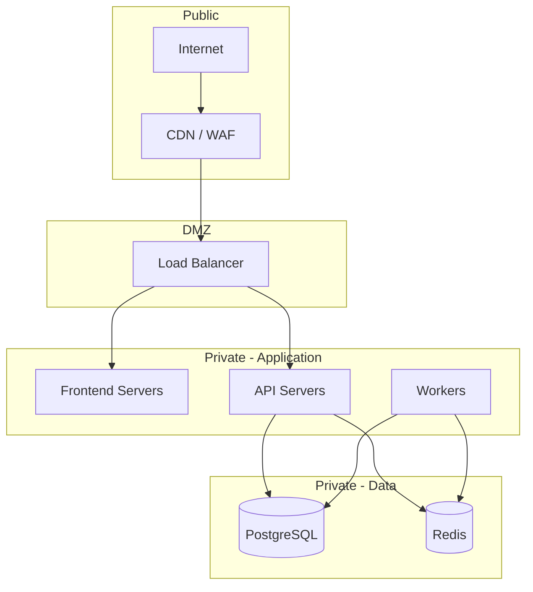

# Infrastructure Plan

**Document Status:** Draft — Pending Human Sign-off  
**Last Updated:** 2026-01-18  
**Version:** 1.0

---

## Overview

This document defines the infrastructure plan for the TrustCart Kenya e-commerce platform. It establishes environment configurations, service mappings, secrets management, deployment flows, and operational controls.

> [!NOTE]
> This is a conceptual infrastructure plan. Specific cloud provider configurations are intentionally excluded.

---

## 1. Environment Overview

### 1.1 Environment Summary

| Environment | Purpose | Stability | Data | Access |
|-------------|---------|-----------|------|--------|
| **Local** | Developer workstation | Unstable | Mock/Synthetic | Developer |
| **Dev** | Feature integration | Unstable | Synthetic | Dev team |
| **SIT** | System integration testing | Semi-stable | Synthetic | QA + Dev |
| **UAT** | Business acceptance | Stable | Masked | Stakeholders |
| **Prod** | Live customers | Stable | Real | Ops only |

---

## 2. Environment Service Map

### 2.1 Local Environment

| Component | Configuration |
|-----------|---------------|
| **Frontend** | `pnpm dev` on localhost:3000 |
| **Backend** | `pnpm dev` on localhost:3001 |
| **Database** | PostgreSQL 15 in Docker |
| **Redis** | Redis 7 in Docker |
| **Workers** | Runs in-process with backend |
| **External APIs** | Mocked / Stubbed |
| **Secrets** | `.env` file (git-ignored) |

---

### 2.2 Development Environment

| Component | Count | Specification | Purpose |
|-----------|-------|---------------|---------|
| **Frontend** | 1 | Next.js container | Feature integration |
| **Backend API** | 1 | NestJS container | API testing |
| **Worker** | 1 | Node.js container | Async jobs |
| **PostgreSQL** | 1 | Managed DB (small) | Shared dev data |
| **Redis** | 1 | Managed Redis (small) | Cache, queues |

**External Services:**
- MPesa: Sandbox environment
- Courier: Test endpoints
- Email: Test mailbox (Mailhog/Mailtrap)
- SMS: Disabled or test endpoint

---

### 2.3 SIT Environment

| Component | Count | Specification | Purpose |
|-----------|-------|---------------|---------|
| **Frontend** | 1 | Next.js container | Integration tests |
| **Backend API** | 1 | NestJS container | API integration |
| **Worker** | 1 | Node.js container | Async testing |
| **PostgreSQL** | 1 | Managed DB (small) | Test data |
| **Redis** | 1 | Managed Redis (small) | Cache, queues |

**External Services:**
- MPesa: Sandbox with realistic delays
- Courier: Test endpoints with callbacks
- Email: Test mailbox
- SMS: Test endpoint

---

### 2.4 UAT Environment

| Component | Count | Specification | Purpose |
|-----------|-------|---------------|---------|
| **Frontend** | 1 | Next.js container | Business validation |
| **Backend API** | 1 | NestJS container | Full feature testing |
| **Worker** | 1 | Node.js container | Async processing |
| **PostgreSQL** | 1 | Managed DB (medium) | Masked prod data |
| **Redis** | 1 | Managed Redis (small) | Cache, queues |

**External Services:**
- MPesa: Sandbox (production-like)
- Courier: Test endpoints
- Email: Real service (internal addresses only)
- SMS: Test endpoint

---

### 2.5 Production Environment

| Component | Count | Specification | Purpose |
|-----------|-------|---------------|---------|
| **Frontend** | 2+ (auto-scale) | Next.js containers | Serve customers |
| **Backend API** | 2+ (auto-scale) | NestJS containers | API requests |
| **Workers** | 2+ | Node.js containers | Async processing |
| **PostgreSQL** | 1 Primary + 1 Replica | Managed DB (production) | Persistent data |
| **Redis** | 3-node cluster | Managed Redis (HA) | Cache, queues, sessions |
| **CDN/WAF** | 1 | Cloud CDN + WAF | Edge security |
| **Load Balancer** | 1 | Application LB | Traffic distribution |

---

## 3. Service Specifications

### 3.1 Compute Resources by Environment

| Environment | Frontend | Backend | Workers | Notes |
|-------------|----------|---------|---------|-------|
| **Local** | Dev server | Dev server | In-process | — |
| **Dev** | 0.5 vCPU, 512MB | 0.5 vCPU, 512MB | 0.25 vCPU, 256MB | Shared |
| **SIT** | 0.5 vCPU, 512MB | 1 vCPU, 1GB | 0.5 vCPU, 512MB | — |
| **UAT** | 1 vCPU, 1GB | 2 vCPU, 2GB | 1 vCPU, 1GB | Prod-like |
| **Prod** | 2 vCPU, 2GB | 4 vCPU, 4GB | 2 vCPU, 2GB | Auto-scale |

### 3.2 Database Resources

| Environment | PostgreSQL | Redis | Backup |
|-------------|------------|-------|--------|
| **Local** | Docker | Docker | None |
| **Dev** | 1 vCPU, 1GB, 10GB | 256MB | None |
| **SIT** | 1 vCPU, 2GB, 20GB | 512MB | Daily |
| **UAT** | 2 vCPU, 4GB, 50GB | 1GB | Daily |
| **Prod** | 4 vCPU, 16GB, 200GB | 2GB (cluster) | Hourly + PITR |

---

## 4. Secrets Management

### 4.1 Secret Categories

| Category | Examples | Classification |
|----------|----------|----------------|
| **Database** | Connection strings, passwords | 🔴 Critical |
| **API Keys (Internal)** | JWT secrets, service tokens | 🟠 High |
| **API Keys (External)** | MPesa, email, SMS | 🔴 Critical |
| **Payment Credentials** | MPesa consumer key/secret | 🔴 Critical |
| **Encryption Keys** | Data encryption, JWT signing | 🔴 Critical |

### 4.2 Secrets Storage Strategy

| Environment | Storage | Access |
|-------------|---------|--------|
| **Local** | `.env` file (git-ignored) | Developer only |
| **Dev** | Cloud Secrets Manager | Dev team (read) |
| **SIT** | Cloud Secrets Manager | QA + Dev (read) |
| **UAT** | Cloud Secrets Manager | Limited (read) |
| **Prod** | Cloud Secrets Manager | Ops only (audited) |

### 4.3 Secret Access Rules

| Role | Local | Dev | SIT | UAT | Prod |
|------|-------|-----|-----|-----|------|
| Developer | ✅ Own | ✅ Read | ✅ Read | ⚠️ Limited | ❌ None |
| QA | ❌ | ✅ Read | ✅ Read | ✅ Read | ❌ None |
| DevOps | ✅ | ✅ | ✅ | ✅ | ✅ Audited |
| Admin | ✅ | ✅ | ✅ | ✅ | ✅ Audited |

### 4.4 Secret Rotation Policy

| Secret Type | Rotation | Method |
|-------------|----------|--------|
| Database passwords | 90 days | Automated |
| JWT signing keys | 90 days | Rolling |
| MPesa credentials | 180 days | Manual |
| API keys (internal) | 90 days | Automated |
| Encryption keys | Annually | Versioned migration |

### 4.5 Secret Injection

| Method | Environment | How |
|--------|-------------|-----|
| Environment variables | All | Injected at container start |
| Mounted secrets | Kubernetes | Volume mount |
| SDK fetch | Optional | Runtime fetch from SM |

---

## 5. Deployment Flow

### 5.1 CI/CD Pipeline

### 5.2 Deployment Approvals

| Promotion | Trigger | Approval Required |
|-----------|---------|-------------------|
| → Dev | Merge to `develop` | 1 code review |
| → SIT | Release branch | Tech Lead |
| → UAT | QA sign-off | QA Lead + Tech Lead |
| → Prod | UAT sign-off | Product Owner + Tech Lead + Ops |

### 5.3 Deployment Windows

| Environment | Window | Restrictions |
|-------------|--------|--------------|
| **Dev** | Anytime | — |
| **SIT** | Business hours | Coordinate with QA |
| **UAT** | Business hours | Advance notice |
| **Prod** | Tue-Thu, 6-10 AM or 8-10 PM EAT | No Friday/weekend |

### 5.4 Deployment Checklist

**Pre-Deployment (Prod):**
- [ ] All tests passing
- [ ] Security scan clear
- [ ] Database migrations reviewed
- [ ] Rollback plan documented
- [ ] Monitoring dashboards ready
- [ ] On-call engineer assigned
- [ ] Stakeholders notified

**Post-Deployment (Prod):**
- [ ] Health checks passing
- [ ] Error rates normal
- [ ] Payment success rate verified
- [ ] Key flows smoke tested
- [ ] Deployment documented

---

## 6. High-Risk Operational Points

### 6.1 Critical Services

| Service | Risk | Monitoring | Alert |
|---------|------|------------|-------|
| **Payment Service** | 🔴 Critical | Payment success rate, error rate | PagerDuty |
| **MPesa Integration** | 🔴 Critical | Callback latency, failure rate | PagerDuty |
| **Database** | 🔴 Critical | CPU, connections, replication lag | PagerDuty |
| **Redis** | 🟠 High | Memory, evictions, queue depth | Slack |
| **Order Service** | 🟠 High | Order completion rate, stuck orders | Slack |

### 6.2 High-Risk Operations

| Operation | Risk | Controls |
|-----------|------|----------|
| **Payment processing** | Financial loss | Idempotency, verification, audit logs |
| **Refund processing** | Financial loss | Approval gate, amount validation |
| **PII access** | Privacy breach | RBAC, audit logs, encryption |
| **Database migrations** | Data loss | Reviewed, tested, rollback plan |
| **Price changes** | Revenue impact | Approval workflow, alerts |

### 6.3 Infrastructure Risks

| Risk | Mitigation |
|------|------------|
| **Single point of failure** | Multi-AZ deployment, replicas |
| **Database failure** | Automated failover, backups |
| **Redis failure** | Cluster mode, persistence |
| **DDoS attack** | CDN/WAF, rate limiting |
| **Secret exposure** | Secrets manager, rotation, audit |

---

## 7. Rollback Strategy

### 7.1 Rollback Triggers

| Condition | Severity | Action |
|-----------|----------|--------|
| Health check failure | Critical | Auto-rollback |
| Error rate > 5% | Critical | Manual decision (immediate) |
| Payment success < 90% | Critical | Manual decision (immediate) |
| Error rate > 1% | High | Investigate, consider rollback |
| Performance degradation > 50% | High | Investigate, consider rollback |

### 7.2 Rollback Procedure

### 7.3 Rollback Time Targets

| Environment | Target | Method |
|-------------|--------|--------|
| **Production** | < 15 minutes | Container image revert |
| **UAT** | < 30 minutes | Container image revert |
| **SIT** | < 1 hour | Redeploy |

### 7.4 Database Rollback

| Scenario | Strategy |
|----------|----------|
| **Schema migration (additive)** | No rollback needed |
| **Schema migration (breaking)** | Down migration script |
| **Data corruption** | Point-in-time recovery |
| **Major failure** | Restore from backup |

---

## 8. Monitoring & Alerting

### 8.1 Monitoring Stack

| Layer | Tool (Recommendation) | Purpose |
|-------|----------------------|---------|
| **Infrastructure** | Cloud monitoring | CPU, memory, disk, network |
| **Application** | Prometheus + Grafana | Metrics, dashboards |
| **Logging** | ELK / Loki | Log aggregation |
| **Tracing** | Jaeger / Cloud Trace | Distributed tracing |
| **Error Tracking** | Sentry | Exception monitoring |
| **Uptime** | Uptime Robot / Pingdom | External health checks |

### 8.2 Key Metrics

| Metric | Source | Alert Threshold |
|--------|--------|-----------------|
| **Uptime** | Health checks | < 99.5% |
| **Error rate** | Application logs | > 1% |
| **Response time (p95)** | APM | > 2 seconds |
| **Payment success rate** | Payment service | < 95% |
| **Queue depth** | Redis | > 1000 |
| **Database connections** | PostgreSQL | > 80% |
| **Memory usage** | Runtime | > 85% |

### 8.3 Alert Routing

| Severity | Channel | Response Time |
|----------|---------|---------------|
| 🔴 Critical | PagerDuty + SMS | Immediate |
| 🟠 High | Slack #alerts + Email | 15 minutes |
| 🟡 Medium | Slack #alerts | 1 hour |
| 🟢 Low | Email digest | Next business day |

### 8.4 Dashboards

| Dashboard | Audience | Contents |
|-----------|----------|----------|
| **System Overview** | All | Uptime, error rate, latency |
| **Payment Health** | Finance, Ops | Success rate, failures, refunds |
| **Order Pipeline** | Ops | Orders by state, stuck orders |
| **Infrastructure** | DevOps | CPU, memory, disk, network |
| **Queue Health** | DevOps | Depth, throughput, DLQ |
| **Business KPIs** | Leadership | Orders, revenue, conversion |

---

## 9. Disaster Recovery

### 9.1 Recovery Objectives

| Metric | Target |
|--------|--------|
| **RTO (Recovery Time Objective)** | < 4 hours |
| **RPO (Recovery Point Objective)** | < 1 hour (data loss) |

### 9.2 Backup Strategy

| Component | Frequency | Retention | Location |
|-----------|-----------|-----------|----------|
| **PostgreSQL** | Hourly + PITR | 30 days | Cross-region |
| **Redis** | 6 hours | 7 days | Same region |
| **File storage** | Daily | 30 days | Cross-region |
| **Secrets** | On change | Versioned | Multi-region |

### 9.3 Disaster Scenarios

| Scenario | Response |
|----------|----------|
| **Single server failure** | Auto-recovery, load balancer removes |
| **Availability zone failure** | Failover to other AZ |
| **Region failure** | Manual failover to DR region |
| **Database corruption** | Point-in-time recovery |
| **Security breach** | Incident response, secret rotation |

---

## 10. Network Architecture

### 10.1 Network Segmentation

### 10.2 Security Groups

| Component | Inbound | Outbound |
|-----------|---------|----------|
| **Load Balancer** | 80, 443 from Internet | Application tier |
| **Frontend** | 3000 from LB | API tier, CDN |
| **API** | 3001 from LB, Frontend | Data tier, External APIs |
| **Workers** | None | Data tier, External APIs |
| **PostgreSQL** | 5432 from App tier | None |
| **Redis** | 6379 from App tier | None |

---

## Artefact Cross-References

| Infrastructure Aspect | Source Artefact |
|-----------------------|-----------------|
| Environment Strategy | [environment-strategy.md](file:///c:/Users/STEPH/Documents/Portfolio/Projects/modern-ecom/docs/planning/environment-strategy.md) |
| System Architecture | [system-architecture.md](file:///c:/Users/STEPH/Documents/Portfolio/Projects/modern-ecom/docs/architecture/system-architecture.md) |
| Async Flows | [async-flow-diagram.md](file:///c:/Users/STEPH/Documents/Portfolio/Projects/modern-ecom/docs/architecture/async-flow-diagram.md) |
| Risk Points | [risk-register-compliance.md](file:///c:/Users/STEPH/Documents/Portfolio/Projects/modern-ecom/docs/planning/risk-register-compliance.md) |
| Coding Standards | [coding-standards.md](file:///c:/Users/STEPH/Documents/Portfolio/Projects/modern-ecom/docs/planning/coding-standards.md) |

---

## Document Approval

| Role | Name | Status | Date |
|------|------|--------|------|
| Technical Architect | — | Pending | — |
| DevOps Lead | — | Pending | — |
| Operations Lead | — | Pending | — |
| Security Lead | — | Pending | — |

---

*This document defines the infrastructure plan. All environments must be provisioned according to these specifications. Deviations require explicit approval and documentation.*
