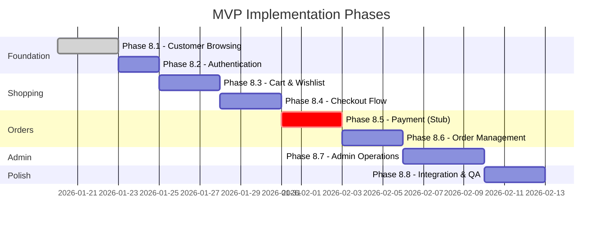
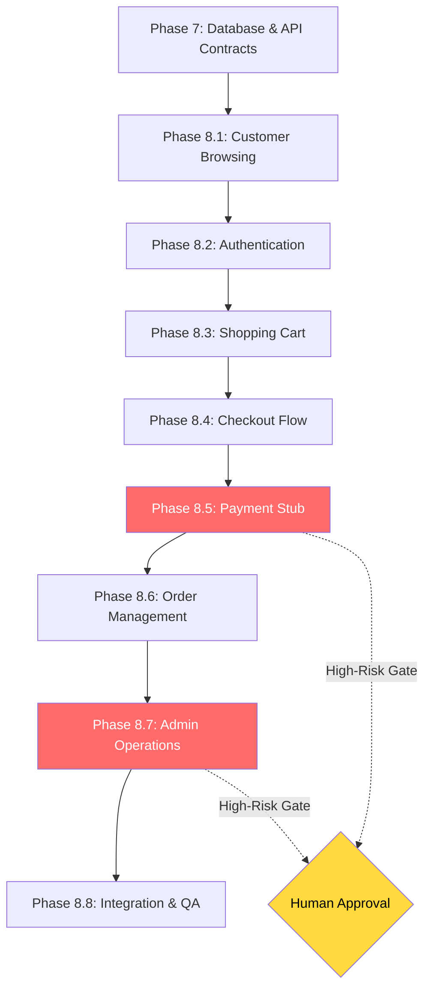

# Phase 8: MVP Implementation Plan

**Document Status:** Draft — Pending Human Sign-off  
**Last Updated:** 2026-01-19  
**Version:** 1.0

---

## Overview

This document defines the **phased implementation plan** for the TrustCart Kenya MVP, covering Local and Development environments only. It translates all planning and architecture artefacts into executable development steps with clear dependencies, validation criteria, and high-risk gates.

### Guiding Principles

| Principle                      | Description                                                               |
| ------------------------------ | ------------------------------------------------------------------------- |
| **High-Value, Low-Risk First** | Implement read-only and customer-facing flows before high-risk operations |
| **Incremental Delivery**       | Each phase produces a testable, demonstrable slice                        |
| **Contract-First**             | All implementations follow approved API and async contracts               |
| **No Production Data**         | Only synthetic test data in Local/Dev environments                        |
| **Auditable Progress**         | Each phase has clear entry/exit criteria                                  |

### Risk Classification

| Risk Level | Examples                                        | Agent Authority         |
| ---------- | ----------------------------------------------- | ----------------------- |
| 🟢 Low     | Product catalog, search, cart UI                | Autonomous              |
| 🟡 Medium  | User registration, order creation               | Autonomous with logging |
| 🔴 High    | Payment processing, refunds, order cancellation | Requires approval       |

---

## Phase Summary

---

## Phase 8.1: Customer Browsing

### Objective

Implement product catalog browsing so customers can discover and view products.

### Risk Level: 🟢 Low (Read-only, no sensitive data)

### Scope

| Component             | Items                                                                         |
| --------------------- | ----------------------------------------------------------------------------- |
| **Frontend Pages**    | Home, Category Listing, Product Detail, Search Results                        |
| **Backend Endpoints** | GET /products, GET /products/{id}, GET /products/slug/{slug}, GET /categories |
| **Database Tables**   | Product, Category, Brand, ProductImage, ProductAttribute, InventoryRecord     |
| **Async Events**      | None                                                                          |

### Artefact Traceability

| Artefact     | Reference                                             |
| ------------ | ----------------------------------------------------- |
| Domain Model | Product, Category, Brand, Inventory entities          |
| MVP Scope    | Product catalog, search, category browsing, filtering |
| API Contract | GET /products (Section 2.2), GET /categories          |
| Wireframes   | Home page, Category page, Product detail page         |

### Dependencies

- ✅ Phase 7 complete (database schema, ProductsModule API)
- Docker containers running (PostgreSQL, Redis)

### Implementation Steps

| Step  | Task                                                            | Validation                            |
| ----- | --------------------------------------------------------------- | ------------------------------------- |
| 8.1.1 | Create CategoriesModule (service, controller, DTOs)             | GET /categories returns 5 categories  |
| 8.1.2 | Implement product filtering (category, brand, price, condition) | Query params work correctly           |
| 8.1.3 | Implement product search (name, description, SKU)               | Search returns relevant results       |
| 8.1.4 | Create frontend Home page with featured products                | Page renders 10 products              |
| 8.1.5 | Create Category listing page with filters                       | Filtering updates product list        |
| 8.1.6 | Create Product detail page                                      | Shows images, specs, inventory status |
| 8.1.7 | Create Search results page                                      | Search query shows results            |
| 8.1.8 | Add responsive design for mobile                                | Lighthouse mobile score > 80          |

### Environment

- **Local:** Full implementation
- **Dev:** Deploy after local validation

### Testing

- Unit tests for ProductsService filter/search methods
- Integration tests for all GET endpoints
- E2E test: Navigate Home → Category → Product Detail

### High-Risk Gates: None

### Exit Criteria

- [ ] All product endpoints return correct data
- [ ] Frontend pages render without errors
- [ ] TypeScript passes, lint clean
- [ ] E2E browsing flow works

---

## Phase 8.2: Authentication & User Accounts

### Objective

Implement user registration, login, and profile management.

### Risk Level: 🟡 Medium (User data, credentials)

### Scope

| Component             | Items                                                                                                                                  |
| --------------------- | -------------------------------------------------------------------------------------------------------------------------------------- |
| **Frontend Pages**    | Register, Login, Forgot Password, Profile, Address Management                                                                          |
| **Backend Endpoints** | POST /auth/register, POST /auth/login, POST /auth/forgot-password, GET /users/me, PATCH /users/me, GET/POST/DELETE /users/me/addresses |
| **Database Tables**   | User, Address                                                                                                                          |
| **Async Events**      | notification.send (password reset email)                                                                                               |

### Artefact Traceability

| Artefact        | Reference                                                             |
| --------------- | --------------------------------------------------------------------- |
| Domain Model    | User, Address entities                                                |
| MVP Scope       | Customer registration/login, password reset, profile, saved addresses |
| API Contract    | Auth endpoints (Section 2.1), User endpoints                          |
| Order Lifecycle | User required for order creation                                      |

### Dependencies

- Phase 8.1 complete
- Email service configured (Mailhog for Local/Dev)

### Implementation Steps

| Step   | Task                                                        | Validation                      |
| ------ | ----------------------------------------------------------- | ------------------------------- |
| 8.2.1  | Create AuthModule with JWT strategy                         | Token generation works          |
| 8.2.2  | Implement POST /auth/register with password hashing         | User created in database        |
| 8.2.3  | Implement POST /auth/login                                  | Returns JWT token               |
| 8.2.4  | Implement POST /auth/forgot-password                        | Sends email (Mailhog capture)   |
| 8.2.5  | Implement POST /auth/reset-password                         | Password updated                |
| 8.2.6  | Create UsersModule with profile endpoints                   | GET/PATCH /users/me works       |
| 8.2.7  | Implement address CRUD                                      | Addresses saved and retrievable |
| 8.2.8  | Create Auth guards (roles: CUSTOMER, STAFF, MANAGER, ADMIN) | Role-based access works         |
| 8.2.9  | Create frontend Register page                               | Form validation works           |
| 8.2.10 | Create frontend Login page                                  | Redirects to profile            |
| 8.2.11 | Create frontend Profile page                                | Shows user info and addresses   |

### Environment

- **Local:** JWT secret from .env.local, Mailhog for emails
- **Dev:** Same with managed email service (Mailtrap)

### Testing

- Unit tests for password hashing, token generation
- Integration tests for auth flow
- E2E test: Register → Login → View Profile → Add Address

### High-Risk Gates

- ⚠️ Password reset flow requires email verification (no SMS in MVP)

### Exit Criteria

- [ ] Users can register and login
- [ ] JWT tokens are validated correctly
- [ ] Role guards restrict access appropriately
- [ ] Password reset email received in Mailhog

---

## Phase 8.3: Shopping Cart

### Objective

Implement cart functionality for logged-in and guest users.

### Risk Level: 🟢 Low (No financial transactions)

### Scope

| Component             | Items                                                                                          |
| --------------------- | ---------------------------------------------------------------------------------------------- |
| **Frontend Pages**    | Cart page, Cart drawer/modal                                                                   |
| **Backend Endpoints** | GET /cart, POST /cart/items, PATCH /cart/items/{id}, DELETE /cart/items/{id}, POST /cart/promo |
| **Database Tables**   | Cart, CartItem, PromoCode                                                                      |
| **Async Events**      | None                                                                                           |

### Artefact Traceability

| Artefact     | Reference                                           |
| ------------ | --------------------------------------------------- |
| Domain Model | Cart, CartItem, PromoCode entities                  |
| MVP Scope    | Add/remove from cart, cart persistence, promo codes |
| API Contract | Cart endpoints (Section 2.3)                        |
| User Journey | Browse → Add to Cart → View Cart                    |

### Dependencies

- Phase 8.2 complete (authentication for logged-in cart)
- Inventory availability check

### Implementation Steps

| Step   | Task                                             | Validation                               |
| ------ | ------------------------------------------------ | ---------------------------------------- |
| 8.3.1  | Create CartModule (service, controller, DTOs)    | Basic CRUD works                         |
| 8.3.2  | Implement cart retrieval/creation logic          | Cart created on first add                |
| 8.3.3  | Implement add to cart with stock check           | 409 INSUFFICIENT_STOCK when unavailable  |
| 8.3.4  | Implement quantity update with stock validation  | Quantity limited to available stock      |
| 8.3.5  | Implement remove from cart                       | Item removed, cart total recalculated    |
| 8.3.6  | Implement promo code application                 | Discount applied to cart total           |
| 8.3.7  | Implement cart expiry logic (24 hours for guest) | Expired carts cleaned up                 |
| 8.3.8  | Implement inventory reservation on add           | InventoryRecord.quantityReserved updated |
| 8.3.9  | Create frontend Cart page                        | Shows items, quantities, totals          |
| 8.3.10 | Add "Add to Cart" button to Product Detail       | Button works, shows confirmation         |
| 8.3.11 | Create cart icon with item count in header       | Count updates in real-time               |

### Environment

- **Local:** Cart persists in database
- **Dev:** Same behavior

### Testing

- Unit tests for cart calculations, stock validation
- Integration tests for cart endpoints
- E2E test: Add product → Update quantity → Apply promo → Remove item

### High-Risk Gates: None

### Exit Criteria

- [ ] Cart CRUD operations work correctly
- [ ] Stock validation prevents overselling
- [ ] Promo codes apply correct discounts
- [ ] Cart totals calculate correctly (subtotal, discount, delivery, total)

---

## Phase 8.4: Checkout Flow

### Objective

Implement checkout process from cart to order creation.

### Risk Level: 🟡 Medium (Order creation, address handling)

### Scope

| Component             | Items                                              |
| --------------------- | -------------------------------------------------- |
| **Frontend Pages**    | Checkout page (single-step)                        |
| **Backend Endpoints** | POST /checkout                                     |
| **Database Tables**   | Order, OrderItem, OrderAddress, OrderStatusHistory |
| **Async Events**      | None (payment and notifications in Phase 8.5)      |

### Artefact Traceability

| Artefact        | Reference                                                      |
| --------------- | -------------------------------------------------------------- |
| Domain Model    | Order, OrderItem, OrderAddress entities                        |
| MVP Scope       | Single-step checkout with address and payment method selection |
| API Contract    | POST /checkout (Section 2.4)                                   |
| Order Lifecycle | CREATED → PENDING_PAYMENT states                               |

### Dependencies

- Phase 8.3 complete (cart with items)
- Phase 8.2 complete (user with addresses)

### Implementation Steps

| Step   | Task                                               | Validation                       |
| ------ | -------------------------------------------------- | -------------------------------- |
| 8.4.1  | Create OrdersModule skeleton                       | Module loads                     |
| 8.4.2  | Implement order number generation (TC-YYYY-NNNNNN) | Unique numbers generated         |
| 8.4.3  | Implement checkout endpoint                        | Order created in PENDING_PAYMENT |
| 8.4.4  | Copy cart items to OrderItems (snapshot prices)    | Prices locked at checkout        |
| 8.4.5  | Copy selected address to OrderAddress              | Address snapshot saved           |
| 8.4.6  | Create initial OrderStatusHistory entry            | History tracks CREATED state     |
| 8.4.7  | Calculate and apply delivery fee by zone           | Fee calculated correctly         |
| 8.4.8  | Clear cart after successful checkout               | Cart emptied                     |
| 8.4.9  | Create frontend Checkout page                      | Single-step form renders         |
| 8.4.10 | Implement address selection in checkout            | User addresses displayed         |
| 8.4.11 | Implement payment method selection                 | MPesa STK option shown           |
| 8.4.12 | Add order summary display                          | Cart contents shown with totals  |

### Environment

- **Local:** Delivery zones hardcoded (Nairobi zones)
- **Dev:** Same with configurable delivery fee matrix

### Testing

- Unit tests for order number generation, price calculation
- Integration tests for checkout flow
- E2E test: Cart → Checkout → Order created with correct data

### High-Risk Gates

- ⚠️ Price snapshot at checkout (no modification after creation)

### Exit Criteria

- [ ] Checkout creates order in PENDING_PAYMENT status
- [ ] Order items capture product prices at checkout time
- [ ] Order address is a snapshot (not linked to user address)
- [ ] Delivery fee calculated by zone

---

## Phase 8.5: Payment Processing (Stub Mode)

### Objective

Implement payment initiation and confirmation flow in stub mode (no real MPesa integration).

### Risk Level: 🔴 High (Financial operations)

> [!CAUTION]
> **High-Risk Phase:** Payment logic requires careful implementation. All changes require code review. Production MPesa integration is NOT in scope.

### Scope

| Component             | Items                                                                             |
| --------------------- | --------------------------------------------------------------------------------- |
| **Frontend Pages**    | Payment initiation modal, Order confirmation page                                 |
| **Backend Endpoints** | POST /payments/initiate, GET /payments/{id}, POST /webhooks/mpesa/callback (stub) |
| **Database Tables**   | PaymentTransaction, MpesaTransaction                                              |
| **Async Events**      | payment.verify, order.confirmed, notification.send                                |

### Artefact Traceability

| Artefact        | Reference                                                |
| --------------- | -------------------------------------------------------- |
| Domain Model    | PaymentTransaction, MpesaTransaction entities            |
| MVP Scope       | MPesa STK Push, payment confirmation, receipt generation |
| API Contract    | Payment endpoints (Section 2.5)                          |
| Order Lifecycle | PENDING_PAYMENT → CONFIRMED transition                   |
| Agent Scope     | Payment domain rules (Section 6.1)                       |

### Dependencies

- Phase 8.4 complete (order in PENDING_PAYMENT)
- BullMQ configured for async processing

### Implementation Steps

| Step   | Task                                          | Validation                          |
| ------ | --------------------------------------------- | ----------------------------------- |
| 8.5.1  | Create PaymentsModule skeleton                | Module loads                        |
| 8.5.2  | Install and configure BullMQ                  | Queues created in Redis             |
| 8.5.3  | Implement POST /payments/initiate (stub mode) | Returns INITIATED status            |
| 8.5.4  | Create payment.verify queue processor         | Job processes successfully          |
| 8.5.5  | Implement stub MPesa callback simulation      | Auto-confirms after 3 seconds       |
| 8.5.6  | Update order status on payment confirmation   | Order moves to CONFIRMED            |
| 8.5.7  | Create order.confirmed event handler          | Triggers notification job           |
| 8.5.8  | Create notification.send processor            | Logs email content (no actual send) |
| 8.5.9  | Implement idempotency key validation          | Duplicate requests rejected         |
| 8.5.10 | Create frontend payment initiation modal      | Phone number input shown            |
| 8.5.11 | Create order confirmation page                | Shows order details and receipt     |
| 8.5.12 | Implement payment status polling              | UI updates on confirmation          |

### Environment

- **Local:** `PAYMENT_STUB_MODE=true` - instant confirmation
- **Dev:** Same stub mode, no real MPesa calls

### Testing

- Unit tests for idempotency, status transitions
- Integration tests for payment flow
- E2E test: Initiate payment → Confirm → View order confirmation

### High-Risk Gates

- ⚠️ **APPROVAL REQUIRED** before implementing real MPesa integration
- ⚠️ **APPROVAL REQUIRED** for any payment logic changes
- ⚠️ All payment transactions logged with audit trail

### Exit Criteria

- [ ] Payment initiation creates transaction record
- [ ] Stub confirmation updates order to CONFIRMED
- [ ] Order confirmation notification queued
- [ ] Idempotency prevents duplicate payments

---

## Phase 8.6: Order Management (Customer)

### Objective

Implement customer-facing order history and tracking.

### Risk Level: 🟡 Medium (Order data access)

### Scope

| Component             | Items                                                   |
| --------------------- | ------------------------------------------------------- |
| **Frontend Pages**    | Order History, Order Detail                             |
| **Backend Endpoints** | GET /orders, GET /orders/{id}, POST /orders/{id}/cancel |
| **Database Tables**   | Order, OrderStatusHistory                               |
| **Async Events**      | order.status_changed                                    |

### Artefact Traceability

| Artefact        | Reference                                                |
| --------------- | -------------------------------------------------------- |
| Domain Model    | Order entity with status history                         |
| MVP Scope       | Order status tracking, order history visible to customer |
| API Contract    | Order endpoints (Section 2.4)                            |
| Order Lifecycle | All customer-visible states                              |

### Dependencies

- Phase 8.5 complete (confirmed orders exist)

### Implementation Steps

| Step  | Task                                             | Validation                           |
| ----- | ------------------------------------------------ | ------------------------------------ |
| 8.6.1 | Implement GET /orders with pagination            | Returns user's orders only           |
| 8.6.2 | Implement GET /orders/{id} with authorization    | Owner and staff can access           |
| 8.6.3 | Implement order cancellation (before DISPATCHED) | Status changes to CANCELLED          |
| 8.6.4 | Create order.status_changed event handler        | Notification sent on status change   |
| 8.6.5 | Create frontend Order History page               | Lists orders with status             |
| 8.6.6 | Create frontend Order Detail page                | Shows items, address, status history |
| 8.6.7 | Add cancel order button (conditional display)    | Only shown before DISPATCHED         |
| 8.6.8 | Implement order status timeline UI               | Visual status progression            |

### Environment

- **Local:** Full implementation
- **Dev:** Same behavior

### Testing

- Unit tests for authorization, cancellation rules
- Integration tests for order retrieval
- E2E test: View orders → View detail → Cancel order (if allowed)

### High-Risk Gates

- ⚠️ Cancellation after DISPATCHED requires Manager+ role

### Exit Criteria

- [ ] Customers see only their own orders
- [ ] Order details include all items and history
- [ ] Cancellation follows lifecycle rules
- [ ] Status changes trigger notifications

---

## Phase 8.7: Admin Operations

### Objective

Implement admin panel for product, inventory, and order management.

### Risk Level: 🔴 High (Data modification, inventory, refunds)

> [!WARNING]
> **High-Risk Phase:** Admin operations affect business data. Role-based access strictly enforced.

### Scope

| Component             | Items                                                                                                                                                        |
| --------------------- | ------------------------------------------------------------------------------------------------------------------------------------------------------------ |
| **Frontend Pages**    | Admin Dashboard, Product Management, Inventory, Order Management                                                                                             |
| **Backend Endpoints** | POST /admin/products, PATCH /admin/products/{id}, PATCH /admin/orders/{id}/status, PATCH /admin/inventory/{productId}/adjust, POST /admin/orders/{id}/refund |
| **Database Tables**   | Product, InventoryRecord, StockAdjustment, Order, Refund                                                                                                     |
| **Async Events**      | inventory.adjust, order.status_changed                                                                                                                       |

### Artefact Traceability

| Artefact     | Reference                                                                 |
| ------------ | ------------------------------------------------------------------------- |
| Domain Model | All admin-modifiable entities                                             |
| MVP Scope    | Product management, inventory tracking, order management, basic dashboard |
| API Contract | Admin endpoints (Section 2.6)                                             |
| Agent Scope  | Inventory rules (Section 6.3), Order rules (Section 6.2)                  |

### Dependencies

- Phase 8.6 complete (orders exist for management)
- Role guards implemented (Phase 8.2)

### Implementation Steps

| Step   | Task                                                | Validation                       |
| ------ | --------------------------------------------------- | -------------------------------- |
| 8.7.1  | Create AdminModule skeleton                         | Module loads with role guard     |
| 8.7.2  | Implement product CRUD (create, update, deactivate) | Products manageable              |
| 8.7.3  | Implement inventory adjustment with logging         | StockAdjustment records created  |
| 8.7.4  | Implement order status update (Staff+)              | Valid transitions allowed        |
| 8.7.5  | Implement refund initiation (Manager+)              | Refund record created            |
| 8.7.6  | Create frontend Admin Dashboard                     | Shows orders today, revenue      |
| 8.7.7  | Create frontend Product Management page             | CRUD operations work             |
| 8.7.8  | Create frontend Inventory page                      | Stock levels visible, adjustable |
| 8.7.9  | Create frontend Order Management page               | List with status update          |
| 8.7.10 | Implement low-stock alerts                          | Alert shown when below threshold |

### Environment

- **Local:** Admin user from seed data (admin@trustcart.co.ke)
- **Dev:** Same with test admin accounts

### Testing

- Unit tests for role authorization, inventory rules
- Integration tests for admin endpoints
- E2E test: Login as admin → Create product → Adjust inventory → Update order

### High-Risk Gates

- ⚠️ **Refund initiation** requires Manager+ and creates audit log
- ⚠️ **Order status changes** logged with reason
- ⚠️ **Inventory adjustments** logged with reference

### Exit Criteria

- [ ] Only Staff+ can access admin endpoints
- [ ] Only Manager+ can create products and initiate refunds
- [ ] All admin actions create audit trail
- [ ] Dashboard shows accurate metrics

---

## Phase 8.8: Integration & QA

### Objective

Complete end-to-end integration testing, fix issues, and prepare for Dev deployment.

### Risk Level: 🟡 Medium

### Scope

| Area              | Items                                |
| ----------------- | ------------------------------------ |
| **Testing**       | Full E2E tests for all user journeys |
| **Performance**   | Lighthouse audit, API response times |
| **Security**      | OWASP basic checks, auth validation  |
| **Documentation** | API docs complete, README updated    |

### Artefact Traceability

| Artefact         | Reference                           |
| ---------------- | ----------------------------------- |
| Testing Strategy | Integration and E2E verification    |
| Coding Standards | Linting, type safety, test coverage |

### Dependencies

- All previous phases complete

### Implementation Steps

| Step  | Task                                  | Validation                  |
| ----- | ------------------------------------- | --------------------------- |
| 8.8.1 | Run full E2E test suite               | All tests pass              |
| 8.8.2 | Fix any broken flows                  | Issues resolved             |
| 8.8.3 | Lighthouse audit (desktop & mobile)   | Score > 80 all categories   |
| 8.8.4 | API response time check               | All endpoints < 500ms       |
| 8.8.5 | Security audit (auth, CORS, XSS)      | No critical issues          |
| 8.8.6 | Update Swagger documentation          | All endpoints documented    |
| 8.8.7 | Update README with setup instructions | New dev can start in 15 min |
| 8.8.8 | Deploy to Dev environment             | All services running        |
| 8.8.9 | Smoke test in Dev                     | Core flows work             |

### Environment

- **Local:** Full testing
- **Dev:** Deployment and smoke testing

### Testing

- Complete E2E test suite covering all phases
- Performance benchmarks
- Security checklist validation

### High-Risk Gates

- ⚠️ Dev deployment requires CI passing

### Exit Criteria

- [ ] All E2E tests pass
- [ ] Lighthouse scores > 80
- [ ] No security vulnerabilities
- [ ] Dev environment operational
- [ ] Documentation complete

---

## Summary: Phase Dependencies

---

## Future Phases (Post-MVP)

| Phase        | Scope                         | Prerequisites                                |
| ------------ | ----------------------------- | -------------------------------------------- |
| **Phase 9**  | Real MPesa Integration        | Payment stub validated, sandbox credentials  |
| **Phase 10** | Email/SMS Notifications       | Notification queue tested, provider accounts |
| **Phase 11** | Delivery Provider Integration | Courier API contracts, webhook handling      |
| **Phase 12** | SIT/UAT Deployment            | Dev environment stable, test data prepared   |

---

## Document Approval

| Role          | Name | Status  | Date |
| ------------- | ---- | ------- | ---- |
| Tech Lead     | —    | Pending | —    |
| Product Owner | —    | Pending | —    |
| QA Lead       | —    | Pending | —    |

---

_This plan is designed for incremental, safe implementation in Local and Dev environments. Production deployment requires separate approval and security review._
