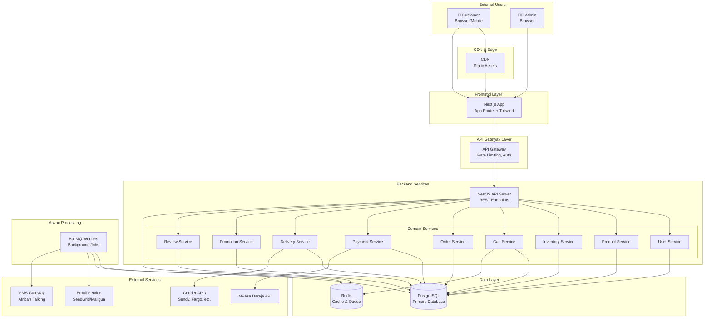
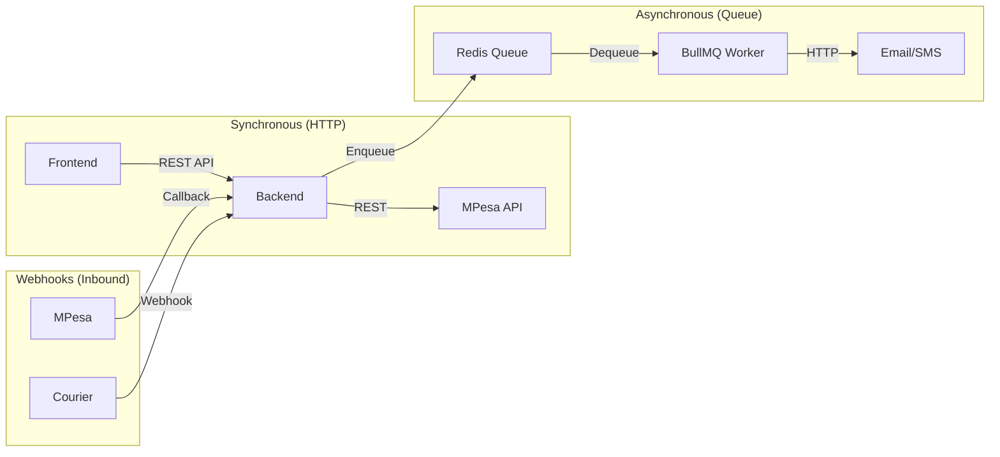
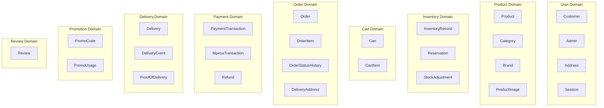
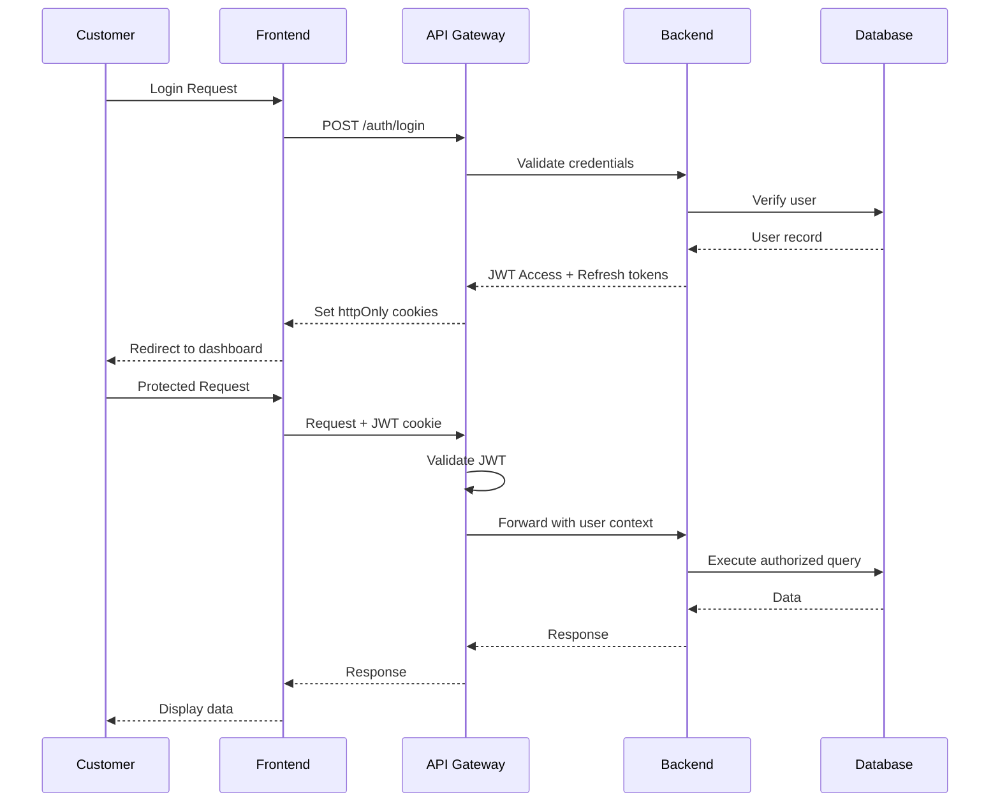
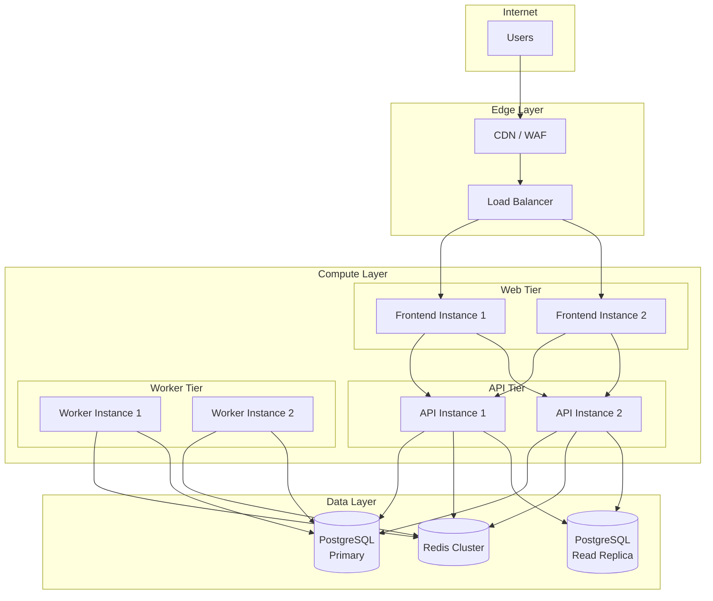

# High-Level System Architecture

**Document Status:** Draft — Pending Human Sign-off  
**Last Updated:** 2026-01-18  
**Version:** 1.0

---

## Overview

This document defines the high-level system architecture for the TrustCart Kenya e-commerce platform. It establishes layer boundaries, service relationships, data ownership, and integration points.

> [!NOTE]
> This is a conceptual architecture document. Implementation details are intentionally excluded.

---

## 1. Architecture Overview



---

## 2. Layer Descriptions

### 2.1 Presentation Layer

| Component | Technology | Responsibility |
|-----------|------------|----------------|
| **Frontend App** | Next.js 14+ (App Router), Tailwind CSS, TypeScript | Server-rendered pages, client interactivity, responsive UI |
| **CDN** | Vercel Edge / Cloudflare | Static asset delivery, caching, DDoS protection |

**Frontend Responsibilities:**
- Server Components for initial page renders
- Client Components for interactivity (forms, cart updates)
- API calls to backend via REST
- Session management (JWT in httpOnly cookies)

---

### 2.2 API Gateway Layer

| Component | Technology | Responsibility |
|-----------|------------|----------------|
| **API Gateway** | Built-in NestJS middleware or API Gateway service | Rate limiting, request logging, authentication verification |

**Gateway Responsibilities:**
- JWT token validation
- Rate limiting (per tier)
- Request/response logging
- CORS handling
- API versioning routing

---

### 2.3 Backend Application Layer

| Component | Technology | Responsibility |
|-----------|------------|----------------|
| **API Server** | NestJS 10+, TypeScript | RESTful API endpoints, request handling, orchestration |
| **Domain Services** | NestJS modules | Business logic, domain rules, invariant enforcement |
| **Repositories** | Prisma ORM | Data access, query building, transaction management |

**Architecture Pattern:**
```
Controller → Service → Repository → Database
```

---

### 2.4 Domain Services

| Service | Owns | Dependencies | Risk Level |
|---------|------|--------------|------------|
| **User Service** | Customer, Admin, Address, Session | Email (password reset) | 🟢 Low |
| **Product Service** | Product, Category, Brand, Image, Attribute | — | 🟢 Low |
| **Inventory Service** | InventoryRecord, Reservation, Adjustment | Product (read) | 🟠 High |
| **Cart Service** | Cart, CartItem | Product, Inventory, Promotion | 🟡 Medium |
| **Order Service** | Order, OrderItem, StatusHistory, DeliveryAddress | All services | 🔴 Critical |
| **Payment Service** | PaymentTransaction, MpesaTransaction, Refund | Order, MPesa API | 🔴 Critical |
| **Delivery Service** | Delivery, DeliveryEvent, ProofOfDelivery | Order, Courier APIs | 🟠 High |
| **Promotion Service** | PromoCode, PromoUsage, ProductDiscount | Product, Customer | 🟡 Medium |
| **Review Service** | Review | Product, Customer, Order | 🟢 Low |

---

### 2.5 Data Layer

| Component | Technology | Purpose |
|-----------|------------|---------|
| **PostgreSQL** | PostgreSQL 15+ | Primary relational database, ACID transactions |
| **Redis** | Redis 7+ | Session cache, cart cache, rate limiting, queue backend |

**Data Distribution:**
- **PostgreSQL**: All persistent domain data
- **Redis**: Ephemeral data (sessions, carts, rate limits, job queues)

---

### 2.6 Async Processing Layer

| Component | Technology | Purpose |
|-----------|------------|---------|
| **BullMQ Workers** | BullMQ 4+ on Node.js | Background job processing |

**Job Types:**
| Queue | Jobs | Priority |
|-------|------|----------|
| `payment` | Payment verification retries, refund processing | High |
| `notification` | Order emails, SMS, delivery updates | Medium |
| `inventory` | Reservation expiry, stock alerts | Medium |
| `scheduled` | Order timeout, cart cleanup, report generation | Low |

---

### 2.7 External Integrations

| Service | Provider | Purpose | Data Exchanged |
|---------|----------|---------|----------------|
| **MPesa** | Safaricom Daraja | Payment processing | Phone, amount, transaction IDs |
| **Courier** | Sendy, Fargo, Wells | Delivery tracking | Address, order ID, tracking events |
| **Email** | SendGrid / Mailgun | Transactional email | Email address, order details |
| **SMS** | Africa's Talking | Order notifications | Phone number, message |

---

## 3. Service Communication

### 3.1 Communication Patterns



| Pattern | Use Case | Examples |
|---------|----------|----------|
| **Sync REST** | User-facing requests | Cart update, checkout, product fetch |
| **Async Queue** | Non-blocking operations | Email, SMS, payment retry, inventory release |
| **Webhooks** | External event ingestion | MPesa callback, courier tracking update |

### 3.2 Inter-Service Communication

All domain services communicate within the same NestJS process via dependency injection:

```
OrderService → injects → PaymentService, InventoryService, DeliveryService
CartService → injects → ProductService, InventoryService, PromotionService
```

No microservice boundaries in MVP — monolithic modular architecture.

---

## 4. Data Ownership Boundaries

### 4.1 Domain Data Ownership



### 4.2 Cross-Domain Access Rules

| Accessor | Target | Access | Purpose |
|----------|--------|--------|---------|
| Cart | Product | Read | Display info, get price |
| Cart | Inventory | Read | Check availability |
| Order | Product | Snapshot | Copy product details at order time |
| Order | Inventory | Write | Reserve/release stock |
| Payment | Order | Write | Update order status on payment |
| Delivery | Order | Write | Update order status on delivery |

---

## 5. High-Risk Domains & Approval Gates

### 5.1 Critical Data Flows

```mermaid
flowchart TD
    subgraph "🔴 CRITICAL: Payment Flow"
        A[Customer Checkout] --> B[Initiate MPesa STK Push]
        B --> C{MPesa Callback}
        C -->|Success| D[Order CONFIRMED]
        C -->|Failure| E[Order PAYMENT_FAILED]
        D --> F[✅ Inventory Decremented at DISPATCH]
    end
    
    subgraph "🔴 CRITICAL: Refund Flow"
        G[Refund Request] --> H{Manager Approval?}
        H -->|Approved| I[Process Refund]
        H -->|Rejected| J[Reject Request]
        I --> K[✅ MPesa Refund]
    end
    
    subgraph "🟠 HIGH: Inventory Flow"
        L[Checkout] --> M[Reserve Stock]
        M --> N{Payment Timeout?}
        N -->|Yes| O[Release Reservation]
        N -->|No| P[Payment Confirmed]
        P --> Q[Stock Decremented at Dispatch]
    end
```



### 5.2 Human Approval Gates

| Domain | Operation | Required Approver | System Enforcement |
|--------|-----------|-------------------|-------------------|
| **Payment** | Process refund | Manager | Block without approval ID |
| **Payment** | Reverse confirmed payment | Super Admin | Block without approval ID |
| **Order** | Cancel after PROCESSING | Manager | Block without approval ID |
| **Order** | Override order total | Super Admin | Block without approval ID |
| **Inventory** | Manual stock adjustment | Manager review | Audit log required |
| **Product** | Price change > 20% | Manager | Alert + approval required |
| **Promotion** | Discount > 50% | CEO | Block without approval ID |

### 5.3 System-Enforced Invariants

| Invariant | Enforcement Point | Action on Violation |
|-----------|-------------------|---------------------|
| Stock cannot go negative | Inventory Service | Reject operation |
| Order total = sum of items | Order Service | Recalculate, reject if mismatch |
| Refund ≤ payment amount | Payment Service | Reject refund |
| Only CONFIRMED payments refundable | Payment Service | Reject refund |
| Order state machine transitions | Order Service | Reject invalid transition |

---

## 6. Security Architecture

### 6.1 Authentication & Authorization Flow



### 6.2 Security Layers

| Layer | Security Measure |
|-------|------------------|
| **Transport** | TLS 1.3 everywhere (HTTPS) |
| **Edge** | DDoS protection, WAF, rate limiting |
| **Authentication** | JWT (15 min access, 7 day refresh) |
| **Authorization** | RBAC (Customer, Staff, Manager, Admin) |
| **Data** | Encryption at rest, field-level PII masking |
| **Logging** | Sensitive data never logged |

---

## 7. Infrastructure Topology

### 7.1 Production Environment



### 7.2 Environment Summary

| Environment | Purpose | Data | Access |
|-------------|---------|------|--------|
| **Local** | Developer workstation | Synthetic | Developer |
| **Dev** | Feature integration | Synthetic | Dev team |
| **SIT** | Integration testing | Synthetic | QA + Dev |
| **UAT** | Business validation | Masked | Limited |
| **Prod** | Live customers | Real | Ops only |

---

## 8. Traceability Matrix

### Artefact Cross-References

| Architecture Component | Source Artefact |
|------------------------|-----------------|
| Domain Services | [domain-model.md](file:///c:/Users/STEPH/Documents/Portfolio/Projects/modern-ecom/docs/planning/domain-model.md) |
| Order State Machine | [order-lifecycle-state-machine.md](file:///c:/Users/STEPH/Documents/Portfolio/Projects/modern-ecom/docs/planning/order-lifecycle-state-machine.md) |
| API Contracts | [api-contract-strategy.md](file:///c:/Users/STEPH/Documents/Portfolio/Projects/modern-ecom/docs/planning/api-contract-strategy.md) |
| Data Ownership | [data-ownership-privacy.md](file:///c:/Users/STEPH/Documents/Portfolio/Projects/modern-ecom/docs/planning/data-ownership-privacy.md) |
| Risk Domains | [risk-register-compliance.md](file:///c:/Users/STEPH/Documents/Portfolio/Projects/modern-ecom/docs/planning/risk-register-compliance.md) |
| Technology Stack | [coding-standards.md](file:///c:/Users/STEPH/Documents/Portfolio/Projects/modern-ecom/docs/planning/coding-standards.md) |
| Environments | [environment-strategy.md](file:///c:/Users/STEPH/Documents/Portfolio/Projects/modern-ecom/docs/planning/environment-strategy.md) |
| Approval Gates | [agent-scope-authority.md](file:///c:/Users/STEPH/Documents/Portfolio/Projects/modern-ecom/docs/planning/agent-scope-authority.md) |
| Business Rules | [business-model-revenue-flows.md](file:///c:/Users/STEPH/Documents/Portfolio/Projects/modern-ecom/docs/planning/business-model-revenue-flows.md) |
| Screen Inventory | [wireframes-screen-inventory.md](file:///c:/Users/STEPH/Documents/Portfolio/Projects/modern-ecom/docs/planning/wireframes-screen-inventory.md) |

---

## Document Approval

| Role | Name | Status | Date |
|------|------|--------|------|
| Technical Architect | — | Pending | — |
| Tech Lead | — | Pending | — |
| Product Owner | — | Pending | — |

---

*This document defines the conceptual system architecture. All implementation must align with these boundaries. Deviations require explicit approval and documentation.*
