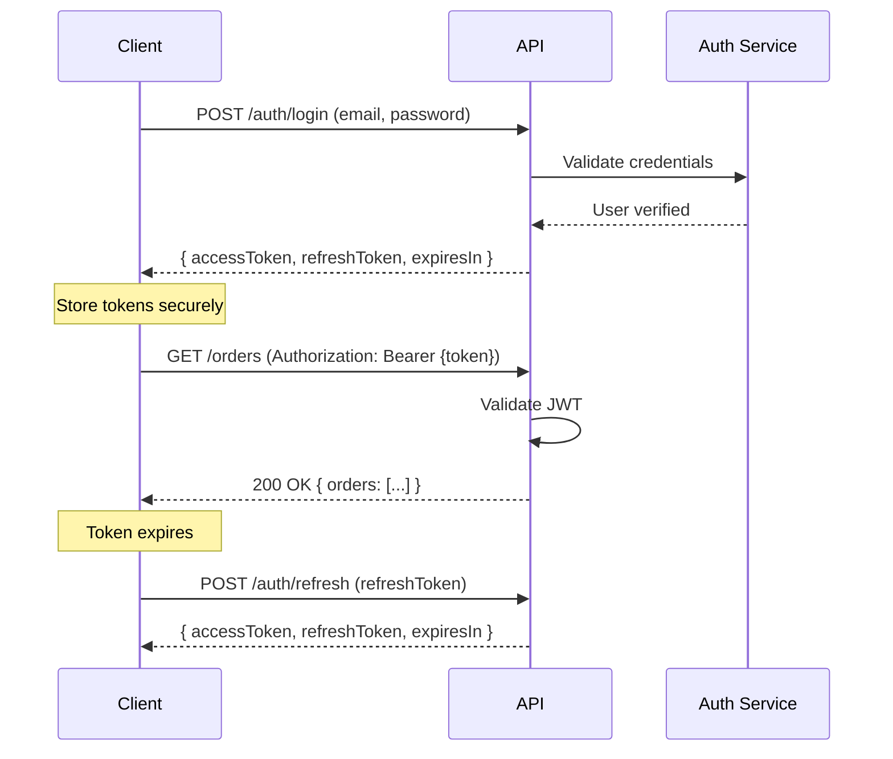

# API Contract Strategy

**Document Status:** Draft — Pending Human Sign-off  
**Last Updated:** 2026-01-18  
**Version:** 1.0

---

## Overview

This document defines the API contract strategy for the TrustCart Kenya e-commerce platform. It establishes:

- API style and design principles
- Resource naming and URL conventions
- Authentication and authorization patterns
- Request/response standards
- Integration patterns for external services
- Versioning and deprecation policies

This strategy ensures consistency, predictability, and maintainability across all API consumers.

---

## 1. API Style & Principles

### 1.1 API Style Choice: REST

| Aspect                     | Decision         | Rationale                                                 |
| -------------------------- | ---------------- | --------------------------------------------------------- |
| **Style**                  | RESTful JSON API | Industry standard, well-understood, good tooling support  |
| **Alternative Considered** | GraphQL          | Deferred — adds complexity; REST sufficient for MVP scope |

### 1.2 Core Design Principles

| Principle             | Description                                                                |
| --------------------- | -------------------------------------------------------------------------- |
| **Resource-Oriented** | APIs expose resources (nouns), not actions (verbs)                         |
| **Stateless**         | Each request contains all information needed; no server-side session state |
| **Consistent**        | Same conventions across all endpoints                                      |
| **Predictable**       | Developers can guess endpoint structure based on patterns                  |
| **Self-Documenting**  | Response structures are explicit and descriptive                           |
| **Secure by Default** | All endpoints require authentication unless explicitly public              |

### 1.3 HTTP Method Semantics

| Method   | Purpose                          | Idempotent | Safe |
| -------- | -------------------------------- | ---------- | ---- |
| `GET`    | Retrieve resource(s)             | Yes        | Yes  |
| `POST`   | Create resource / trigger action | No         | No   |
| `PUT`    | Full replacement of resource     | Yes        | No   |
| `PATCH`  | Partial update of resource       | Yes        | No   |
| `DELETE` | Remove resource                  | Yes        | No   |

### 1.4 Consistency Rules

- All APIs return JSON with `Content-Type: application/json`
- All request bodies are JSON
- All timestamps are ISO 8601 format in UTC (e.g., `2026-01-18T08:30:00Z`)
- All monetary amounts are integers in the smallest unit (cents/centimes) — **except KES which has no subunits, so we use whole shillings**
- All IDs are strings (UUIDs or prefixed IDs like `ord_abc123`)

---

## 2. Resource Naming Conventions

### 2.1 URL Structure

```
https://api.trustcart.co.ke/v1/{resource}
https://api.trustcart.co.ke/v1/{resource}/{id}
https://api.trustcart.co.ke/v1/{resource}/{id}/{sub-resource}
```

### 2.2 Resource Naming Rules

| Rule                                     | Convention                | Example                              |
| ---------------------------------------- | ------------------------- | ------------------------------------ |
| **Plural nouns for collections**         | Always plural             | `/products`, `/orders`, `/customers` |
| **Lowercase with hyphens**               | Kebab-case for multi-word | `/order-items`, `/stock-adjustments` |
| **No verbs in URLs**                     | Use HTTP methods instead  | ✅ `POST /orders` ❌ `/create-order` |
| **Nested resources for clear ownership** | Max 2 levels deep         | `/orders/{id}/items`                 |
| **Actions as sub-resources**             | For non-CRUD operations   | `POST /orders/{id}/cancel`           |

### 2.3 Standard Resource Endpoints

| Resource       | Endpoints                                                                                                |
| -------------- | -------------------------------------------------------------------------------------------------------- |
| **Products**   | `GET /products`, `GET /products/{id}`, `POST /products`, `PATCH /products/{id}`, `DELETE /products/{id}` |
| **Categories** | `GET /categories`, `GET /categories/{id}`                                                                |
| **Cart**       | `GET /cart`, `POST /cart/items`, `PATCH /cart/items/{id}`, `DELETE /cart/items/{id}`                     |
| **Orders**     | `GET /orders`, `GET /orders/{id}`, `POST /orders`, `POST /orders/{id}/cancel`                            |
| **Payments**   | `POST /payments`, `GET /payments/{id}`                                                                   |
| **Customers**  | `GET /customers/{id}`, `PATCH /customers/{id}`                                                           |
| **Addresses**  | `GET /addresses`, `POST /addresses`, `PATCH /addresses/{id}`, `DELETE /addresses/{id}`                   |
| **Reviews**    | `GET /products/{id}/reviews`, `POST /products/{id}/reviews`                                              |
| **Promotions** | `GET /promotions/validate`, `POST /promotions/validate`                                                  |

### 2.4 Query Parameter Conventions

| Purpose             | Convention                                   | Example                                            |
| ------------------- | -------------------------------------------- | -------------------------------------------------- |
| **Filtering**       | Field name as key                            | `?status=confirmed&brand=hp`                       |
| **Sorting**         | `sort` with field, prefix `-` for descending | `?sort=-createdAt` or `?sort=price`                |
| **Pagination**      | `page` and `limit`                           | `?page=2&limit=20`                                 |
| **Field selection** | `fields` (comma-separated)                   | `?fields=id,name,price`                            |
| **Search**          | `q` for full-text search                     | `?q=macbook+pro`                                   |
| **Date ranges**     | `{field}From` and `{field}To`                | `?createdAtFrom=2026-01-01&createdAtTo=2026-01-31` |

### 2.5 URL Examples

| Operation                 | URL                                   | Method |
| ------------------------- | ------------------------------------- | ------ |
| List all products         | `/v1/products`                        | GET    |
| Get single product        | `/v1/products/prod_abc123`            | GET    |
| List products in category | `/v1/products?categoryId=cat_laptops` | GET    |
| Search products           | `/v1/products?q=hp+elitebook`         | GET    |
| Create product (admin)    | `/v1/admin/products`                  | POST   |
| Get customer's orders     | `/v1/orders`                          | GET    |
| Get specific order        | `/v1/orders/ord_xyz789`               | GET    |
| Cancel order              | `/v1/orders/ord_xyz789/cancel`        | POST   |
| Get order items           | `/v1/orders/ord_xyz789/items`         | GET    |
| Add item to cart          | `/v1/cart/items`                      | POST   |
| Update cart item quantity | `/v1/cart/items/ci_123`               | PATCH  |
| Validate promo code       | `/v1/promotions/validate`             | POST   |

---

## 3. Authentication & Authorization

### 3.1 Authentication Strategy

| Component                  | Approach                                                |
| -------------------------- | ------------------------------------------------------- |
| **Mechanism**              | JWT (JSON Web Tokens)                                   |
| **Token Delivery**         | `Authorization: Bearer {token}` header                  |
| **Token Storage (Client)** | HttpOnly secure cookie (web) or secure storage (mobile) |
| **Token Lifespan**         | Access token: 15 minutes; Refresh token: 7 days         |

### 3.2 Authentication Flow



### 3.3 Authentication Endpoints

| Endpoint                | Method | Purpose                      |
| ----------------------- | ------ | ---------------------------- |
| `/auth/register`        | POST   | Create new customer account  |
| `/auth/login`           | POST   | Authenticate and get tokens  |
| `/auth/logout`          | POST   | Invalidate tokens            |
| `/auth/refresh`         | POST   | Get new access token         |
| `/auth/forgot-password` | POST   | Request password reset email |
| `/auth/reset-password`  | POST   | Set new password with token  |
| `/auth/verify-email`    | POST   | Verify email with token      |

### 3.4 Token Payload Structure

```json
{
  "sub": "cust_abc123",
  "email": "john@example.com",
  "role": "customer",
  "iat": 1705564800,
  "exp": 1705565700
}
```

| Field   | Description                                 |
| ------- | ------------------------------------------- |
| `sub`   | Subject — user ID                           |
| `email` | User's email                                |
| `role`  | User role (customer, admin, staff, manager) |
| `iat`   | Issued at timestamp                         |
| `exp`   | Expiration timestamp                        |

### 3.5 Role-Based Access Control

| Role            | Code       | Permissions                                                  |
| --------------- | ---------- | ------------------------------------------------------------ |
| **Customer**    | `customer` | Own orders, own profile, cart, reviews, public endpoints     |
| **Staff**       | `staff`    | All customer permissions + admin read + order status updates |
| **Manager**     | `manager`  | All staff permissions + product management + refund approval |
| **Super Admin** | `admin`    | All permissions including user management                    |

### 3.6 Endpoint Access Matrix

| Endpoint Pattern            | Public | Customer | Staff | Manager | Admin |
| --------------------------- | ------ | -------- | ----- | ------- | ----- |
| `GET /products`             | ✅     | ✅       | ✅    | ✅      | ✅    |
| `GET /orders`               | ❌     | Own only | ✅    | ✅      | ✅    |
| `POST /orders`              | ❌     | ✅       | ❌    | ❌      | ❌    |
| `PATCH /orders/{id}/status` | ❌     | ❌       | ✅    | ✅      | ✅    |
| `POST /orders/{id}/refund`  | ❌     | ❌       | ❌    | ✅      | ✅    |
| `POST /admin/products`      | ❌     | ❌       | ❌    | ✅      | ✅    |
| `GET /admin/customers`      | ❌     | ❌       | ✅    | ✅      | ✅    |
| `POST /admin/users`         | ❌     | ❌       | ❌    | ❌      | ✅    |

### 3.7 Securing Sensitive Endpoints

| Endpoint Category       | Additional Security                   |
| ----------------------- | ------------------------------------- |
| **Payment initiation**  | Validate order ownership              |
| **Refund processing**   | Require manager+ role; log action     |
| **Admin user creation** | Require super admin; audit log        |
| **Password change**     | Require current password confirmation |
| **Order cancellation**  | Validate ownership or admin role      |

---

## 4. Request & Response Standards

### 4.1 Field Naming Convention

| Convention           | Value              | Rationale                                         |
| -------------------- | ------------------ | ------------------------------------------------- |
| **Case style**       | `camelCase`        | JavaScript/TypeScript standard; frontend-friendly |
| **Boolean prefixes** | `is`, `has`, `can` | `isActive`, `hasWarranty`, `canCancel`            |
| **Date fields**      | Suffix with `At`   | `createdAt`, `updatedAt`, `deliveredAt`           |
| **ID fields**        | Suffix with `Id`   | `orderId`, `customerId`, `productId`              |

### 4.2 Standard Response Envelope

All responses follow this structure:

#### Success Response (Single Resource)

```json
{
  "data": {
    "id": "prod_abc123",
    "name": "HP EliteBook 840 G6",
    "price": 45990,
    "condition": "EX_UK",
    "isActive": true,
    "createdAt": "2026-01-15T10:30:00Z"
  }
}
```

#### Success Response (Collection)

```json
{
  "data": [
    { "id": "prod_abc123", "name": "HP EliteBook 840" },
    { "id": "prod_def456", "name": "MacBook Air M2" }
  ],
  "pagination": {
    "page": 1,
    "limit": 20,
    "totalItems": 156,
    "totalPages": 8,
    "hasNextPage": true,
    "hasPrevPage": false
  }
}
```

#### Error Response

```json
{
  "error": {
    "code": "VALIDATION_ERROR",
    "message": "Invalid request parameters",
    "details": [
      {
        "field": "email",
        "message": "Email format is invalid"
      },
      {
        "field": "phone",
        "message": "Phone number must start with +254"
      }
    ],
    "requestId": "req_abc123xyz"
  }
}
```

### 4.3 HTTP Status Codes

| Code    | Meaning               | When to Use                                     |
| ------- | --------------------- | ----------------------------------------------- |
| **200** | OK                    | Successful GET, PUT, PATCH                      |
| **201** | Created               | Successful POST that creates resource           |
| **204** | No Content            | Successful DELETE                               |
| **400** | Bad Request           | Invalid request body or parameters              |
| **401** | Unauthorized          | Missing or invalid authentication               |
| **403** | Forbidden             | Authenticated but lacks permission              |
| **404** | Not Found             | Resource doesn't exist                          |
| **409** | Conflict              | Resource state conflict (e.g., duplicate email) |
| **422** | Unprocessable Entity  | Validation failed                               |
| **429** | Too Many Requests     | Rate limit exceeded                             |
| **500** | Internal Server Error | Server-side error                               |
| **503** | Service Unavailable   | Maintenance or overload                         |

### 4.4 Error Codes

| Error Code                 | HTTP Status | Description                           |
| -------------------------- | ----------- | ------------------------------------- |
| `VALIDATION_ERROR`         | 400/422     | Request validation failed             |
| `AUTHENTICATION_REQUIRED`  | 401         | No valid token provided               |
| `TOKEN_EXPIRED`            | 401         | Access token has expired              |
| `PERMISSION_DENIED`        | 403         | User lacks required permission        |
| `RESOURCE_NOT_FOUND`       | 404         | Requested resource doesn't exist      |
| `DUPLICATE_RESOURCE`       | 409         | Resource already exists (e.g., email) |
| `INVALID_STATE_TRANSITION` | 409         | Order status change not allowed       |
| `INSUFFICIENT_STOCK`       | 409         | Not enough inventory                  |
| `PAYMENT_FAILED`           | 400         | Payment processing failed             |
| `PROMO_CODE_INVALID`       | 400         | Promo code not valid                  |
| `PROMO_CODE_EXPIRED`       | 400         | Promo code has expired                |
| `RATE_LIMIT_EXCEEDED`      | 429         | Too many requests                     |
| `INTERNAL_ERROR`           | 500         | Unexpected server error               |
| `SERVICE_UNAVAILABLE`      | 503         | External service down                 |

### 4.5 Pagination Standards

| Parameter | Default | Max | Description                     |
| --------- | ------- | --- | ------------------------------- |
| `page`    | 1       | —   | Current page number (1-indexed) |
| `limit`   | 20      | 100 | Items per page                  |

Response includes pagination metadata:

```json
{
  "pagination": {
    "page": 2,
    "limit": 20,
    "totalItems": 156,
    "totalPages": 8,
    "hasNextPage": true,
    "hasPrevPage": true
  }
}
```

### 4.6 Filtering & Sorting

#### Filtering

- Use query parameters matching field names
- Support arrays: `?status=confirmed&status=shipped` or `?status[]=confirmed&status[]=shipped`
- Support ranges: `?priceMin=10000&priceMax=50000`

#### Sorting

- Single field: `?sort=price` (ascending) or `?sort=-price` (descending)
- Multiple fields: `?sort=-createdAt,name`

---

## 5. Integration & External Services

### 5.1 External Services

| Service               | Purpose                 | Integration Type        |
| --------------------- | ----------------------- | ----------------------- |
| **MPesa (Daraja)**    | Payment processing      | Outbound API + Webhook  |
| **Card Gateway**      | Card payments (Phase 2) | Outbound API + Redirect |
| **Courier Providers** | Delivery tracking       | Outbound API + Webhook  |
| **Email Provider**    | Transactional emails    | Outbound API            |
| **SMS Provider**      | Notifications           | Outbound API            |

### 5.2 Webhook Endpoints (Inbound)

External services send callbacks to these endpoints:

| Endpoint                             | Source       | Purpose                      |
| ------------------------------------ | ------------ | ---------------------------- |
| `POST /webhooks/mpesa/callback`      | MPesa Daraja | Payment confirmation/failure |
| `POST /webhooks/mpesa/timeout`       | MPesa Daraja | Payment timeout              |
| `POST /webhooks/delivery/{provider}` | Courier      | Delivery status updates      |

### 5.3 Webhook Security

| Measure                    | Description                                        |
| -------------------------- | -------------------------------------------------- |
| **Signature Verification** | Validate request signature using provider's secret |
| **IP Whitelisting**        | Only accept webhooks from known IP ranges          |
| **Idempotency**            | Handle duplicate webhook deliveries gracefully     |
| **Timeout Handling**       | Respond within 30 seconds; process async if needed |

### 5.4 Webhook Payload Standard

Inbound webhooks are normalized to internal format:

```json
{
  "source": "mpesa",
  "eventType": "payment.confirmed",
  "timestamp": "2026-01-18T10:30:00Z",
  "payload": {
    "transactionId": "mpesa_abc123",
    "orderId": "ord_xyz789",
    "amount": 49290,
    "phone": "+254712345678",
    "receiptNumber": "QJH2ABCD5T"
  },
  "signature": "sha256=..."
}
```

### 5.5 Async Operations

For long-running operations, APIs return immediately with a status:

```json
{
  "data": {
    "operationId": "op_abc123",
    "status": "PROCESSING",
    "estimatedCompletion": "2026-01-18T10:35:00Z"
  }
}
```

Client can poll for status:

```
GET /operations/{operationId}
```

Or register for webhook callback:

```json
{
  "callbackUrl": "https://client.example.com/callbacks",
  "events": ["payment.confirmed", "payment.failed"]
}
```

---

## 6. API Namespaces

### 6.1 Namespace Structure

| Namespace    | Base Path   | Purpose                    | Access                    |
| ------------ | ----------- | -------------------------- | ------------------------- |
| **Public**   | `/v1`       | Customer-facing operations | Public + Authenticated    |
| **Admin**    | `/v1/admin` | Back-office operations     | Admin roles only          |
| **Webhooks** | `/webhooks` | External callbacks         | IP-restricted + Signature |
| **Internal** | `/internal` | Service-to-service         | Internal network only     |

### 6.2 Public API Endpoints

| Category       | Endpoints                                                               |
| -------------- | ----------------------------------------------------------------------- |
| **Auth**       | `/auth/register`, `/auth/login`, `/auth/logout`, `/auth/refresh`        |
| **Products**   | `/products`, `/products/{id}`, `/products/{id}/reviews`                 |
| **Categories** | `/categories`, `/categories/{id}`                                       |
| **Cart**       | `/cart`, `/cart/items`, `/cart/items/{id}`                              |
| **Checkout**   | `/checkout`, `/checkout/validate`                                       |
| **Orders**     | `/orders`, `/orders/{id}`, `/orders/{id}/cancel`, `/orders/{id}/return` |
| **Payments**   | `/payments/initiate`, `/payments/{id}`                                  |
| **Profile**    | `/profile`, `/profile/addresses`                                        |
| **Promotions** | `/promotions/validate`                                                  |

### 6.3 Admin API Endpoints

| Category       | Endpoints                                                                                       |
| -------------- | ----------------------------------------------------------------------------------------------- |
| **Dashboard**  | `/admin/dashboard/metrics`                                                                      |
| **Orders**     | `/admin/orders`, `/admin/orders/{id}`, `/admin/orders/{id}/status`, `/admin/orders/{id}/refund` |
| **Products**   | `/admin/products`, `/admin/products/{id}`                                                       |
| **Inventory**  | `/admin/inventory`, `/admin/inventory/{productId}/adjust`                                       |
| **Promotions** | `/admin/promotions`, `/admin/promotions/{id}`                                                   |
| **Customers**  | `/admin/customers`, `/admin/customers/{id}`                                                     |
| **Reports**    | `/admin/reports/sales`, `/admin/reports/inventory`                                              |

---

## 7. Versioning & Deprecation Strategy

### 7.1 Versioning Approach

| Aspect                | Decision                                            |
| --------------------- | --------------------------------------------------- |
| **Versioning Method** | URL path prefix (`/v1`, `/v2`)                      |
| **Current Version**   | `v1`                                                |
| **Version in Header** | Optional `Accept-Version` header for minor versions |

### 7.2 What Constitutes a Breaking Change

| Change Type                       | Breaking? | Requires New Version? |
| --------------------------------- | --------- | --------------------- |
| Adding new endpoint               | No        | No                    |
| Adding optional field to response | No        | No                    |
| Adding optional field to request  | No        | No                    |
| Removing endpoint                 | Yes       | Yes                   |
| Removing field from response      | Yes       | Yes                   |
| Making optional field required    | Yes       | Yes                   |
| Changing field type               | Yes       | Yes                   |
| Changing URL structure            | Yes       | Yes                   |
| Changing error codes              | Yes       | Yes (or use fallback) |

### 7.3 Deprecation Policy

| Phase                | Duration      | Actions                                        |
| -------------------- | ------------- | ---------------------------------------------- |
| **Announcement**     | —             | Document deprecation in changelog and API docs |
| **Sunset Warning**   | 30 days       | Add `Deprecation` header to responses          |
| **Migration Period** | 90 days       | Both versions run in parallel                  |
| **Removal**          | End of period | Old version returns 410 Gone                   |

### 7.4 Deprecation Headers

```http
HTTP/1.1 200 OK
Deprecation: true
Sunset: Sat, 18 Apr 2026 00:00:00 GMT
Link: <https://api.trustcart.co.ke/v2/products>; rel="successor-version"
```

### 7.5 Changelog Requirements

Each API version maintains a changelog documenting:

- New endpoints
- Modified endpoints
- Deprecated endpoints
- Breaking changes
- Migration instructions

---

## 8. Rate Limiting

### 8.1 Rate Limit Tiers

| Tier                         | Limit         | Window   | Applies To           |
| ---------------------------- | ------------- | -------- | -------------------- |
| **Public (Unauthenticated)** | 60 requests   | 1 minute | All public endpoints |
| **Authenticated (Customer)** | 300 requests  | 1 minute | Logged-in customers  |
| **Authenticated (Admin)**    | 600 requests  | 1 minute | Admin users          |
| **Webhooks**                 | 1000 requests | 1 minute | Webhook endpoints    |

### 8.2 Rate Limit Headers

```http
HTTP/1.1 200 OK
X-RateLimit-Limit: 300
X-RateLimit-Remaining: 245
X-RateLimit-Reset: 1705565700
```

### 8.3 Rate Limit Exceeded Response

```http
HTTP/1.1 429 Too Many Requests
Retry-After: 45

{
  "error": {
    "code": "RATE_LIMIT_EXCEEDED",
    "message": "Too many requests. Please retry after 45 seconds.",
    "retryAfter": 45
  }
}
```

---

## 9. API Documentation Requirements

### 9.1 Documentation Standards

| Requirement  | Standard                                          |
| ------------ | ------------------------------------------------- |
| **Format**   | OpenAPI 3.0 (Swagger)                             |
| **Location** | `/docs` (interactive), `/openapi.json` (spec)     |
| **Updates**  | Updated with each deployment                      |
| **Examples** | Every endpoint includes request/response examples |

### 9.2 Documentation Content

Each endpoint must document:

- Description and purpose
- Authentication requirements
- Request parameters and body schema
- Response schema with examples
- Possible error codes
- Rate limit tier

---

## 10. Idempotency

### 10.1 Idempotent Operations

| Method | Idempotent? | Notes                                         |
| ------ | ----------- | --------------------------------------------- |
| GET    | Yes         | Always safe to retry                          |
| PUT    | Yes         | Full replacement is idempotent                |
| PATCH  | Yes         | Partial update is idempotent                  |
| DELETE | Yes         | Multiple deletes have same effect             |
| POST   | No          | May create duplicates without idempotency key |

### 10.2 Idempotency Keys

For non-idempotent operations (POST), clients can provide an idempotency key:

```http
POST /v1/payments/initiate
Idempotency-Key: unique-request-id-12345

{
  "orderId": "ord_xyz789",
  "method": "MPESA_STK"
}
```

| Rule                  | Description                                |
| --------------------- | ------------------------------------------ |
| **Header**            | `Idempotency-Key`                          |
| **Format**            | UUID or client-generated unique string     |
| **Lifetime**          | Keys are stored for 24 hours               |
| **Duplicate Request** | Returns original response, no side effects |

---

## Document Approval

| Role                | Name | Status  | Date |
| ------------------- | ---- | ------- | ---- |
| Technical Architect | —    | Pending | —    |
| Backend Lead        | —    | Pending | —    |
| Frontend Lead       | —    | Pending | —    |
| Security Lead       | —    | Pending | —    |

---

_This document defines the API contract strategy and serves as the authoritative reference for all API design and implementation. All endpoints must conform to these standards._
