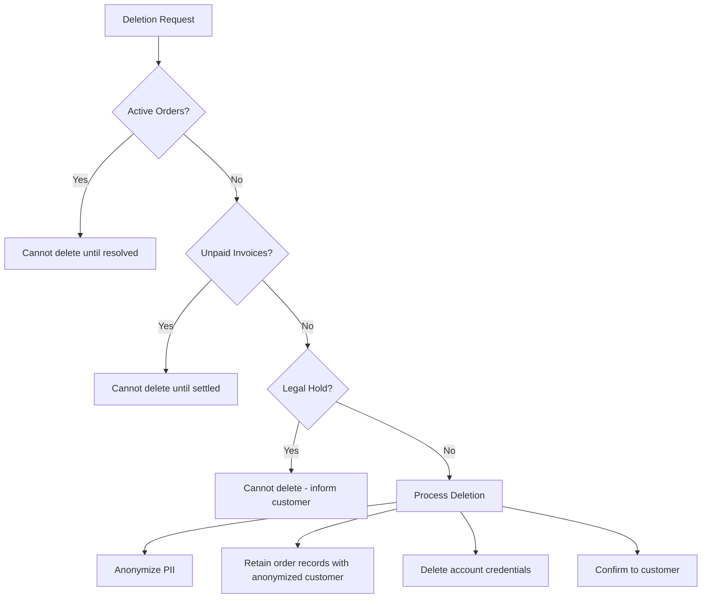

# Data Ownership & Privacy

**Document Status:** Draft — Pending Human Sign-off  
**Last Updated:** 2026-01-18  
**Version:** 1.0  
**Applicable Law:** Kenya Data Protection Act (DPA) 2019

---

## Overview

This document defines the data ownership, access, retention, and privacy policies for the TrustCart Kenya e-commerce platform. It establishes:

- Classification of all data types
- Clear ownership and responsibility assignments
- Access control rules by role
- Retention and deletion policies
- Compliance with Kenya's Data Protection Act 2019
- Risk considerations and mitigations

This policy governs all data handling across the platform and directly influences system design, API behavior, and operational procedures.

---

## 1. Data Categories

### 1.1 Data Classification Levels

| Level            | Code | Description                       | Examples                                   |
| ---------------- | ---- | --------------------------------- | ------------------------------------------ |
| **Public**       | L0   | Publicly visible, no restrictions | Product names, prices, category names      |
| **Internal**     | L1   | Business data, limited access     | Inventory levels, order counts, analytics  |
| **Confidential** | L2   | Sensitive business data           | Financial reports, supplier costs, margins |
| **Restricted**   | L3   | Highly sensitive, PII, regulated  | Customer PII, payment data, passwords      |

### 1.2 Data Category Definitions

#### 1.2.1 Personally Identifiable Information (PII) — Level L3

| Data Type               | Examples                                     | Sensitivity  |
| ----------------------- | -------------------------------------------- | ------------ |
| **Identity Data**       | Full name, date of birth, national ID        | Restricted   |
| **Contact Data**        | Email, phone number, physical address        | Restricted   |
| **Location Data**       | Delivery addresses, GPS coordinates          | Restricted   |
| **Account Credentials** | Password hashes, security questions          | Restricted   |
| **Device Data**         | IP address, device fingerprint, browser info | Confidential |

#### 1.2.2 Transactional Data — Level L2/L3

| Data Type           | Examples                              | Sensitivity               |
| ------------------- | ------------------------------------- | ------------------------- |
| **Order Data**      | Order details, line items, totals     | Confidential              |
| **Payment Data**    | MPesa phone, transaction IDs, amounts | Restricted                |
| **Payment Secrets** | Card numbers, CVV (if applicable)     | Restricted (never stored) |
| **Refund Data**     | Refund amounts, reasons, approvals    | Confidential              |
| **Delivery Data**   | Tracking info, courier assignments    | Confidential              |

#### 1.2.3 Operational Data — Level L1/L2

| Data Type           | Examples                                         | Sensitivity     |
| ------------------- | ------------------------------------------------ | --------------- |
| **Product Catalog** | Product info, images, specifications             | Public/Internal |
| **Inventory Data**  | Stock levels, adjustments, reservations          | Internal        |
| **Pricing Data**    | Base prices (public), cost prices (confidential) | Mixed           |
| **Promotion Data**  | Promo codes, discount rules                      | Internal        |
| **Staff Data**      | Admin accounts, roles, permissions               | Confidential    |
| **Audit Logs**      | System actions, state changes, timestamps        | Confidential    |

#### 1.2.4 Derived / Aggregated Data — Level L1/L2

| Data Type                    | Examples                                  | Sensitivity  |
| ---------------------------- | ----------------------------------------- | ------------ |
| **Analytics**                | Page views, conversion rates, traffic     | Internal     |
| **Reports**                  | Sales summaries, inventory reports        | Confidential |
| **KPIs**                     | Revenue, order count, average order value | Confidential |
| **Aggregated Customer Data** | Cohort analysis, purchase patterns        | Internal     |

---

## 2. Data Ownership

### 2.1 Ownership Matrix

| Data Category           | Primary Owner | Authority                 | Responsibilities                                                  |
| ----------------------- | ------------- | ------------------------- | ----------------------------------------------------------------- |
| **Customer PII**        | Customer      | Customer + System         | Customer provides; system stores; customer can request deletion   |
| **Account Credentials** | System        | System                    | System generates/stores; customer can reset                       |
| **Order Data**          | System        | System                    | System creates; customer and admin read; immutable after creation |
| **Payment Data**        | System        | System + Payment Provider | System initiates; provider confirms; system stores reference      |
| **Product Data**        | Business      | Admin                     | Admins create/edit; system serves                                 |
| **Inventory Data**      | Business      | Admin + System            | Admins adjust; system reserves/decrements                         |
| **Delivery Data**       | Business      | System + Provider         | System creates; courier updates; system stores                    |
| **Audit Logs**          | System        | System                    | System creates; immutable; admin read-only                        |
| **Analytics Data**      | System        | System                    | System generates; admin reads                                     |

### 2.2 Domain Ownership

| Domain               | Owned Data                          | Cross-Domain Read                     | Cross-Domain Write                    |
| -------------------- | ----------------------------------- | ------------------------------------- | ------------------------------------- |
| **User Domain**      | PII, credentials, preferences       | Order (reference), Review (reference) | —                                     |
| **Order Domain**     | Orders, order items, status history | Payment, Delivery, Product            | Inventory (reserve)                   |
| **Payment Domain**   | Transactions, refunds               | Order                                 | Order (status update on confirmation) |
| **Delivery Domain**  | Deliveries, tracking events         | Order                                 | Order (status update on delivery)     |
| **Product Domain**   | Products, categories, prices        | Inventory                             | —                                     |
| **Inventory Domain** | Stock levels, adjustments           | Product                               | —                                     |

### 2.3 Data Controller vs Data Processor

| Role                | Entity              | Description                                 |
| ------------------- | ------------------- | ------------------------------------------- |
| **Data Controller** | TrustCart Kenya Ltd | Determines purposes and means of processing |
| **Data Processor**  | MPesa/Safaricom     | Processes payments on our behalf            |
| **Data Processor**  | Courier Partners    | Processes delivery data on our behalf       |
| **Data Processor**  | Cloud Provider      | Stores data on our behalf                   |

> [!IMPORTANT]
> **DPA 2019 Requirement:** Data processing agreements must be in place with all data processors before launch.

---

## 3. Access Rules

### 3.1 Role-Based Access Control (RBAC)

| Data Type                    | Public | Customer   | Staff | Manager    | Admin |
| ---------------------------- | ------ | ---------- | ----- | ---------- | ----- |
| **Product catalog (public)** | Read   | Read       | Read  | Read/Write | Full  |
| **Product costs**            | —      | —          | —     | Read       | Full  |
| **Own customer PII**         | —      | Read/Write | —     | —          | —     |
| **Any customer PII**         | —      | —          | Read  | Read       | Full  |
| **Own orders**               | —      | Read       | —     | —          | —     |
| **All orders**               | —      | —          | Read  | Read/Write | Full  |
| **Payment transactions**     | —      | Own only   | Read  | Read       | Read  |
| **Refund processing**        | —      | —          | —     | Approve    | Full  |
| **Inventory levels**         | —      | —          | Read  | Read/Write | Full  |
| **Audit logs**               | —      | —          | —     | Read       | Read  |
| **Admin accounts**           | —      | —          | —     | —          | Full  |
| **System configuration**     | —      | —          | —     | —          | Full  |

### 3.2 Sensitive Data Access Rules

| Data Type                  | Access Rule                                   |
| -------------------------- | --------------------------------------------- |
| **Password hashes**        | System only; never exposed to any user or API |
| **Full payment details**   | System only; API returns masked values        |
| **Customer phone (MPesa)** | Masked in logs (last 4 digits only)           |
| **Customer email**         | Visible to authorized staff; masked in logs   |
| **Delivery address**       | Visible to authorized staff and courier       |
| **Customer IP address**    | System only; used for fraud detection         |

### 3.3 Data Masking Rules

| Data Type         | Storage      | Display to Staff | Display to Customer |
| ----------------- | ------------ | ---------------- | ------------------- |
| **Phone number**  | Full         | Full             | Full (own)          |
| **Email**         | Full         | Full             | Full (own)          |
| **Password**      | Hashed       | Never shown      | Never shown         |
| **MPesa receipt** | Full         | Full             | Full                |
| **Card number**   | Never stored | —                | —                   |
| **IP address**    | Full         | Masked           | Never shown         |

### 3.4 External Integration Access

| Integration        | Data Accessed              | Access Type                       | Constraints     |
| ------------------ | -------------------------- | --------------------------------- | --------------- |
| **MPesa Daraja**   | Phone, amount, order ref   | Write (initiate), Read (callback) | Signed requests |
| **Courier API**    | Address, phone, order ref  | Write (create), Read (status)     | API key auth    |
| **Email Provider** | Email, name, order details | Write (send)                      | API key auth    |
| **SMS Provider**   | Phone, message content     | Write (send)                      | API key auth    |
| **Analytics**      | Anonymized events          | Write                             | Aggregated only |

---

## 4. Retention Policy

### 4.1 Retention Periods

| Data Category                    | Retention Period           | Justification                              |
| -------------------------------- | -------------------------- | ------------------------------------------ |
| **Customer account data**        | Account lifetime + 2 years | Business relationship + dispute resolution |
| **Order data**                   | 7 years                    | Tax and legal requirements                 |
| **Payment transactions**         | 7 years                    | Financial audit requirements               |
| **Refund records**               | 7 years                    | Financial audit requirements               |
| **Delivery records**             | 3 years                    | Dispute resolution                         |
| **Product catalog (historical)** | Indefinite (archived)      | Reference for past orders                  |
| **Inventory adjustments**        | 3 years                    | Audit trail                                |
| **Audit logs**                   | 7 years                    | Security and compliance                    |
| **Analytics data**               | 3 years                    | Business intelligence                      |
| **Marketing consent records**    | Account lifetime + 5 years | Consent proof                              |
| **Failed/abandoned carts**       | 30 days                    | Operational cleanup                        |
| **Session data**                 | 24 hours after expiry      | Security                                   |
| **Email verification tokens**    | 24 hours                   | Security                                   |
| **Password reset tokens**        | 1 hour                     | Security                                   |

### 4.2 Archival Rules

| Data Type                     | Archive After | Archive Location | Access                   |
| ----------------------------- | ------------- | ---------------- | ------------------------ |
| **Orders > 2 years old**      | 2 years       | Cold storage     | Legal/Compliance only    |
| **Payment records > 2 years** | 2 years       | Cold storage     | Finance/Legal only       |
| **Audit logs > 1 year**       | 1 year        | Cold storage     | Security/Compliance only |

### 4.3 Extended Retention Conditions

Data may be retained beyond standard periods when:

| Condition                      | Action                         |
| ------------------------------ | ------------------------------ |
| **Active legal dispute**       | Retain until resolved + 1 year |
| **Regulatory investigation**   | Retain until closed + 5 years  |
| **Customer support case open** | Retain until resolved          |
| **Unpaid invoice**             | Retain until settled + 7 years |

---

## 5. Deletion & Anonymization

### 5.1 Customer-Requested Deletion (Right to Erasure)

Under DPA 2019, customers have the right to request deletion of their personal data.

| Scenario                     | Response                    | Timeline |
| ---------------------------- | --------------------------- | -------- |
| **Account deletion request** | Delete or anonymize PII     | 30 days  |
| **Marketing opt-out**        | Remove from marketing lists | 7 days   |
| **Data portability request** | Provide data export         | 30 days  |

#### Deletion Process

### 5.2 What Gets Deleted vs Anonymized

| Data Type               | Action                                        | Reason                       |
| ----------------------- | --------------------------------------------- | ---------------------------- |
| **Account credentials** | Delete                                        | No longer needed             |
| **Email address**       | Anonymize → `deleted_user_abc123@example.com` | Order records must remain    |
| **Phone number**        | Anonymize → `+254700000000`                   | Order records must remain    |
| **Name**                | Anonymize → `Deleted Customer`                | Order records must remain    |
| **Addresses**           | Delete                                        | Not needed for order history |
| **Order records**       | Retain (anonymized)                           | Legal/financial requirements |
| **Payment records**     | Retain (anonymized)                           | Financial audit              |
| **Reviews**             | Anonymize (keep content) or delete            | Customer choice              |

### 5.3 Automatic Data Cleanup

| Data Type                   | Trigger                   | Action              |
| --------------------------- | ------------------------- | ------------------- |
| **Abandoned carts**         | 30 days inactive          | Delete              |
| **Unverified accounts**     | 7 days after registration | Delete              |
| **Expired sessions**        | 24 hours after expiry     | Delete              |
| **Failed payment attempts** | 90 days                   | Archive then delete |
| **Expired promo codes**     | 1 year after expiry       | Archive             |

### 5.4 Log Data Retention

| Log Type             | Retention | Anonymization            |
| -------------------- | --------- | ------------------------ |
| **Application logs** | 90 days   | PII masked at write time |
| **Access logs**      | 1 year    | IP addresses retained    |
| **Security logs**    | 7 years   | Full data retained       |
| **Audit logs**       | 7 years   | Full data retained       |

---

## 6. Compliance Notes

### 6.1 Kenya Data Protection Act 2019 — Key Requirements

| Requirement               | Implementation                                                |
| ------------------------- | ------------------------------------------------------------- |
| **Registration**          | Register as data controller with ODPC before launch           |
| **Consent**               | Explicit consent for marketing; implied for service operation |
| **Purpose Limitation**    | Collect only data necessary for specified purposes            |
| **Data Minimization**     | Don't collect data we don't need                              |
| **Accuracy**              | Allow customers to correct their data                         |
| **Storage Limitation**    | Delete/anonymize when no longer needed                        |
| **Security**              | Implement appropriate technical and organizational measures   |
| **Data Subject Rights**   | Support access, correction, deletion requests                 |
| **Cross-Border Transfer** | Only to countries with adequate protection                    |
| **Breach Notification**   | Notify ODPC within 72 hours of breach                         |

### 6.2 Data Subject Rights (DPA 2019)

| Right                            | Description                     | Our Implementation          |
| -------------------------------- | ------------------------------- | --------------------------- |
| **Right to be Informed**         | Know how data is used           | Privacy policy on website   |
| **Right of Access**              | Get copy of their data          | Account data export feature |
| **Right to Rectification**       | Correct inaccurate data         | Edit profile functionality  |
| **Right to Erasure**             | Request data deletion           | Deletion request process    |
| **Right to Restrict Processing** | Limit how data is used          | Marketing opt-out           |
| **Right to Data Portability**    | Receive data in portable format | JSON export                 |
| **Right to Object**              | Object to certain processing    | Opt-out mechanisms          |

### 6.3 Consent Management

| Purpose                                 | Consent Type          | Default | Revocable                        |
| --------------------------------------- | --------------------- | ------- | -------------------------------- |
| **Account creation**                    | Explicit (checkbox)   | Off     | Yes (delete account)             |
| **Order processing**                    | Contractual necessity | —       | No (required for service)        |
| **Payment processing**                  | Contractual necessity | —       | No (required for service)        |
| **Delivery**                            | Contractual necessity | —       | No (required for service)        |
| **Email notifications (transactional)** | Legitimate interest   | On      | Partial (order updates required) |
| **Email marketing**                     | Explicit (opt-in)     | Off     | Yes                              |
| **SMS marketing**                       | Explicit (opt-in)     | Off     | Yes                              |
| **Analytics (anonymized)**              | Legitimate interest   | On      | Yes                              |

### 6.4 Payment Data Compliance

| Standard             | Applicability           | Implementation                                  |
| -------------------- | ----------------------- | ----------------------------------------------- |
| **PCI-DSS**          | Card payments (Phase 2) | Never store card numbers; use tokenized gateway |
| **MPesa Guidelines** | MPesa payments          | Follow Daraja API security requirements         |

> [!CAUTION]
> **Never Store:**
>
> - Full card numbers
> - CVV/CVC codes
> - Card PIN
> - MPesa PIN
>
> **Store Only:**
>
> - Last 4 digits (display)
> - Transaction reference numbers
> - MPesa receipt numbers

### 6.5 Cross-Border Data Transfer

| Destination         | Permitted?     | Requirement                           |
| ------------------- | -------------- | ------------------------------------- |
| **Kenya (primary)** | ✅ Yes         | Local hosting preferred               |
| **EU countries**    | ✅ Yes         | GDPR adequacy                         |
| **USA**             | ⚠️ Conditional | Standard contractual clauses required |
| **Other countries** | ⚠️ Conditional | Case-by-case assessment               |

### 6.6 Breach Notification

| Event                         | Action                    | Timeline            |
| ----------------------------- | ------------------------- | ------------------- |
| **Security breach detected**  | Assess scope and impact   | Immediate           |
| **Personal data compromised** | Notify ODPC               | Within 72 hours     |
| **High-risk breach**          | Notify affected customers | Without undue delay |
| **Document incident**         | Create incident report    | Within 7 days       |

---

## 7. Risk Considerations

### 7.1 Data Security Risks

| Risk                   | Likelihood | Impact   | Mitigation                                         |
| ---------------------- | ---------- | -------- | -------------------------------------------------- |
| **Database breach**    | Medium     | Critical | Encryption at rest, access controls, monitoring    |
| **API data exposure**  | Medium     | High     | Input validation, output filtering, rate limiting  |
| **Insider threat**     | Low        | High     | RBAC, audit logging, background checks             |
| **Third-party breach** | Medium     | High     | Vendor security assessment, data minimization      |
| **Phishing attacks**   | High       | Medium   | Staff training, MFA, email security                |
| **Ransomware**         | Low        | Critical | Backups, network segmentation, endpoint protection |

### 7.2 Privacy Risks

| Risk                                   | Likelihood | Impact | Mitigation                         |
| -------------------------------------- | ---------- | ------ | ---------------------------------- |
| **Over-collection of data**            | Medium     | Medium | Data minimization review           |
| **Purpose creep**                      | Medium     | Medium | Clear policies, consent management |
| **Consent not properly obtained**      | Medium     | High   | Clear consent UI, audit trail      |
| **Failure to honor deletion requests** | Low        | High   | Automated deletion workflow        |
| **Marketing without consent**          | Medium     | High   | Double opt-in, preference center   |

### 7.3 Agent/Automation Risks

| Risk                                     | Description                           | Mitigation                     |
| ---------------------------------------- | ------------------------------------- | ------------------------------ |
| **Agent accesses unauthorized data**     | Agent queries data beyond scope       | Enforce RBAC at API level      |
| **Agent exposes PII in logs**            | PII written to logs during operations | Mask PII before logging        |
| **Agent retains data inappropriately**   | Agent caches sensitive data           | No PII in agent context        |
| **Agent performs unauthorized deletion** | Agent deletes without proper checks   | Require approval for deletions |

---

## 8. Privacy by Design Principles

### 8.1 Implementation Principles

| Principle                     | Implementation                             |
| ----------------------------- | ------------------------------------------ |
| **Proactive not Reactive**    | Privacy built into design, not retrofitted |
| **Privacy as Default**        | Minimum data collection; opt-in for extras |
| **Privacy Embedded**          | Part of architecture, not an add-on        |
| **Functionality**             | Privacy doesn't compromise functionality   |
| **End-to-End Security**       | Data protected throughout lifecycle        |
| **Visibility & Transparency** | Clear privacy policy; open about practices |
| **Respect for User Privacy**  | User-centric; empower customers            |

### 8.2 Technical Controls Required

| Control                   | Purpose                            |
| ------------------------- | ---------------------------------- |
| **Encryption at rest**    | Protect stored data                |
| **Encryption in transit** | Protect data in transmission (TLS) |
| **Access logging**        | Track who accessed what            |
| **Data masking**          | Limit exposure of sensitive fields |
| **Input validation**      | Prevent injection attacks          |
| **Output encoding**       | Prevent XSS                        |
| **Rate limiting**         | Prevent abuse                      |
| **Session management**    | Secure authentication              |

---

## 9. Data Processing Activities Register

> [!NOTE]
> **DPA 2019 Requirement:** Maintain a record of processing activities.

| Activity                 | Data Types                      | Legal Basis         | Recipients         | Retention                  |
| ------------------------ | ------------------------------- | ------------------- | ------------------ | -------------------------- |
| **Account registration** | Name, email, phone, password    | Consent             | Internal           | Account lifetime + 2 years |
| **Order processing**     | Order details, payment, address | Contract            | Internal, courier  | 7 years                    |
| **Payment processing**   | Phone, amount, transaction      | Contract            | MPesa              | 7 years                    |
| **Delivery**             | Address, phone, order ref       | Contract            | Courier            | 3 years                    |
| **Customer support**     | All customer data               | Contract            | Internal           | Support case + 2 years     |
| **Marketing emails**     | Email, name, preferences        | Consent             | Email provider     | Until opt-out              |
| **Analytics**            | Anonymized usage data           | Legitimate interest | Analytics provider | 3 years                    |
| **Fraud prevention**     | IP, device, behavior            | Legitimate interest | Internal           | 2 years                    |

---

## Document Approval

| Role                    | Name | Status  | Date |
| ----------------------- | ---- | ------- | ---- |
| Data Protection Officer | —    | Pending | —    |
| Legal Counsel           | —    | Pending | —    |
| Technical Lead          | —    | Pending | —    |
| CEO                     | —    | Pending | —    |

---

## Appendix A: Data Subject Request Form Template

### Request for Data Deletion

| Field          | Value                                                   |
| -------------- | ------------------------------------------------------- |
| Customer Email |                                                         |
| Request Type   | ☐ Access ☐ Correction ☐ Deletion ☐ Portability          |
| Description    |                                                         |
| Date Received  |                                                         |
| Response Due   | (30 days from receipt)                                  |
| Status         | ☐ Received ☐ Verified ☐ Processing ☐ Completed ☐ Denied |
| Outcome        |                                                         |

---

_This document defines data ownership and privacy policies. All system design, API behavior, and operational procedures must comply with these policies. Violations require immediate escalation._
