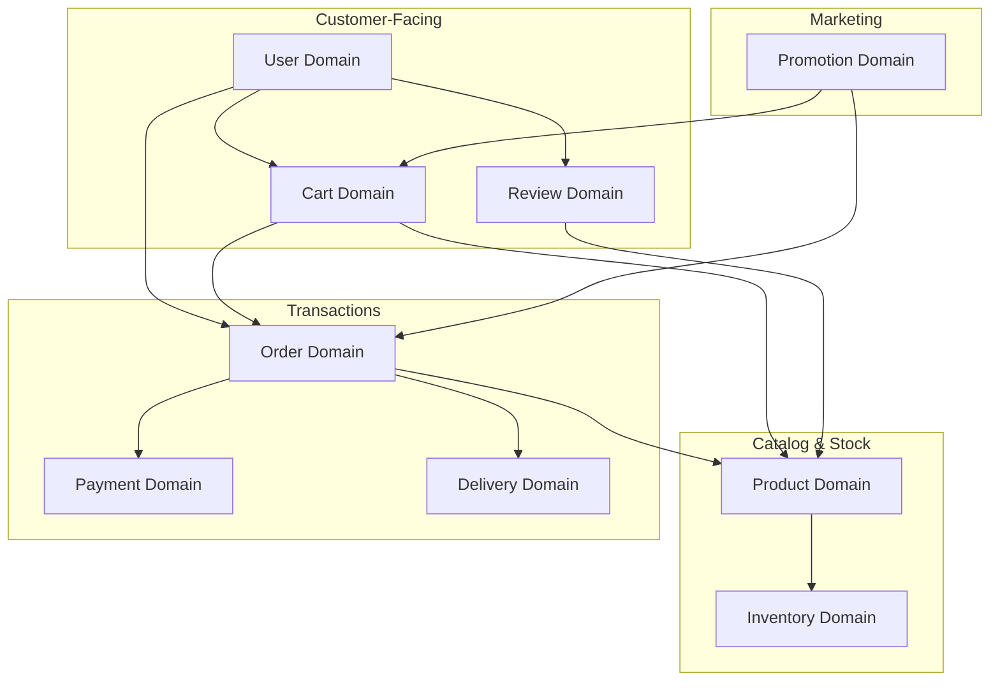
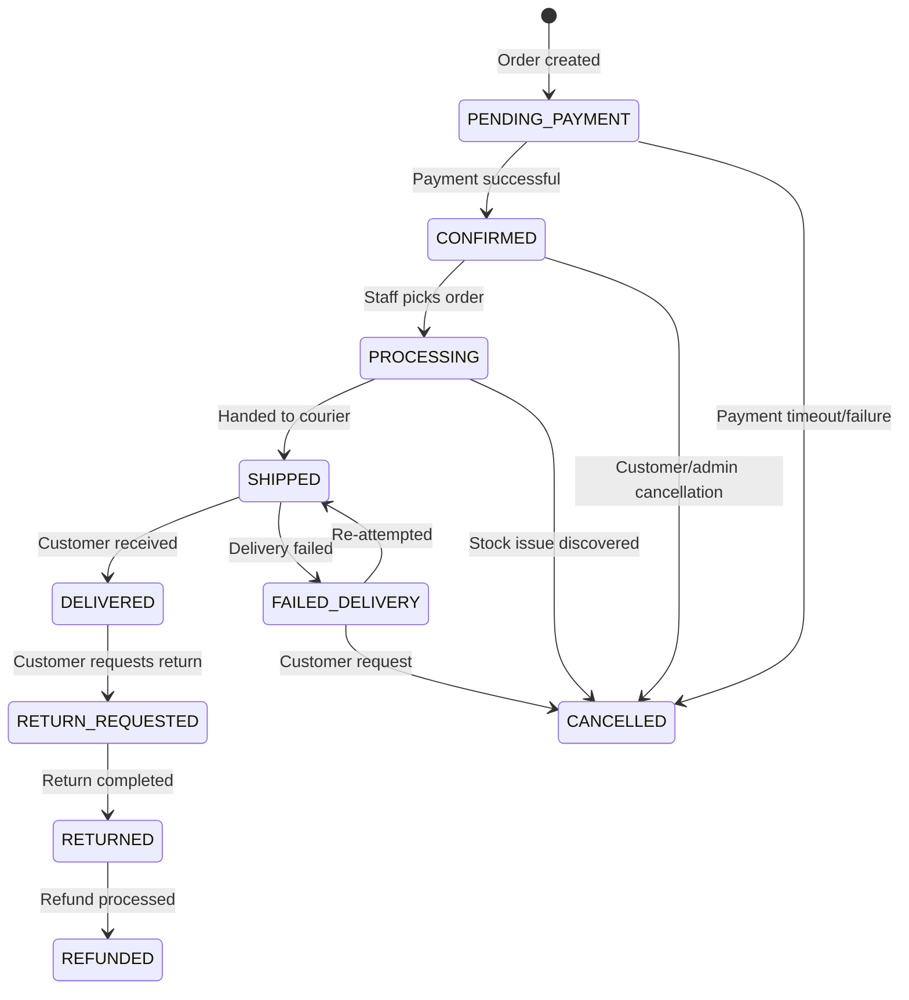
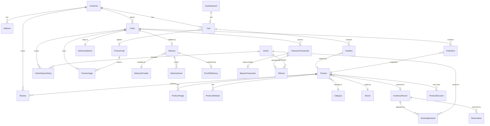

# Domain Model

**Document Status:** Draft — Pending Human Sign-off  
**Last Updated:** 2026-01-18  
**Version:** 1.0

---

## Overview

This document defines the core domains, entities, relationships, and business rules for the TrustCart Kenya e-commerce platform. It serves as the foundation for all architecture, API design, and agent-driven operations.

---

## 1. Core Domains

### 1.1 User Domain

**Purpose:** Manage identity, authentication, and authorization for all platform users.

| Aspect | Description |
|--------|-------------|
| **Responsibilities** | Registration, login, password management, profile management, role assignment |
| **Owns** | User identity, credentials, contact information, preferences |
| **Controlled By Others** | Order history (owned by Order), reviews (owned by Review) |

#### Key Entities

| Entity | Description | Key Attributes |
|--------|-------------|----------------|
| **Customer** | A person who browses and purchases products | `id`, `email`, `phone`, `name`, `passwordHash`, `createdAt`, `lastLoginAt` |
| **GuestSession** | An anonymous browsing session (not yet registered) | `sessionId`, `email` (captured at checkout), `phone`, `expiresAt` |
| **Admin** | Internal user with elevated privileges | `id`, `email`, `name`, `role`, `permissions`, `createdAt` |
| **Role** | Permission grouping for admins | `id`, `name`, `permissions[]` |
| **Address** | Saved delivery address | `id`, `customerId`, `label`, `line1`, `line2`, `city`, `county`, `phone`, `isDefault` |

#### Roles & Permissions (v1)

| Role | Permissions |
|------|-------------|
| **Customer** | Browse, cart, checkout, view own orders, submit reviews |
| **Admin (Staff)** | Manage products, view orders, update order status |
| **Admin (Manager)** | All Staff permissions + manage inventory, apply promotions |
| **Admin (Super)** | All permissions + manage users, refunds, system config |

---

### 1.2 Product Domain

**Purpose:** Manage the catalog of items available for sale.

| Aspect | Description |
|--------|-------------|
| **Responsibilities** | Product creation, attributes, categorization, pricing, images, condition |
| **Owns** | Product definitions, categories, pricing history |
| **Controlled By Others** | Stock levels (owned by Inventory), reviews (owned by Review) |

#### Key Entities

| Entity | Description | Key Attributes |
|--------|-------------|----------------|
| **Product** | A sellable item | `id`, `sku`, `name`, `description`, `condition`, `brand`, `price`, `vatInclusive`, `isActive`, `createdAt`, `updatedAt` |
| **Category** | Grouping for products | `id`, `name`, `slug`, `parentId`, `isActive` |
| **ProductImage** | Photos of a product | `id`, `productId`, `url`, `altText`, `sortOrder`, `isPrimary` |
| **ProductAttribute** | Key-value specifications | `id`, `productId`, `name`, `value` (e.g., "RAM": "16GB") |
| **Brand** | Manufacturer or brand | `id`, `name`, `slug`, `logoUrl` |

#### Product Condition Values

| Condition | Description |
|-----------|-------------|
| `BRAND_NEW` | Factory sealed, never used |
| `OPEN_BOX` | Opened but unused, all accessories included |
| `CERTIFIED_REFURBISHED` | Professionally restored, tested, with warranty |
| `EX_UK` | Used, imported from UK, graded condition |
| `EX_USA` | Used, imported from USA, graded condition |

---

### 1.3 Inventory Domain

**Purpose:** Track physical stock levels and availability.

| Aspect | Description |
|--------|-------------|
| **Responsibilities** | Stock counts, reservations, adjustments, low-stock alerts |
| **Owns** | Stock quantities, reservation holds, adjustment history |
| **Controlled By Others** | Product definitions (owned by Product) |

#### Key Entities

| Entity | Description | Key Attributes |
|--------|-------------|----------------|
| **InventoryRecord** | Stock level for a product | `id`, `productId`, `quantityOnHand`, `quantityReserved`, `quantityAvailable`, `reorderThreshold` |
| **StockAdjustment** | Manual or system stock change | `id`, `productId`, `adjustmentType`, `quantity`, `reason`, `adminId`, `createdAt` |
| **Reservation** | Temporary hold during checkout | `id`, `productId`, `orderId`, `quantity`, `expiresAt`, `status` |

#### Adjustment Types

| Type | Trigger |
|------|---------|
| `PURCHASE` | Stock received from supplier |
| `SALE` | Order completed and shipped |
| `RETURN` | Customer returned item |
| `DAMAGE` | Item damaged or unsellable |
| `CORRECTION` | Manual count correction |

---

### 1.4 Cart Domain

**Purpose:** Manage temporary order state before checkout.

| Aspect | Description |
|--------|-------------|
| **Responsibilities** | Adding/removing items, quantity updates, promo code application, cart expiration |
| **Owns** | Cart contents, applied promotions |
| **Controlled By Others** | Product info (owned by Product), pricing (owned by Product), stock availability (owned by Inventory) |

#### Key Entities

| Entity | Description | Key Attributes |
|--------|-------------|----------------|
| **Cart** | Shopping cart instance | `id`, `customerId` (nullable for guests), `sessionId`, `promoCodeId`, `createdAt`, `updatedAt`, `expiresAt` |
| **CartItem** | Line item in cart | `id`, `cartId`, `productId`, `quantity`, `priceAtAdd`, `addedAt` |

#### Cart Behavior Rules

| Rule | Description |
|------|-------------|
| **Guest carts** | Carts for unauthenticated users, identified by session ID |
| **Cart merge** | When guest logs in, guest cart merges into customer cart |
| **Cart expiration** | Guest carts expire after 7 days of inactivity |
| **Price snapshot** | `priceAtAdd` captures price when item added; checkout uses current price from Product |

---

### 1.5 Order Domain

**Purpose:** Manage the lifecycle of confirmed purchases.

| Aspect | Description |
|--------|-------------|
| **Responsibilities** | Order creation, status transitions, line items, totals, customer communication |
| **Owns** | Order records, order items, status history, order totals |
| **Controlled By Others** | Payment status (owned by Payment), delivery status (owned by Delivery) |

#### Key Entities

| Entity | Description | Key Attributes |
|--------|-------------|----------------|
| **Order** | A confirmed purchase | `id`, `orderNumber`, `customerId`, `email`, `phone`, `status`, `subtotal`, `deliveryFee`, `discount`, `total`, `paymentMethod`, `createdAt`, `updatedAt` |
| **OrderItem** | Line item in order | `id`, `orderId`, `productId`, `productName`, `productSku`, `quantity`, `unitPrice`, `lineTotal` |
| **OrderStatusHistory** | Audit trail of status changes | `id`, `orderId`, `fromStatus`, `toStatus`, `changedBy`, `reason`, `createdAt` |
| **DeliveryAddress** | Snapshot of delivery address | `id`, `orderId`, `recipientName`, `phone`, `line1`, `line2`, `city`, `county` |

#### Order Status Flow

| Status | Description |
|--------|-------------|
| `PENDING_PAYMENT` | Order created, awaiting payment confirmation |
| `CONFIRMED` | Payment confirmed, order ready for processing |
| `PROCESSING` | Order being picked and packed |
| `SHIPPED` | Order handed to delivery provider |
| `DELIVERED` | Customer has received the order |
| `FAILED_DELIVERY` | Delivery attempt failed |
| `CANCELLED` | Order cancelled (various reasons) |
| `RETURN_REQUESTED` | Customer initiated return |
| `RETURNED` | Product received back |
| `REFUNDED` | Refund issued |

---

### 1.6 Payment Domain

**Purpose:** Handle all money movement and payment verification.

| Aspect | Description |
|--------|-------------|
| **Responsibilities** | Payment initiation, verification, confirmation, refunds, reconciliation |
| **Owns** | Transaction records, payment status, refund records |
| **Controlled By Others** | Order association (owned by Order) |

> [!CAUTION]
> **High-Risk Domain:** All changes to payment logic require human approval.

#### Key Entities

| Entity | Description | Key Attributes |
|--------|-------------|----------------|
| **PaymentTransaction** | A payment attempt | `id`, `orderId`, `method`, `amount`, `currency`, `status`, `providerRef`, `initiatedAt`, `confirmedAt`, `failedAt` |
| **MpesaTransaction** | MPesa-specific details | `id`, `transactionId`, `phoneNumber`, `mpesaReceiptNumber`, `checkoutRequestId`, `resultCode`, `resultDesc` |
| **Refund** | A refund record | `id`, `orderId`, `transactionId`, `amount`, `reason`, `status`, `processedBy`, `processedAt` |

#### Payment Methods

| Method | Code | Description |
|--------|------|-------------|
| MPesa STK Push | `MPESA_STK` | Customer receives push to confirm |
| MPesa Paybill | `MPESA_PAYBILL` | Customer initiates manually |
| Pay on Delivery | `POD_CASH` | Cash collected at delivery |
| Card (Phase 2) | `CARD` | Visa/Mastercard via gateway |

#### Payment Status Flow

| Status | Description |
|--------|-------------|
| `INITIATED` | Payment request sent to provider |
| `PENDING` | Awaiting customer action or callback |
| `CONFIRMED` | Payment verified and successful |
| `FAILED` | Payment failed or declined |
| `CANCELLED` | Payment cancelled by customer |
| `REFUNDED` | Payment refunded (full or partial) |

---

### 1.7 Delivery Domain

**Purpose:** Manage order fulfillment and logistics.

| Aspect | Description |
|--------|-------------|
| **Responsibilities** | Delivery scheduling, provider assignment, tracking, proof of delivery |
| **Owns** | Delivery records, tracking events, provider details |
| **Controlled By Others** | Order and address (owned by Order) |

#### Key Entities

| Entity | Description | Key Attributes |
|--------|-------------|----------------|
| **Delivery** | Fulfillment record for an order | `id`, `orderId`, `providerId`, `status`, `zone`, `fee`, `scheduledDate`, `trackingNumber`, `deliveredAt` |
| **DeliveryProvider** | Courier or logistics company | `id`, `name`, `code`, `contactPhone`, `isActive` |
| **DeliveryEvent** | Tracking events | `id`, `deliveryId`, `eventType`, `description`, `location`, `occurredAt` |
| **ProofOfDelivery** | Delivery confirmation | `id`, `deliveryId`, `recipientName`, `signatureUrl`, `photoUrl`, `collectedAt` |

#### Delivery Status Flow

| Status | Description |
|--------|-------------|
| `PENDING` | Order confirmed, awaiting dispatch |
| `ASSIGNED` | Courier assigned |
| `DISPATCHED` | Order picked up by courier |
| `IN_TRANSIT` | En route to customer |
| `OUT_FOR_DELIVERY` | With local delivery agent |
| `DELIVERED` | Successfully delivered |
| `FAILED` | Delivery attempt failed |
| `RETURNED_TO_SENDER` | Returned after failed attempts |

#### Delivery Zones

| Zone | Code | Coverage |
|------|------|----------|
| Zone 1 | `NRB_CBD` | Nairobi CBD & Environs |
| Zone 2 | `NRB_METRO` | Greater Nairobi |
| Zone 3 | `MAJOR_TOWN` | Mombasa, Kisumu, Nakuru, Eldoret |
| Zone 4 | `OTHER` | Rest of Kenya |

---

### 1.8 Promotion Domain

**Purpose:** Manage discounts, promo codes, and campaigns.

| Aspect | Description |
|--------|-------------|
| **Responsibilities** | Promo code creation, validation, usage tracking, expiration |
| **Owns** | Promo codes, discount rules, usage records |
| **Controlled By Others** | Applied at Cart level (Cart owns application) |

#### Key Entities

| Entity | Description | Key Attributes |
|--------|-------------|----------------|
| **PromoCode** | Discount code | `id`, `code`, `discountType`, `discountValue`, `minOrderValue`, `maxUsageTotal`, `maxUsagePerCustomer`, `startsAt`, `expiresAt`, `isActive` |
| **PromoUsage** | Record of code usage | `id`, `promoCodeId`, `customerId`, `orderId`, `discountApplied`, `usedAt` |
| **ProductDiscount** | Direct discount on product | `id`, `productId`, `discountType`, `discountValue`, `startsAt`, `expiresAt`, `isActive` |

#### Discount Types

| Type | Code | Description |
|------|------|-------------|
| Percentage | `PERCENT` | % off order or product |
| Fixed Amount | `FIXED` | KES off order or product |
| Free Delivery | `FREE_DELIVERY` | Waive delivery fee |

---

### 1.9 Review Domain

**Purpose:** Manage customer feedback and product ratings.

| Aspect | Description |
|--------|-------------|
| **Responsibilities** | Review submission, moderation, rating aggregation |
| **Owns** | Reviews, ratings |
| **Controlled By Others** | Product association (Product domain), Customer association (User domain) |

#### Key Entities

| Entity | Description | Key Attributes |
|--------|-------------|----------------|
| **Review** | Customer product review | `id`, `productId`, `customerId`, `orderId`, `rating`, `title`, `body`, `status`, `createdAt`, `moderatedAt` |

#### Review Status

| Status | Description |
|--------|-------------|
| `PENDING` | Awaiting moderation |
| `APPROVED` | Visible on site |
| `REJECTED` | Rejected by moderator |

#### Review Rules

- Only customers who purchased the product can review it
- One review per product per customer
- Reviews require rating (1-5 stars); text is optional
- Reviews are moderated before publication

---

## 2. Entity Relationships

### 2.1 Relationship Diagram

### 2.2 Ownership Boundaries

| Domain | Owns | References (Read-Only) |
|--------|------|------------------------|
| **User** | Customer, Admin, Address, Role | — |
| **Product** | Product, Category, Brand, ProductImage, ProductAttribute | — |
| **Inventory** | InventoryRecord, StockAdjustment, Reservation | Product (id only) |
| **Cart** | Cart, CartItem | Product, PromoCode, Customer/Session |
| **Order** | Order, OrderItem, OrderStatusHistory, DeliveryAddress | Product (snapshot), Customer, PromoCode |
| **Payment** | PaymentTransaction, MpesaTransaction, Refund | Order |
| **Delivery** | Delivery, DeliveryProvider, DeliveryEvent, ProofOfDelivery | Order |
| **Promotion** | PromoCode, PromoUsage, ProductDiscount | Product, Customer |
| **Review** | Review | Product, Customer, Order |

### 2.3 Cross-Domain Access Rules

| Accessor Domain | Target Domain | Access Type | Purpose |
|-----------------|---------------|-------------|---------|
| Cart | Product | Read | Display product info, current price |
| Cart | Inventory | Read | Check availability |
| Cart | Promotion | Read | Validate promo code |
| Order | Product | Snapshot | Copy product details at order time |
| Order | Inventory | Write | Reserve/release stock |
| Order | Payment | Read | Check payment status |
| Order | Delivery | Read | Check delivery status |
| Payment | Order | Write | Update order status on payment confirmation |
| Delivery | Order | Write | Update order status on delivery events |
| Review | Order | Read | Verify purchase before allowing review |

---

## 3. Invariants & Business Rules

### 3.1 User Domain Invariants

| ID | Rule | Enforcement |
|----|------|-------------|
| U1 | Email must be unique across all customers | Reject duplicate registration |
| U2 | Phone number must be valid Kenyan format (+254...) | Validation at input |
| U3 | Password must meet minimum complexity requirements | Validation at input |
| U4 | Admin roles cannot be self-assigned | Requires higher-level admin |

### 3.2 Product Domain Invariants

| ID | Rule | Enforcement |
|----|------|-------------|
| P1 | SKU must be unique across all products | Database constraint |
| P2 | Price must be positive (> 0) | Validation at input |
| P3 | Inactive products cannot be added to cart | Check at cart add |
| P4 | Product must have at least one image before activation | Validation before activation |

### 3.3 Inventory Domain Invariants

| ID | Rule | Enforcement |
|----|------|-------------|
| I1 | `quantityOnHand` cannot be negative | Reject updates that would cause negative |
| I2 | `quantityAvailable = quantityOnHand - quantityReserved` | Computed field |
| I3 | Reservations expire and release hold automatically | Background process |
| I4 | Stock adjustments require a reason | Mandatory field |

### 3.4 Cart Domain Invariants

| ID | Rule | Enforcement |
|----|------|-------------|
| C1 | Cart item quantity cannot exceed available inventory | Check at add and checkout |
| C2 | Only one promo code per cart | Reject second code |
| C3 | Guest cart merges into customer cart on login | Merge logic on authentication |
| C4 | Expired carts are purged automatically | Background process |

### 3.5 Order Domain Invariants

| ID | Rule | Enforcement |
|----|------|-------------|
| O1 | Order status transitions must follow defined state machine | Reject invalid transitions |
| O2 | Order cannot be created with zero items | Validation at creation |
| O3 | Order total must equal sum of line totals + delivery fee - discount | Computed and validated |
| O4 | Order cannot transition to CONFIRMED without successful payment | Payment callback triggers transition |
| O5 | Order items are immutable after order creation | No update allowed |
| O6 | CANCELLED orders cannot transition to any other status | Terminal state |
| O7 | DELIVERED orders can only transition to RETURN_REQUESTED | Limited transitions |

### 3.6 Payment Domain Invariants

| ID | Rule | Enforcement |
|----|------|-------------|
| PY1 | Payment amount must equal order total | Validation at initiation |
| PY2 | Only CONFIRMED payments can be refunded | Check before refund |
| PY3 | Refund amount cannot exceed original payment amount | Validation at refund |
| PY4 | Refund requires reason and admin authorization | Mandatory fields |
| PY5 | MPesa receipt number must be unique | Reject duplicates |

### 3.7 Delivery Domain Invariants

| ID | Rule | Enforcement |
|----|------|-------------|
| D1 | Delivery cannot be created for unpaid orders (except PoD) | Check at creation |
| D2 | Delivery status transitions must follow defined state machine | Reject invalid transitions |
| D3 | Proof of delivery required for DELIVERED status | Validation before transition |
| D4 | Delivery fee is based on zone and order value | Calculated per rules |

### 3.8 Promotion Domain Invariants

| ID | Rule | Enforcement |
|----|------|-------------|
| PR1 | Promo code cannot be used after expiration | Check at application |
| PR2 | Promo code usage cannot exceed maxUsageTotal | Check at application |
| PR3 | Customer cannot use same code more than maxUsagePerCustomer times | Check at application |
| PR4 | Discount cannot reduce order total below zero | Validation at calculation |
| PR5 | Discount cannot exceed 50% without CEO approval | Business rule flag |

### 3.9 Review Domain Invariants

| ID | Rule | Enforcement |
|----|------|-------------|
| R1 | Only customers with DELIVERED orders for product can review | Check at submission |
| R2 | One review per product per customer | Check at submission |
| R3 | Rating must be 1-5 | Validation at input |
| R4 | Review must be moderated before public display | Status workflow |

---

## 4. Risk Points

### 4.1 High-Risk Domains

| Domain | Risk Level | Primary Risks |
|--------|------------|---------------|
| **Payment** | 🔴 Critical | Fraud, double-charging, missed payments, refund abuse |
| **Order** | 🔴 Critical | Incorrect totals, invalid state transitions, orphaned orders |
| **Inventory** | 🟠 High | Overselling, negative stock, ghost stock |
| **Delivery** | 🟠 High | Failed deliveries, PoD non-payment, address fraud |
| **Promotion** | 🟡 Medium | Code abuse, unintended discounts, stacking errors |

### 4.2 Specific Risk Scenarios

| Risk | Domain | Description | Mitigation |
|------|--------|-------------|------------|
| **Fake payment confirmation** | Payment | Fraudster sends fake screenshot | Only trust MPesa callbacks; never screenshots |
| **Double payment** | Payment | Customer pays twice for same order | Lock order on first payment initiation; idempotency keys |
| **Overselling** | Inventory | More orders placed than stock available | Reserve stock at checkout; expire reservations |
| **PoD non-payment** | Payment/Delivery | Customer refuses to pay on delivery | Limit PoD order value; blacklist repeat offenders |
| **Cart stockpiling** | Cart/Inventory | Competitor adds items to cart to block stock | Cart expiration; no indefinite reservations |
| **Promo code sharing** | Promotion | Single-use codes shared publicly | Track by customer ID and phone; limit redemptions |
| **Return fraud** | Order | Customer returns empty box or different item | Verify serial numbers; photograph on receipt |
| **Price manipulation** | Product | Admin error sets wrong price | Audit trail; price change alerts |

---

## 5. Human Approval Gates

### 5.1 Operations Requiring Human Approval

| Domain | Operation | Approval Required From | Reason |
|--------|-----------|------------------------|--------|
| **Payment** | Process refund | Manager or higher | Money movement |
| **Payment** | Reverse confirmed payment | Super Admin | Irreversible financial action |
| **Order** | Cancel SHIPPED order | Manager | Logistics already engaged |
| **Order** | Override order total | Super Admin | Financial risk |
| **Inventory** | Adjust stock (non-sale) | Staff + Manager review | Audit trail requirement |
| **Product** | Activate product with 0 stock | Manager | Prevents overselling |
| **Product** | Price change > 20% | Manager | Prevents pricing errors |
| **Promotion** | Create discount > 30% | Manager | Margin protection |
| **Promotion** | Create discount > 50% | CEO | Exceptional discount |
| **User** | Assign Admin role | Super Admin | Security |
| **User** | Deactivate customer account | Manager | Customer impact |

### 5.2 Automated Actions (No Approval Needed)

| Domain | Operation | Condition |
|--------|-----------|-----------|
| Order | Cancel pending payment order | Payment timeout (24 hours) |
| Cart | Purge expired cart | Inactivity timeout (7 days) |
| Inventory | Release reservation | Reservation timeout (30 minutes) |
| Payment | Confirm payment | Valid MPesa callback received |
| Delivery | Update delivery status | Valid webhook from provider |

---

## 6. Domain Boundaries Summary

| Domain | Boundary Type | External Dependencies |
|--------|---------------|----------------------|
| **User** | Self-contained | Email provider (password reset) |
| **Product** | Self-contained | None |
| **Inventory** | Self-contained | None |
| **Cart** | Cross-domain reads | Product, Inventory, Promotion |
| **Order** | Cross-domain orchestrator | All domains |
| **Payment** | External integration | MPesa, Card gateway (Phase 2) |
| **Delivery** | External integration | Courier providers |
| **Promotion** | Self-contained | None |
| **Review** | Cross-domain reads | Product, Order, User |

---

## Document Approval

| Role | Name | Status | Date |
|------|------|--------|------|
| Technical Architect | — | Pending | — |
| Product Owner | — | Pending | — |
| Engineering Lead | — | Pending | — |

---

*This document serves as the foundation for all architecture, API design, and agent behavior. Deviations require explicit approval and documentation.*
