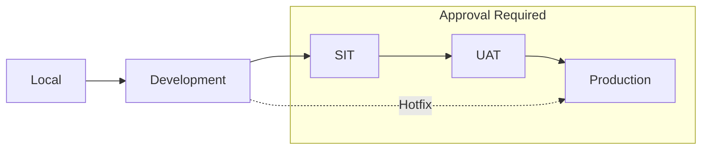
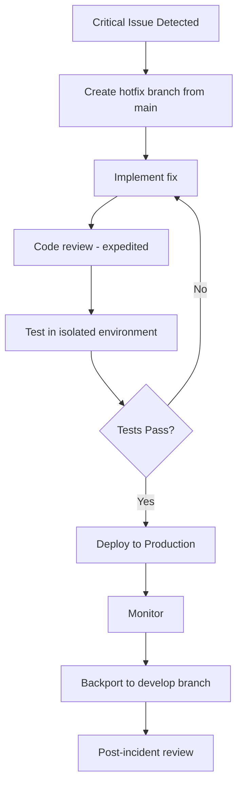

# Environment Strategy

**Document Status:** Draft — Pending Human Sign-off  
**Last Updated:** 2026-01-18  
**Version:** 1.0

---

## Overview

This document defines the environment strategy for the TrustCart Kenya e-commerce platform. It establishes:

- All environments and their purposes
- Data handling rules for each environment
- Secrets management policies
- Code promotion and rollback procedures

This strategy ensures safe, predictable, and auditable development and deployment workflows.

---

## 1. Environment List

### 1.1 Environment Summary

| Environment | Code | Purpose | Stability | Data Type |
|-------------|------|---------|-----------|-----------|
| **Local** | `local` | Developer workstation | Unstable | Synthetic / Mock |
| **Development** | `dev` | Integration and feature development | Unstable | Synthetic |
| **SIT** | `sit` | System Integration Testing | Semi-stable | Synthetic |
| **UAT** | `uat` | User Acceptance Testing | Stable | Masked production / Synthetic |
| **Production** | `prod` | Live customer-facing system | Stable | Real |

### 1.2 Environment Details

#### Local (`local`)

| Attribute | Value |
|-----------|-------|
| **Purpose** | Developer workstation for coding and unit testing |
| **Who Uses** | Individual developers |
| **Deployment** | Manual / local tooling |
| **Data** | Mock data, synthetic fixtures |
| **External Services** | Mocked or stubbed (no real MPesa, email, etc.) |
| **Secrets** | Local `.env` file (not committed) |
| **Stability** | Unstable; frequently reset |

#### Development (`dev`)

| Attribute | Value |
|-----------|-------|
| **Purpose** | Shared environment for feature integration |
| **Who Uses** | Development team |
| **Deployment** | Automatic on merge to `develop` branch |
| **Data** | Synthetic test data; refreshed weekly |
| **External Services** | Sandbox/test endpoints (MPesa sandbox, test email) |
| **Secrets** | Environment-specific, stored in secrets manager |
| **Stability** | Unstable; may break during development |

#### System Integration Testing (`sit`)

| Attribute | Value |
|-----------|-------|
| **Purpose** | Test integrations between components and external services |
| **Who Uses** | QA team, developers |
| **Deployment** | Manual promotion from `dev` |
| **Data** | Synthetic data with realistic volume |
| **External Services** | Sandbox endpoints with realistic behavior |
| **Secrets** | Environment-specific, stricter access |
| **Stability** | Semi-stable; scheduled test runs |

#### User Acceptance Testing (`uat`)

| Attribute | Value |
|-----------|-------|
| **Purpose** | Business stakeholder validation before production |
| **Who Uses** | Product owner, business stakeholders, QA |
| **Deployment** | Manual promotion from `sit` with approval |
| **Data** | Masked production data or high-fidelity synthetic |
| **External Services** | Sandbox endpoints configured to mimic production |
| **Secrets** | Environment-specific; limited access |
| **Stability** | Stable; changes only with approval |

#### Production (`prod`)

| Attribute | Value |
|-----------|-------|
| **Purpose** | Live system serving real customers |
| **Who Uses** | Customers, admins, operations |
| **Deployment** | Manual promotion from `uat` with multi-approval |
| **Data** | Real customer data, real transactions |
| **External Services** | Production endpoints (MPesa production, real email) |
| **Secrets** | Production secrets; highly restricted access |
| **Stability** | Stable; changes require strict process |

---

## 2. Data Rules

### 2.1 Data Classification by Environment

| Data Type | Local | Dev | SIT | UAT | Prod |
|-----------|-------|-----|-----|-----|------|
| **Real Customer PII** | ❌ Never | ❌ Never | ❌ Never | ❌ Never | ✅ Yes |
| **Masked Customer Data** | ❌ | ❌ | ⚠️ Optional | ✅ Preferred | ❌ |
| **Synthetic Data** | ✅ | ✅ | ✅ | ⚠️ Optional | ❌ |
| **Mock Data** | ✅ | ⚠️ | ❌ | ❌ | ❌ |
| **Real Transactions** | ❌ Never | ❌ Never | ❌ Never | ❌ Never | ✅ Yes |
| **Test Transactions** | ✅ | ✅ | ✅ | ✅ | ❌ |
| **Real Payment Credentials** | ❌ Never | ❌ Never | ❌ Never | ❌ Never | ✅ Yes |

### 2.2 Data Rules by Category

#### Customer Data (PII)

| Rule | Description |
|------|-------------|
| **Production Only** | Real customer PII exists only in production |
| **No Copy Down** | Production customer data must never be copied to lower environments |
| **Masking Required** | If UAT needs realistic data, use masked copies (email, phone, name anonymized) |
| **Synthetic Preferred** | Use data generators for non-production environments |

#### Transaction Data

| Rule | Description |
|------|-------------|
| **Production Only** | Real orders, payments, refunds exist only in production |
| **Test Data** | Use clearly marked test transactions in lower environments |
| **No Replay** | Never replay production transactions in lower environments |

#### Product & Catalog Data

| Rule | Description |
|------|-------------|
| **Copy Allowed** | Product catalog can be copied to lower environments |
| **Price Caution** | Mark clearly as test data; avoid confusion with real prices |
| **Images** | Can be shared across environments |

### 2.3 Data Refresh Rules

| Environment | Refresh Frequency | Process |
|-------------|-------------------|---------|
| **Local** | Developer-controlled | Reset scripts, fixtures |
| **Dev** | Weekly (Sunday) | Automated synthetic data seed |
| **SIT** | Before each test cycle | Scripted environment reset |
| **UAT** | Before each UAT cycle | Masked production snapshot or fresh synthetic |
| **Prod** | Never reset | N/A |

### 2.4 High-Risk Data Restrictions

> [!CAUTION]
> The following data must NEVER exist outside production:

| Data Type | Restriction |
|-----------|-------------|
| **Real MPesa transaction IDs** | Production only |
| **Real customer phone numbers** | Production only |
| **Real customer email addresses** | Production only |
| **Real delivery addresses** | Production only |
| **Production API keys/secrets** | Production environment only |
| **Payment reconciliation data** | Production only |

---

## 3. Secrets Management

### 3.1 Secret Categories

| Category | Examples | Sensitivity |
|----------|----------|-------------|
| **Infrastructure** | Database passwords, Redis passwords | High |
| **API Keys - Internal** | Inter-service authentication | Medium |
| **API Keys - External** | MPesa API keys, email provider | High |
| **Payment Credentials** | MPesa consumer key/secret, paybill | Critical |
| **Encryption Keys** | Data encryption keys, JWT signing | Critical |
| **Third-Party Tokens** | Courier API keys, SMS provider | High |

### 3.2 Secrets Storage by Environment

| Environment | Storage Method | Access Control |
|-------------|----------------|----------------|
| **Local** | `.env` file (git-ignored) | Developer only |
| **Dev** | Cloud secrets manager | Dev team read access |
| **SIT** | Cloud secrets manager | QA + Dev read access |
| **UAT** | Cloud secrets manager | Limited team access |
| **Prod** | Cloud secrets manager | Ops/Admin only; no dev access |

### 3.3 Secret Access Principles

| Principle | Description |
|-----------|-------------|
| **Least Privilege** | Only grant access to secrets that are needed |
| **Environment Isolation** | Production secrets never accessible from lower environments |
| **No Secrets in Code** | Never commit secrets to version control |
| **No Secrets in Logs** | Mask secrets in all log output |
| **Audit Trail** | Log all secret access for production |

### 3.4 Secret Rotation Policy

| Secret Type | Rotation Frequency | Process |
|-------------|-------------------|---------|
| **Database passwords** | 90 days | Automated rotation |
| **API keys - internal** | 90 days | Rolling update |
| **API keys - external** | On provider recommendation | Manual coordination |
| **Payment credentials** | 180 days or on breach | Manual with provider |
| **JWT signing keys** | 90 days | Rolling key rotation |
| **Encryption keys** | Annually | Key versioning, gradual migration |

### 3.5 Secret Retrieval

| Method | When Used | Notes |
|--------|-----------|-------|
| **Environment variables** | Runtime configuration | Injected by platform |
| **Secrets manager API** | Application retrieval | Secure, audited access |
| **Mounted files** | Container environments | Read-only, secured |

### 3.6 Breach Response

| If Secret Is Compromised | Action |
|--------------------------|--------|
| **Production secret** | Rotate immediately; audit access logs; assess impact |
| **Non-production secret** | Rotate; review access controls |
| **Payment credential** | Notify payment provider immediately; rotate; audit |

---

## 4. Promotion Rules

### 4.1 Promotion Pipeline

### 4.2 Branch Strategy

| Branch | Environment | Purpose |
|--------|-------------|---------|
| `feature/*` | Local / Dev | Feature development |
| `develop` | Dev | Integration branch |
| `release/*` | SIT → UAT | Release candidate |
| `main` | Production | Stable production code |
| `hotfix/*` | Prod → Dev | Emergency fixes |

### 4.3 Promotion Requirements

#### Local → Development

| Requirement | Details |
|-------------|---------|
| **Trigger** | Merge to `develop` branch |
| **Approval** | Code review (1 developer) |
| **Tests** | Unit tests pass |
| **Deployment** | Automatic |

#### Development → SIT

| Requirement | Details |
|-------------|---------|
| **Trigger** | Manual promotion / release branch creation |
| **Approval** | Tech Lead |
| **Tests** | Unit + integration tests pass |
| **Deployment** | Semi-automatic with approval |

#### SIT → UAT

| Requirement | Details |
|-------------|---------|
| **Trigger** | QA sign-off on SIT testing |
| **Approval** | QA Lead + Tech Lead |
| **Tests** | All automated tests + QA test report |
| **Deployment** | Manual with approval |

#### UAT → Production

| Requirement | Details |
|-------------|---------|
| **Trigger** | Business sign-off on UAT |
| **Approval** | Product Owner + Tech Lead + Operations Lead |
| **Tests** | UAT test report + regression suite |
| **Deployment** | Manual with multi-approval |
| **Window** | Scheduled deployment windows (avoid peak hours) |
| **Monitoring** | Enhanced monitoring post-deployment |

### 4.4 Deployment Windows

| Environment | Deployment Window | Restrictions |
|-------------|-------------------|--------------|
| **Local** | Anytime | — |
| **Dev** | Anytime | — |
| **SIT** | Business hours | Coordinate with QA |
| **UAT** | Business hours | Advance notice to stakeholders |
| **Prod** | Tue-Thu, 6:00-10:00 AM or 8:00-10:00 PM EAT | No Friday/weekend deployments |

### 4.5 High-Risk Deployments

> [!WARNING]
> The following changes require additional approval and extended testing:

| Change Type | Additional Requirements |
|-------------|-------------------------|
| **Payment logic changes** | Finance Lead approval; extended UAT |
| **Authentication changes** | Security review; extended UAT |
| **Database schema changes** | DBA review; rollback plan verified |
| **External integration changes** | Integration test cycle; partner notification |
| **Order lifecycle changes** | Operations Lead approval; extended UAT |

### 4.6 Rollback Strategy

#### Automatic Rollback Triggers

| Condition | Action |
|-----------|--------|
| **Health check failure** | Auto-rollback to previous version |
| **Error rate spike (>5%)** | Alert + manual decision |
| **Payment success rate drop (>2%)** | Alert + immediate review |

#### Manual Rollback Procedure

| Step | Action | Owner |
|------|--------|-------|
| 1 | Detect issue (monitoring, alerts, user reports) | On-call |
| 2 | Assess severity and impact | Tech Lead |
| 3 | Decision: rollback or hotfix | Tech Lead + Product |
| 4 | Execute rollback to previous stable version | DevOps |
| 5 | Verify rollback successful | On-call |
| 6 | Communicate to stakeholders | Operations |
| 7 | Post-incident review | Team |

#### Rollback Time Targets

| Environment | Target Rollback Time |
|-------------|---------------------|
| **Production** | < 15 minutes |
| **UAT** | < 30 minutes |
| **SIT** | < 1 hour |

### 4.7 Hotfix Procedure

For critical production issues requiring immediate fix:

| Hotfix Requirement | Details |
|--------------------|---------|
| **Approval** | Tech Lead (minimum) |
| **Testing** | Focused test on fix; smoke test on core flows |
| **Documentation** | Incident ticket required |
| **Backport** | Must be merged to `develop` within 24 hours |

---

## 5. Environment Access Control

### 5.1 Access Matrix

| Role | Local | Dev | SIT | UAT | Prod (Read) | Prod (Write) |
|------|-------|-----|-----|-----|-------------|--------------|
| **Developer** | ✅ | ✅ | ✅ | ⚠️ Limited | ❌ | ❌ |
| **QA Engineer** | ✅ | ✅ | ✅ | ✅ | ❌ | ❌ |
| **Tech Lead** | ✅ | ✅ | ✅ | ✅ | ✅ | ⚠️ Approve only |
| **DevOps** | ✅ | ✅ | ✅ | ✅ | ✅ | ✅ |
| **Operations** | ❌ | ❌ | ⚠️ | ✅ | ✅ | ⚠️ App only |
| **Product Owner** | ❌ | ❌ | ❌ | ✅ | ⚠️ Dashboards | ❌ |

### 5.2 Production Access Rules

| Rule | Description |
|------|-------------|
| **No Developer Access** | Developers cannot directly access production systems |
| **Read-Only Dashboards** | Business users access production via dashboards only |
| **Emergency Access** | Break-glass procedure for emergencies with audit |
| **Session Recording** | All production admin access is logged |

---

## 6. Environment-Specific Configuration

### 6.1 Configuration Categories

| Category | Examples | Environment-Specific? |
|----------|----------|----------------------|
| **Feature Flags** | Enable/disable features | Yes |
| **API Endpoints** | MPesa URL, email provider | Yes |
| **Rate Limits** | API throttling | Yes (stricter in prod) |
| **Logging Level** | Debug, info, warn, error | Yes (less verbose in prod) |
| **Cache TTL** | Cache durations | Yes |
| **Timeouts** | API timeouts, payment timeout | Could vary |

### 6.2 Feature Flags

| Flag Type | Description | When Used |
|-----------|-------------|-----------|
| **Release Flags** | Hide incomplete features | Development |
| **Ops Flags** | Enable/disable features instantly | Production |
| **Experiment Flags** | A/B testing | Production |

---

## 7. Monitoring & Observability

### 7.1 Monitoring by Environment

| Environment | Monitoring Level | Alerting |
|-------------|------------------|----------|
| **Local** | None | None |
| **Dev** | Basic | Slack (low priority) |
| **SIT** | Standard | Slack |
| **UAT** | Standard | Slack + Email |
| **Prod** | Full | Slack + Email + PagerDuty |

### 7.2 Key Metrics Monitored

| Metric | Threshold (Prod) | Action |
|--------|------------------|--------|
| **Uptime** | <99.5% | Alert |
| **Error rate** | >1% | Investigate; >5% escalate |
| **Response time (p95)** | >2s | Investigate |
| **Payment success rate** | <95% | Immediate escalation |
| **Order completion rate** | <90% | Investigate |

---

## Document Approval

| Role | Name | Status | Date |
|------|------|--------|------|
| Tech Lead | — | Pending | — |
| DevOps Lead | — | Pending | — |
| Operations Lead | — | Pending | — |

---

*This document defines the environment strategy. All teams must follow these rules for data handling, secrets management, and code promotion. Violations require immediate escalation.*
