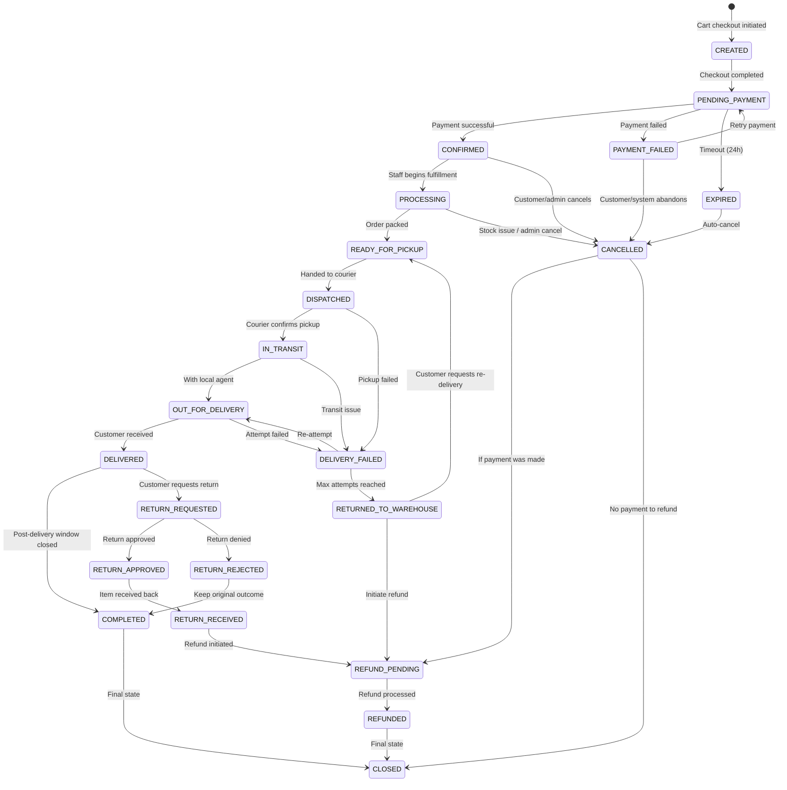
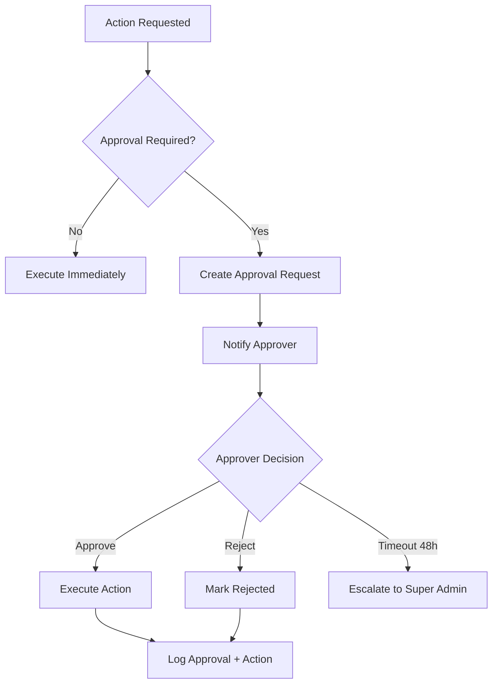
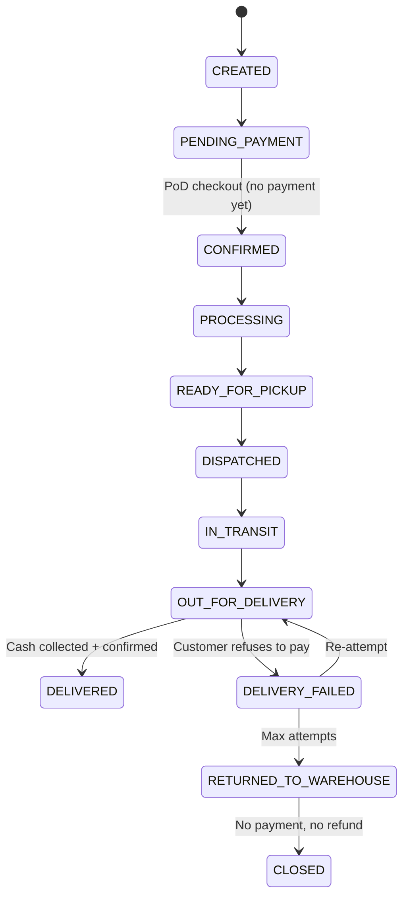

# Order Lifecycle & State Machine

**Document Status:** Draft — Pending Human Sign-off  
**Last Updated:** 2026-01-18  
**Version:** 1.0

---

## Overview

This document defines the complete order lifecycle for the TrustCart Kenya e-commerce platform. It establishes:

- All valid order states
- Allowed and forbidden state transitions
- Business rules and invariants
- Human approval gates
- Risk points and mitigations

This state machine governs all order processing across the platform.

---

## 1. Order States

### 1.1 Primary States

### 1.2 State Definitions

| State | Code | Description | Terminal? |
|-------|------|-------------|-----------|
| **CREATED** | `CRE` | Order record created, checkout in progress | No |
| **PENDING_PAYMENT** | `PND` | Awaiting payment confirmation | No |
| **PAYMENT_FAILED** | `PFL` | Payment attempt failed, retry allowed | No |
| **EXPIRED** | `EXP` | Payment timeout reached (24 hours) | No |
| **CONFIRMED** | `CNF` | Payment confirmed, ready for fulfillment | No |
| **PROCESSING** | `PRC` | Staff picking and packing order | No |
| **READY_FOR_PICKUP** | `RFP` | Packed and awaiting courier | No |
| **DISPATCHED** | `DSP` | Handed to delivery provider | No |
| **IN_TRANSIT** | `TRN` | En route to destination | No |
| **OUT_FOR_DELIVERY** | `OFD` | With local delivery agent | No |
| **DELIVERED** | `DLV` | Customer received goods | No |
| **DELIVERY_FAILED** | `DFL` | Delivery attempt unsuccessful | No |
| **RETURNED_TO_WAREHOUSE** | `RTW` | Returned after failed delivery | No |
| **RETURN_REQUESTED** | `RRQ` | Customer initiated return | No |
| **RETURN_APPROVED** | `RAP` | Return request approved | No |
| **RETURN_REJECTED** | `RRJ` | Return request denied | No |
| **RETURN_RECEIVED** | `RRC` | Returned item received at warehouse | No |
| **REFUND_PENDING** | `RFP` | Refund initiated, awaiting processing | No |
| **REFUNDED** | `RFD` | Refund completed | No |
| **CANCELLED** | `CAN` | Order cancelled | No |
| **COMPLETED** | `COM` | Order successfully fulfilled, no returns | Yes |
| **CLOSED** | `CLS` | Final terminal state | Yes |

### 1.3 State Categories

| Category | States |
|----------|--------|
| **Pre-Payment** | CREATED, PENDING_PAYMENT, PAYMENT_FAILED, EXPIRED |
| **Fulfillment** | CONFIRMED, PROCESSING, READY_FOR_PICKUP |
| **Delivery** | DISPATCHED, IN_TRANSIT, OUT_FOR_DELIVERY, DELIVERED, DELIVERY_FAILED, RETURNED_TO_WAREHOUSE |
| **Returns** | RETURN_REQUESTED, RETURN_APPROVED, RETURN_REJECTED, RETURN_RECEIVED |
| **Financial Resolution** | REFUND_PENDING, REFUNDED |
| **Closure** | CANCELLED, COMPLETED, CLOSED |

---

## 2. Valid State Transitions

### 2.1 Pre-Payment Phase

| From State | To State | Trigger | Actor | Conditions |
|------------|----------|---------|-------|------------|
| CREATED | PENDING_PAYMENT | Checkout form submitted | Customer | Address and contact info provided |
| PENDING_PAYMENT | CONFIRMED | Payment callback received (success) | Payment Service | Valid payment confirmation |
| PENDING_PAYMENT | PAYMENT_FAILED | Payment callback received (failure) | Payment Service | Payment declined or failed |
| PENDING_PAYMENT | EXPIRED | 24-hour timeout | System (Scheduler) | No payment received |
| PAYMENT_FAILED | PENDING_PAYMENT | Customer retries payment | Customer | Within retry window |
| PAYMENT_FAILED | CANCELLED | Customer abandons or timeout | Customer/System | — |
| EXPIRED | CANCELLED | Auto-transition | System | — |

### 2.2 Fulfillment Phase

| From State | To State | Trigger | Actor | Conditions |
|------------|----------|---------|-------|------------|
| CONFIRMED | PROCESSING | Staff starts picking | Admin (Warehouse) | — |
| CONFIRMED | CANCELLED | Cancellation request | Customer/Admin | Within cancellation window |
| PROCESSING | READY_FOR_PICKUP | Packing complete | Admin (Warehouse) | All items verified |
| PROCESSING | CANCELLED | Stock issue discovered | Admin (Manager) | Requires approval if partial |

### 2.3 Delivery Phase

| From State | To State | Trigger | Actor | Conditions |
|------------|----------|---------|-------|------------|
| READY_FOR_PICKUP | DISPATCHED | Courier handoff | Admin (Warehouse) | Courier assigned |
| DISPATCHED | IN_TRANSIT | Courier confirms pickup | Delivery Provider | Tracking initiated |
| DISPATCHED | DELIVERY_FAILED | Pickup failed | Delivery Provider | Courier no-show |
| IN_TRANSIT | OUT_FOR_DELIVERY | Reached local hub | Delivery Provider | — |
| IN_TRANSIT | DELIVERY_FAILED | Transit issue | Delivery Provider | Damage, loss, delay |
| OUT_FOR_DELIVERY | DELIVERED | Successful delivery | Delivery Provider | Proof of delivery captured |
| OUT_FOR_DELIVERY | DELIVERY_FAILED | Attempt failed | Delivery Provider | Customer unavailable, wrong address |
| DELIVERY_FAILED | OUT_FOR_DELIVERY | Re-attempt scheduled | Admin/Customer | Within max attempts |
| DELIVERY_FAILED | RETURNED_TO_WAREHOUSE | Max attempts reached | System | 3 failed attempts |
| RETURNED_TO_WAREHOUSE | READY_FOR_PICKUP | Customer requests re-send | Admin | New delivery arranged |
| RETURNED_TO_WAREHOUSE | REFUND_PENDING | Refund requested | Customer/Admin | — |

### 2.4 Post-Delivery Phase

| From State | To State | Trigger | Actor | Conditions |
|------------|----------|---------|-------|------------|
| DELIVERED | COMPLETED | Post-delivery window closes | System (Scheduler) | 14 days after delivery |
| DELIVERED | RETURN_REQUESTED | Customer requests return | Customer | Within 14 days |
| RETURN_REQUESTED | RETURN_APPROVED | Return approved | Admin (Manager) | Valid return reason |
| RETURN_REQUESTED | RETURN_REJECTED | Return denied | Admin (Manager) | Policy violation |
| RETURN_APPROVED | RETURN_RECEIVED | Item received at warehouse | Admin (Warehouse) | Item inspected |
| RETURN_REJECTED | COMPLETED | Keep original outcome | System | — |

### 2.5 Refund Phase

| From State | To State | Trigger | Actor | Conditions |
|------------|----------|---------|-------|------------|
| RETURN_RECEIVED | REFUND_PENDING | Refund initiated | Admin (Finance) | Item verified |
| CANCELLED | REFUND_PENDING | Payment was made | System | Payment exists for order |
| CANCELLED | CLOSED | No payment was made | System | No payment record |
| REFUND_PENDING | REFUNDED | Refund processed | Admin (Finance) / System | Funds transferred |

### 2.6 Terminal Transitions

| From State | To State | Trigger | Actor | Conditions |
|------------|----------|---------|-------|------------|
| REFUNDED | CLOSED | Auto-transition | System | — |
| COMPLETED | CLOSED | Auto-transition after 30 days | System | — |

---

## 3. Invalid Transitions (Forbidden)

The following transitions are **explicitly forbidden** and must be prevented by the system:

### 3.1 Backward Movement (Anti-Patterns)

| From State | To State | Reason |
|------------|----------|--------|
| CONFIRMED | PENDING_PAYMENT | Payment already confirmed |
| CONFIRMED | CREATED | Order past checkout |
| PROCESSING | CONFIRMED | Cannot unpick an order |
| DISPATCHED | READY_FOR_PICKUP | Already with courier |
| DELIVERED | OUT_FOR_DELIVERY | Already delivered |
| DELIVERED | IN_TRANSIT | Already delivered |
| DELIVERED | DISPATCHED | Already delivered |
| REFUNDED | REFUND_PENDING | Already refunded |
| CLOSED | Any state | Terminal state is immutable |
| COMPLETED | Any state (except CLOSED) | Terminal category |

### 3.2 Illegal Jumps (Skipping States)

| From State | To State | Reason |
|------------|----------|--------|
| PENDING_PAYMENT | PROCESSING | Must go through CONFIRMED |
| PENDING_PAYMENT | DELIVERED | Cannot skip fulfillment |
| CONFIRMED | DISPATCHED | Must go through PROCESSING + READY_FOR_PICKUP |
| CREATED | CONFIRMED | Must go through PENDING_PAYMENT |
| RETURN_REQUESTED | REFUNDED | Must go through RETURN_APPROVED + RETURN_RECEIVED |

### 3.3 Financial Safety Rules

| From State | To State | Reason |
|------------|----------|--------|
| CONFIRMED | CANCELLED (without refund) | Payment received, refund required |
| PROCESSING | CANCELLED (without refund) | Payment received, refund required |
| DISPATCHED | CANCELLED | Too late, must use DELIVERY_FAILED path |
| IN_TRANSIT | CANCELLED | Too late, must use DELIVERY_FAILED path |

---

## 4. Business Rules & Invariants

### 4.1 Payment Invariants

| ID | Rule | Enforcement |
|----|------|-------------|
| PAY-01 | Order cannot reach CONFIRMED without a successful payment record (except PoD) | Block transition |
| PAY-02 | Pay-on-Delivery orders skip to CONFIRMED on checkout but require payment before DELIVERED | Block DELIVERED without PoD confirmation |
| PAY-03 | Refund amount cannot exceed original payment amount | Validate at refund initiation |
| PAY-04 | Partial refunds allowed only for partial returns | Require matching return items |
| PAY-05 | Refund must target original payment method | System constraint |

### 4.2 Inventory Invariants

| ID | Rule | Enforcement |
|----|------|-------------|
| INV-01 | Stock is reserved when order reaches PENDING_PAYMENT | Atomic reservation |
| INV-02 | Reservation expires if payment not received within timeout | Background job release |
| INV-03 | Stock is decremented when order reaches DISPATCHED | Atomic decrement |
| INV-04 | Stock is restored when order reaches CANCELLED (if was reserved) | Atomic restore |
| INV-05 | Stock is restored when return is received (RETURN_RECEIVED) | Atomic restore |
| INV-06 | Inventory can never go negative | Block if decrement would cause negative |

### 4.3 Timing Invariants

| ID | Rule | Enforcement |
|----|------|-------------|
| TIME-01 | PENDING_PAYMENT expires after 24 hours | Scheduler job |
| TIME-02 | PAYMENT_FAILED allows retry for 1 hour | Block retry after window |
| TIME-03 | Customer cancellation allowed only before DISPATCHED | Block cancellation after |
| TIME-04 | Return window is 14 days from DELIVERED | Block RETURN_REQUESTED after |
| TIME-05 | DELIVERED auto-transitions to COMPLETED after 14 days | Scheduler job |
| TIME-06 | COMPLETED auto-transitions to CLOSED after 30 days | Scheduler job |

### 4.4 Delivery Invariants

| ID | Rule | Enforcement |
|----|------|-------------|
| DEL-01 | Maximum 3 delivery attempts before RETURNED_TO_WAREHOUSE | Counter check |
| DEL-02 | Proof of delivery required for DELIVERED status | Block without POD |
| DEL-03 | Re-delivery after RETURNED_TO_WAREHOUSE requires new delivery fee | Charge calculated |
| DEL-04 | PoD cash must be collected and confirmed before DELIVERED | Block without confirmation |

### 4.5 Return Invariants

| ID | Rule | Enforcement |
|----|------|-------------|
| RET-01 | Return only allowed after DELIVERED | Block from other states |
| RET-02 | Return only allowed within 14-day window | Block after window |
| RET-03 | Reason required for return request | Mandatory field |
| RET-04 | Manager approval required for returns > KES 50,000 | Approval gate |
| RET-05 | Item must be received and inspected before refund | Block REFUND_PENDING until RETURN_RECEIVED |

### 4.6 Order Integrity Invariants

| ID | Rule | Enforcement |
|----|------|-------------|
| ORD-01 | Order items are immutable after CREATED | Block modifications |
| ORD-02 | Order totals are immutable after PENDING_PAYMENT | Block modifications |
| ORD-03 | Delivery address is immutable after DISPATCHED | Block modifications |
| ORD-04 | Every state transition must be logged | Audit trail |
| ORD-05 | Only one active order per cart checkout | Block duplicate submission |

---

## 5. Human Approval Gates

### 5.1 Required Approvals

| Transition / Action | Required Approver | Conditions |
|---------------------|-------------------|------------|
| PROCESSING → CANCELLED | Manager | Stock issue discovered |
| RETURNED_TO_WAREHOUSE → REFUND_PENDING | Manager | If order > KES 20,000 |
| RETURN_REQUESTED → RETURN_APPROVED | Manager | If order > KES 50,000 |
| RETURN_REQUESTED → RETURN_APPROVED | Manager | If return reason is disputed |
| REFUND_PENDING → REFUNDED | Finance Admin | All refunds require approval |
| Manual price override on order | Super Admin | Emergency pricing correction |
| Delivery address change after CONFIRMED | Manager | Risk of fraud |
| Force transition bypassing rules | Super Admin | Emergency override (fully logged) |

### 5.2 Approval Workflow

### 5.3 Escalation Rules

| If Approver | Does Not Respond Within | Escalate To |
|-------------|-------------------------|-------------|
| Staff | 4 hours | Manager |
| Manager | 24 hours | Super Admin |
| Super Admin | 48 hours | CEO (external notification) |

---

## 6. Pay-on-Delivery Special Flow

Pay-on-Delivery (PoD) orders follow a modified flow:

### 6.1 PoD State Differences

| Standard Flow | PoD Flow |
|---------------|----------|
| PENDING_PAYMENT → CONFIRMED on payment callback | PENDING_PAYMENT → CONFIRMED on checkout (no payment yet) |
| N/A | OUT_FOR_DELIVERY → DELIVERED requires cash collection confirmation |
| Refund via original payment method | Refund via MPesa to customer phone |

### 6.2 PoD Invariants

| ID | Rule | Enforcement |
|----|------|-------------|
| POD-01 | PoD orders limited to KES 30,000 | Block checkout if exceeded |
| POD-02 | PoD not available for phones or high-value items | Product flag check |
| POD-03 | PoD only for Zone 1 and Zone 2 | Delivery zone check |
| POD-04 | Cash collected must equal order total | Validation at delivery |
| POD-05 | Delivery agent must confirm cash collection | Block DELIVERED without confirmation |

### 6.3 PoD Flow Diagram

---

## 7. Risk Points

### 7.1 Critical Risk Areas

| Risk Area | State(s) Affected | Risk Description | Mitigation |
|-----------|-------------------|------------------|------------|
| **Fake Payment** | PENDING_PAYMENT → CONFIRMED | Fraudster sends fake confirmation | Only trust payment provider callback |
| **Double Payment** | PENDING_PAYMENT | Customer pays twice | Lock order on first payment initiation |
| **Overselling** | CONFIRMED → PROCESSING | More orders than stock | Reserve stock at PENDING_PAYMENT |
| **Stuck Orders** | Any non-terminal state | Order never progresses | Daily monitoring dashboard + alerts |
| **PoD Non-Payment** | OUT_FOR_DELIVERY | Customer refuses to pay | Limit PoD value; blacklist repeat offenders |
| **Delivery Fraud** | OUT_FOR_DELIVERY | Agent marks delivered without POD | Require photo proof + signature |
| **Return Abuse** | RETURN_REQUESTED | Serial returners | Track return rate; flag at threshold |
| **Refund Fraud** | REFUND_PENDING | Refund issued without return | Require RETURN_RECEIVED before refund |
| **Inventory Drift** | Any | System stock ≠ physical stock | Daily reconciliation; adjustment logs |

### 7.2 State-Specific Risk Summary

| State | Risk Level | Key Risks |
|-------|------------|-----------|
| PENDING_PAYMENT | 🟡 Medium | Payment timeout, cart abandonment, stock reservation expiry |
| CONFIRMED | 🟢 Low | Customer cancellation |
| PROCESSING | 🟡 Medium | Stock discrepancy discovered |
| DISPATCHED | 🟠 High | Courier issues, package loss |
| OUT_FOR_DELIVERY | 🔴 Critical | Delivery failure, PoD non-payment, theft |
| DELIVERED | 🟡 Medium | Customer disputes, return abuse |
| REFUND_PENDING | 🔴 Critical | Incorrect refund amount, refund to wrong account |

### 7.3 Recovery Procedures

| Stuck State | Recovery Action | Actor |
|-------------|-----------------|-------|
| PENDING_PAYMENT > 24h | Auto-cancel and release reservation | System |
| CONFIRMED > 48h without PROCESSING | Alert warehouse team | System |
| READY_FOR_PICKUP > 24h | Alert logistics coordinator | System |
| DISPATCHED > 72h without IN_TRANSIT | Contact courier; escalate | Admin |
| DELIVERY_FAILED > 3 attempts | Auto-return to warehouse | System |
| REFUND_PENDING > 5 days | Escalate to Finance Manager | System |

---

## 8. Integration Points

### 8.1 External System Events

| External System | Events Sent | Affected States |
|-----------------|-------------|-----------------|
| **MPesa** | Payment confirmation, Payment failure | PENDING_PAYMENT → CONFIRMED/PAYMENT_FAILED |
| **Card Gateway** | Payment confirmation, Chargeback | PENDING_PAYMENT → CONFIRMED, DELIVERED → REFUND_PENDING |
| **Courier Provider** | Pickup confirmed, In transit, Delivered, Failed | All delivery states |
| **Email Service** | Confirmation sent, Notification delivered | N/A (informational) |
| **SMS Service** | OTP sent, Status update sent | N/A (informational) |

### 8.2 Internal System Events Emitted

| State Transition | Event Emitted | Subscribers |
|------------------|---------------|-------------|
| → CONFIRMED | `order.confirmed` | Inventory, Email, SMS |
| → PROCESSING | `order.processing` | Email |
| → DISPATCHED | `order.dispatched` | Email, SMS, Customer App |
| → DELIVERED | `order.delivered` | Email, Inventory, Analytics |
| → CANCELLED | `order.cancelled` | Inventory, Email, Refund |
| → REFUNDED | `order.refunded` | Email, Accounting |

---

## 9. Audit Trail Requirements

### 9.1 Logged Data Per Transition

Every state transition must log:

| Field | Description |
|-------|-------------|
| `orderId` | Order identifier |
| `fromState` | Previous state |
| `toState` | New state |
| `triggeredBy` | Actor (system, customer ID, admin ID, provider) |
| `trigger` | Event or action that caused transition |
| `timestamp` | Exact time of transition (UTC) |
| `metadata` | Additional context (payment ref, tracking number, etc.) |
| `ipAddress` | For customer/admin actions |

### 9.2 Immutability

- Audit logs are **append-only**
- No deletion or modification of historical logs
- Logs retained for **7 years** (regulatory compliance)

---

## Document Approval

| Role | Name | Status | Date |
|------|------|--------|------|
| Technical Architect | — | Pending | — |
| Operations Lead | — | Pending | — |
| Finance Lead | — | Pending | — |
| Product Owner | — | Pending | — |

---

*This document governs all order processing. Any deviation from defined transitions must be logged as an exception and reviewed. System implementations must enforce these rules without exception.*
