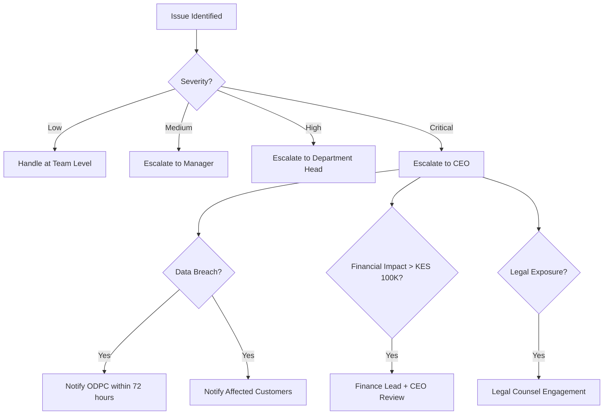

# Risk Register & Trust & Compliance

**Document Status:** Draft — Pending Human Sign-off  
**Last Updated:** 2026-01-18  
**Version:** 1.0

---

## Overview

This document establishes the risk management framework and trust/compliance requirements for the TrustCart Kenya e-commerce platform. It serves as:

- A centralized register of operational, financial, and compliance risks
- A framework for risk assessment, mitigation, and monitoring
- A guide for trust-building policies and regulatory compliance
- A reference for agent-guided operations and approval workflows

---

# Part 1: Risk Register

## 1.1 Risk Scoring Matrix

### Impact Levels

| Level | Score | Description | Examples |
|-------|-------|-------------|----------|
| **Low** | 1 | Minor inconvenience, easily corrected | Typo in product description, minor UI bug |
| **Medium** | 2 | Significant disruption, customer complaints | Delayed delivery, incorrect order item |
| **High** | 3 | Major financial loss, legal exposure, reputation damage | Payment fraud, data breach, failed refunds |
| **Critical** | 4 | Existential threat, regulatory action, mass customer loss | Major security breach, payment system failure |

### Likelihood Levels

| Level | Score | Description | Frequency |
|-------|-------|-------------|-----------|
| **Rare** | 1 | Unlikely to occur | Less than once per year |
| **Unlikely** | 2 | Could occur occasionally | Once per year |
| **Possible** | 3 | May occur regularly | Monthly |
| **Likely** | 4 | Expected to occur frequently | Weekly |
| **Almost Certain** | 5 | Will occur regularly | Daily |

### Risk Score Calculation

```
Risk Score = Impact × Likelihood
```

| Score Range | Risk Level | Action Required |
|-------------|------------|-----------------|
| 1-4 | 🟢 Low | Monitor; address in normal course |
| 5-8 | 🟡 Medium | Active mitigation required |
| 9-12 | 🟠 High | Priority mitigation; escalate to management |
| 13-20 | 🔴 Critical | Immediate action required; executive oversight |

---

## 1.2 Risk Register — Payment Domain

### RISK-PAY-001: Fake Payment Confirmation

| Attribute | Value |
|-----------|-------|
| **Domain** | Payment |
| **Description** | Fraudster sends fake MPesa confirmation screenshot to claim payment was made |
| **Impact** | High (3) — Financial loss, goods shipped without payment |
| **Likelihood** | Likely (4) — Common attack vector |
| **Risk Score** | 🔴 12 — Critical |
| **Owner** | Payment Service / Tech Lead |

**Mitigation Controls:**

| Type | Control |
|------|---------|
| **Preventive** | Only accept MPesa callback from verified Daraja API; never trust screenshots |
| **Detective** | Log all payment attempts; alert on mismatch between claimed and actual |
| **Corrective** | Halt order if callback not received; auto-cancel after timeout |

---

### RISK-PAY-002: Double Payment

| Attribute | Value |
|-----------|-------|
| **Domain** | Payment |
| **Description** | Customer is charged twice for the same order due to retry logic or timeout |
| **Impact** | High (3) — Customer disputes, refund costs, reputation damage |
| **Likelihood** | Possible (3) — Can occur with network issues |
| **Risk Score** | 🟠 9 — High |
| **Owner** | Payment Service / Tech Lead |

**Mitigation Controls:**

| Type | Control |
|------|---------|
| **Preventive** | Idempotency keys on payment initiation; lock order during payment |
| **Detective** | Monitor for duplicate MPesa receipts; reconciliation alerts |
| **Corrective** | Auto-refund duplicates; notify customer immediately |

---

### RISK-PAY-003: Payment Timeout Confusion

| Attribute | Value |
|-----------|-------|
| **Domain** | Payment |
| **Description** | Payment succeeds after order is auto-cancelled due to timeout |
| **Impact** | Medium (2) — Customer confusion, support burden, refund needed |
| **Likelihood** | Possible (3) — MPesa delays are common |
| **Risk Score** | 🟡 6 — Medium |
| **Owner** | Payment Service / Operations |

**Mitigation Controls:**

| Type | Control |
|------|---------|
| **Preventive** | Set appropriate timeout (24 hours); process late callbacks |
| **Detective** | Alert on payment received for cancelled order |
| **Corrective** | Auto-refund; notify customer with explanation |

---

### RISK-PAY-004: Pay-on-Delivery Non-Payment

| Attribute | Value |
|-----------|-------|
| **Domain** | Payment / Delivery |
| **Description** | Customer refuses to pay on delivery; goods returned |
| **Impact** | Medium (2) — Logistics cost, inventory handling, lost sale |
| **Likelihood** | Likely (4) — Common with PoD |
| **Risk Score** | 🟠 8 — High |
| **Owner** | Operations / Finance |

**Mitigation Controls:**

| Type | Control |
|------|---------|
| **Preventive** | Limit PoD to <KES 30,000; restrict for first-time customers; phone verification |
| **Detective** | Track refusal rate by customer; flag repeat offenders |
| **Corrective** | Blacklist repeat refusers; recover logistics cost where possible |

---

### RISK-PAY-005: Refund Fraud

| Attribute | Value |
|-----------|-------|
| **Domain** | Payment / Returns |
| **Description** | Customer claims defect falsely; receives refund while keeping product |
| **Impact** | High (3) — Direct financial loss |
| **Likelihood** | Possible (3) — Known abuse pattern |
| **Risk Score** | 🟠 9 — High |
| **Owner** | Operations / Finance |

**Mitigation Controls:**

| Type | Control |
|------|---------|
| **Preventive** | Require return of product before refund; verify serial numbers |
| **Detective** | Track refund rate by customer; flag anomalies |
| **Corrective** | Investigate high-refund customers; legal action for fraud |

---

## 1.3 Risk Register — Delivery Domain

### RISK-DEL-001: Lost Parcel

| Attribute | Value |
|-----------|-------|
| **Domain** | Delivery |
| **Description** | Package is lost in transit; never delivered to customer |
| **Impact** | High (3) — Product loss, customer compensation, reputation |
| **Likelihood** | Unlikely (2) — Rare but possible |
| **Risk Score** | 🟡 6 — Medium |
| **Owner** | Operations / Logistics |

**Mitigation Controls:**

| Type | Control |
|------|---------|
| **Preventive** | Use reputable couriers with insurance; require tracking |
| **Detective** | Daily tracking check; alert on stale shipments |
| **Corrective** | Claim from courier insurance; refund or reship to customer |

---

### RISK-DEL-002: Delivery to Wrong Person

| Attribute | Value |
|-----------|-------|
| **Domain** | Delivery |
| **Description** | Package delivered to someone other than the customer |
| **Impact** | High (3) — Product loss, customer dispute |
| **Likelihood** | Possible (3) — Especially in shared buildings |
| **Risk Score** | 🟠 9 — High |
| **Owner** | Operations / Logistics |

**Mitigation Controls:**

| Type | Control |
|------|---------|
| **Preventive** | Require ID verification for high-value orders; call before delivery |
| **Detective** | Photo proof of delivery with recipient |
| **Corrective** | Investigate with courier; compensate if at fault |

---

### RISK-DEL-003: Damaged in Transit

| Attribute | Value |
|-----------|-------|
| **Domain** | Delivery |
| **Description** | Product arrives damaged due to handling |
| **Impact** | Medium (2) — Replacement cost, customer frustration |
| **Likelihood** | Possible (3) — Electronics are fragile |
| **Risk Score** | 🟡 6 — Medium |
| **Owner** | Operations / Warehouse |

**Mitigation Controls:**

| Type | Control |
|------|---------|
| **Preventive** | Proper packaging; fragile labels; choose careful couriers |
| **Detective** | Photo documentation before dispatch |
| **Corrective** | Replace product; claim from courier |

---

### RISK-DEL-004: Failed Delivery Abuse

| Attribute | Value |
|-----------|-------|
| **Domain** | Delivery |
| **Description** | Customer claims "not received" despite delivery |
| **Impact** | High (3) — Direct product/financial loss |
| **Likelihood** | Possible (3) — Known abuse pattern |
| **Risk Score** | 🟠 9 — High |
| **Owner** | Operations |

**Mitigation Controls:**

| Type | Control |
|------|---------|
| **Preventive** | Require signature + photo proof of delivery |
| **Detective** | GPS confirmation of delivery location |
| **Corrective** | Deny false claims with POD evidence; blacklist abusers |

---

## 1.4 Risk Register — Inventory Domain

### RISK-INV-001: Overselling

| Attribute | Value |
|-----------|-------|
| **Domain** | Inventory |
| **Description** | More orders accepted than stock available |
| **Impact** | High (3) — Customer disappointment, refunds, reputation |
| **Likelihood** | Possible (3) — During high traffic or sync issues |
| **Risk Score** | 🟠 9 — High |
| **Owner** | Tech Lead / Operations |

**Mitigation Controls:**

| Type | Control |
|------|---------|
| **Preventive** | Reserve stock at checkout; decrement on dispatch only |
| **Detective** | Real-time stock alerts; block oversold orders |
| **Corrective** | Cancel oversold orders; offer alternative or refund |

---

### RISK-INV-002: Inventory Drift

| Attribute | Value |
|-----------|-------|
| **Domain** | Inventory |
| **Description** | System stock count doesn't match physical stock |
| **Impact** | Medium (2) — Incorrect availability, missed sales or overselling |
| **Likelihood** | Likely (4) — Common in manual operations |
| **Risk Score** | 🟠 8 — High |
| **Owner** | Warehouse / Operations |

**Mitigation Controls:**

| Type | Control |
|------|---------|
| **Preventive** | Regular stock audits; barcode scanning |
| **Detective** | Daily reconciliation report |
| **Corrective** | Stock adjustment with documented reason |

---

### RISK-INV-003: Ghost Stock

| Attribute | Value |
|-----------|-------|
| **Domain** | Inventory |
| **Description** | System shows stock available but item cannot be found physically |
| **Impact** | Medium (2) — Order cancellation, customer frustration |
| **Likelihood** | Possible (3) — Misplaced or miscounted items |
| **Risk Score** | 🟡 6 — Medium |
| **Owner** | Warehouse |

**Mitigation Controls:**

| Type | Control |
|------|---------|
| **Preventive** | Organized warehouse; location tracking |
| **Detective** | Alert when picking fails |
| **Corrective** | Update stock; notify customer; offer alternative |

---

## 1.5 Risk Register — Customer Data Domain

### RISK-DATA-001: PII Data Breach

| Attribute | Value |
|-----------|-------|
| **Domain** | Customer Data |
| **Description** | Customer personal data exposed through hack, leak, or misconfiguration |
| **Impact** | Critical (4) — Legal liability, regulatory fines, reputation destruction |
| **Likelihood** | Unlikely (2) — With proper controls |
| **Risk Score** | 🟠 8 — High |
| **Owner** | Tech Lead / Security |

**Mitigation Controls:**

| Type | Control |
|------|---------|
| **Preventive** | Encryption, access controls, security audits, staff training |
| **Detective** | Intrusion detection, access logging, anomaly alerts |
| **Corrective** | Incident response plan; ODPC notification within 72 hours; customer notification |

---

### RISK-DATA-002: Unauthorized Internal Access

| Attribute | Value |
|-----------|-------|
| **Domain** | Customer Data |
| **Description** | Staff member accesses customer data beyond their need |
| **Impact** | High (3) — Privacy violation, potential misuse |
| **Likelihood** | Possible (3) — Without proper controls |
| **Risk Score** | 🟠 9 — High |
| **Owner** | Tech Lead / HR |

**Mitigation Controls:**

| Type | Control |
|------|---------|
| **Preventive** | Role-based access; least privilege principle; need-to-know |
| **Detective** | Audit logs; access monitoring; regular reviews |
| **Corrective** | Revoke access; disciplinary action; report if required |

---

### RISK-DATA-003: PII in Logs

| Attribute | Value |
|-----------|-------|
| **Domain** | Customer Data / Technical |
| **Description** | Personal data accidentally logged in plain text |
| **Impact** | Medium (2) — Compliance violation, exposure risk |
| **Likelihood** | Possible (3) — Common developer error |
| **Risk Score** | 🟡 6 — Medium |
| **Owner** | Tech Lead |

**Mitigation Controls:**

| Type | Control |
|------|---------|
| **Preventive** | PII masking library; code review; developer training |
| **Detective** | Log scanning for PII patterns |
| **Corrective** | Purge logs; fix code; re-train developers |

---

## 1.6 Risk Register — Platform & Technical Domain

### RISK-TECH-001: Platform Downtime

| Attribute | Value |
|-----------|-------|
| **Domain** | Technical |
| **Description** | Website or API unavailable to customers |
| **Impact** | High (3) — Lost sales, customer frustration |
| **Likelihood** | Unlikely (2) — With proper infrastructure |
| **Risk Score** | 🟡 6 — Medium |
| **Owner** | Tech Lead / DevOps |

**Mitigation Controls:**

| Type | Control |
|------|---------|
| **Preventive** | Redundancy, load balancing, auto-scaling |
| **Detective** | Uptime monitoring, alerting |
| **Corrective** | Failover; incident response; update status page |

---

### RISK-TECH-002: MPesa API Outage

| Attribute | Value |
|-----------|-------|
| **Domain** | Payment / Technical |
| **Description** | MPesa Daraja API unavailable; customers cannot pay |
| **Impact** | High (3) — All MPesa payments blocked |
| **Likelihood** | Possible (3) — External dependency |
| **Risk Score** | 🟠 9 — High |
| **Owner** | Tech Lead / Operations |

**Mitigation Controls:**

| Type | Control |
|------|---------|
| **Preventive** | None (external) |
| **Detective** | Monitor MPesa status; health checks |
| **Corrective** | Display fallback Paybill option; notify customers; retry logic |

---

### RISK-TECH-003: Pricing Error

| Attribute | Value |
|-----------|-------|
| **Domain** | Product / Financial |
| **Description** | Product listed at incorrect price (too low or too high) |
| **Impact** | High (3) — Financial loss if too low; legal issues if too high |
| **Likelihood** | Possible (3) — Human data entry error |
| **Risk Score** | 🟠 9 — High |
| **Owner** | Operations / Tech Lead |

**Mitigation Controls:**

| Type | Control |
|------|---------|
| **Preventive** | Price change approval workflow; sanity check on price ranges |
| **Detective** | Alert on unusual price changes (>20%) |
| **Corrective** | Reserve right to cancel orders at erroneous price; notify customer |

---

## 1.7 Risk Summary Matrix

| Risk ID | Risk Name | Domain | Score | Level |
|---------|-----------|--------|-------|-------|
| RISK-PAY-001 | Fake Payment Confirmation | Payment | 12 | 🔴 Critical |
| RISK-PAY-002 | Double Payment | Payment | 9 | 🟠 High |
| RISK-PAY-003 | Payment Timeout Confusion | Payment | 6 | 🟡 Medium |
| RISK-PAY-004 | PoD Non-Payment | Payment | 8 | 🟠 High |
| RISK-PAY-005 | Refund Fraud | Payment | 9 | 🟠 High |
| RISK-DEL-001 | Lost Parcel | Delivery | 6 | 🟡 Medium |
| RISK-DEL-002 | Delivery to Wrong Person | Delivery | 9 | 🟠 High |
| RISK-DEL-003 | Damaged in Transit | Delivery | 6 | 🟡 Medium |
| RISK-DEL-004 | Failed Delivery Abuse | Delivery | 9 | 🟠 High |
| RISK-INV-001 | Overselling | Inventory | 9 | 🟠 High |
| RISK-INV-002 | Inventory Drift | Inventory | 8 | 🟠 High |
| RISK-INV-003 | Ghost Stock | Inventory | 6 | 🟡 Medium |
| RISK-DATA-001 | PII Data Breach | Data | 8 | 🟠 High |
| RISK-DATA-002 | Unauthorized Internal Access | Data | 9 | 🟠 High |
| RISK-DATA-003 | PII in Logs | Data | 6 | 🟡 Medium |
| RISK-TECH-001 | Platform Downtime | Technical | 6 | 🟡 Medium |
| RISK-TECH-002 | MPesa API Outage | Technical | 9 | 🟠 High |
| RISK-TECH-003 | Pricing Error | Technical | 9 | 🟠 High |

---

## 1.8 Risk Assumptions

| Assumption | Impact if False |
|------------|-----------------|
| MPesa Daraja API has 99.5%+ uptime | Higher payment failure rate |
| Courier partners provide accurate tracking | Delivery visibility compromised |
| Kenya DPA 2019 is the primary applicable regulation | Additional compliance required |
| Customers have access to smartphones and MPesa | Lower conversion rate |
| Staff are trustworthy with access controls | Higher insider threat |
| Cloud provider maintains security certifications | Additional risk exposure |

---

# Part 2: Trust & Compliance

## 2.1 Required Policy Documents

### Policy Document Inventory

| Policy | Purpose | Owner | Location |
|--------|---------|-------|----------|
| **Privacy Policy** | Explain data collection, use, and rights | Legal / DPO | Website footer, registration |
| **Terms & Conditions** | Legal agreement for platform use | Legal | Website footer, registration |
| **Return & Refund Policy** | Explain return process and eligibility | Operations | Website footer, checkout, order confirmation |
| **Warranty Policy** | Explain warranty coverage and claims | Operations | Product pages, order confirmation |
| **Shipping & Delivery Policy** | Explain delivery timelines and fees | Operations | Website footer, checkout |
| **Cookie Policy** | Explain cookie use and consent | Legal / Tech | Cookie banner, footer |

### Policy Content Requirements

#### Privacy Policy Must Include:

- Identity and contact details of data controller
- Types of personal data collected
- Purposes of data processing
- Legal basis for processing
- Data retention periods
- Data sharing with third parties
- Customer rights under DPA 2019
- How to make data subject requests
- Contact for data protection queries
- Complaint process (including ODPC)

#### Terms & Conditions Must Include:

- Business identity and registration
- Eligibility to use platform
- Account creation and responsibility
- Ordering process
- Pricing and payment terms
- Delivery terms and risk transfer
- Returns and refunds
- Warranties and disclaimers
- Limitation of liability
- Dispute resolution
- Governing law (Kenya)
- Modification rights

#### Return & Refund Policy Must Include:

- Return window (14 days)
- Eligible vs ineligible products
- Condition requirements for returns
- Return process steps
- Refund timelines
- Refund methods
- Who pays return shipping
- Exceptions and limitations

---

## 2.2 Policy Visibility & Access

### UI Placement

| Policy | Placement |
|--------|-----------|
| Privacy Policy | Footer link, registration form link, cookie banner link |
| Terms & Conditions | Footer link, registration (require checkbox), checkout (displayed) |
| Return Policy | Footer link, product pages (summary), checkout, order confirmation email |
| Warranty Policy | Footer link, product pages (specific terms), order confirmation |
| Shipping Policy | Footer link, cart (summary), checkout |
| Cookie Policy | Cookie consent banner, footer link |

### Customer Notification of Changes

| Change Type | Notification Method | Timing |
|-------------|---------------------|--------|
| Minor updates (typos, clarifications) | Update document; no notification | — |
| Significant changes | Email to registered customers; website banner | 30 days before effective |
| Changes to data processing | Email + consent renewal if required | 30 days before effective |
| Price or fee changes | Email to registered customers | 14 days before effective |

---

## 2.3 Compliance Requirements

### Kenya Data Protection Act 2019

| Requirement | Status | Action |
|-------------|--------|--------|
| Register with ODPC as data controller | Required | Before launch |
| Appoint Data Protection Officer (if applicable) | TBD | Assess threshold |
| Maintain processing activities register | Required | Document created |
| Obtain valid consent for processing | Required | Consent UI implemented |
| Enable data subject rights | Required | Account features for access, correction, deletion |
| Breach notification to ODPC (72 hours) | Required | Incident response plan |
| Data Protection Impact Assessment | As needed | For high-risk processing |

### Payment Compliance

| Requirement | Standard | Status |
|-------------|----------|--------|
| MPesa integration | Safaricom Daraja API guidelines | Follow API documentation |
| Card data (Phase 2) | PCI-DSS | Never store card numbers; use tokenized gateway |
| Transaction records | Kenya tax law | Retain for 7 years |
| Receipts and invoices | KRA requirements | Auto-generate for all transactions |

### Consumer Protection

| Requirement | Regulation | Implementation |
|-------------|------------|----------------|
| Accurate product descriptions | Consumer Protection Act | Review process for listings |
| Clear pricing (VAT inclusive) | Consumer Protection Act | All prices include VAT |
| Right to return | Consumer Protection Act | 14-day return window |
| Warranty honoring | Consumer Protection Act | Clear warranty terms |
| Complaint handling | Consumer Protection Act | Support contact visible |

### E-Commerce Regulations

| Requirement | Implementation |
|-------------|----------------|
| Business identity displayed | Company name, registration, contact on website |
| Physical address | Listed in Contact page and footer |
| Order confirmation | Email sent for every order |
| Delivery timelines | Clear estimates at checkout |
| Payment security | HTTPS, secure payment integration |

---

## 2.4 Compliance Checks & Audits

### Pre-Launch Compliance Checklist

| Category | Item | Status |
|----------|------|--------|
| **Legal** | Business registration verified | ☐ Pending |
| **Legal** | Terms & Conditions drafted and reviewed | ☐ Pending |
| **Legal** | Privacy Policy drafted and reviewed | ☐ Pending |
| **Data Protection** | ODPC registration submitted | ☐ Pending |
| **Data Protection** | Processing activities register complete | ☐ Pending |
| **Data Protection** | Data processing agreements with vendors | ☐ Pending |
| **Payment** | MPesa Daraja production credentials | ☐ Pending |
| **Payment** | Payment reconciliation process defined | ☐ Pending |
| **Tax** | KRA PIN registration | ☐ Pending |
| **Tax** | VAT registration (if required) | ☐ Pending |
| **Security** | SSL certificate installed | ☐ Pending |
| **Security** | Access controls implemented | ☐ Pending |

### Ongoing Compliance Activities

| Activity | Frequency | Owner |
|----------|-----------|-------|
| Access control review | Quarterly | Tech Lead |
| Policy document review | Annually | Legal |
| Data retention audit | Quarterly | DPO / Operations |
| Payment reconciliation | Daily | Finance |
| Security vulnerability scan | Monthly | Tech Lead |
| Staff data protection training | Annually | HR / DPO |
| Backup and recovery test | Quarterly | Tech Lead |

---

## 2.5 Approval & Escalation

### Document Approval Matrix

| Document | Drafting | Review | Approval |
|----------|----------|--------|----------|
| Privacy Policy | Legal / DPO | CEO, Tech Lead | CEO |
| Terms & Conditions | Legal | CEO, Operations | CEO |
| Return Policy | Operations | Legal, Finance | Operations Lead |
| Warranty Policy | Operations | Legal | Operations Lead |
| Risk Register | Tech Lead | Operations, Finance | CEO |
| Incident Response Plan | Tech Lead | Legal, Operations | CEO |

### Escalation Paths



### Incident Response Contacts

| Role | Responsibility | Escalation Time |
|------|----------------|-----------------|
| On-Call Engineer | First response; assessment | Immediate |
| Tech Lead | Technical resolution; containment | Within 1 hour |
| Operations Lead | Customer communication; business impact | Within 2 hours |
| CEO | Strategic decisions; external communication | Within 4 hours |
| Legal Counsel | Regulatory notification; legal exposure | Within 24 hours |

---

## 2.6 Risk-Linked Controls Matrix

| Risk ID | Risk Name | Compliance Control | Policy Reference |
|---------|-----------|-------------------|------------------|
| RISK-PAY-001 | Fake Payment | Payment verification via callback only | Payment flow documentation |
| RISK-PAY-005 | Refund Fraud | Return required before refund | Return Policy |
| RISK-DEL-002 | Wrong Delivery | ID verification for high-value | Shipping Policy |
| RISK-DATA-001 | Data Breach | Encryption, access controls, breach response | Privacy Policy, Incident Response |
| RISK-DATA-002 | Unauthorized Access | RBAC, audit logging | Data Access Policy |
| RISK-INV-001 | Overselling | Stock reservation at checkout | System invariant |
| RISK-TECH-003 | Pricing Error | Price change approval; cancellation right | Terms & Conditions |

---

## 2.7 Trust Signals for Customers

### Website Trust Elements

| Element | Location | Purpose |
|---------|----------|---------|
| SSL Badge | Footer, checkout | Security assurance |
| MPesa Logo | Footer, payment page | Payment method trust |
| Warranty Badge | Product pages | Quality assurance |
| Return Policy Summary | Product pages | Purchase confidence |
| Customer Reviews | Product pages | Social proof |
| Contact Info | Header, footer, contact page | Accessibility |
| Business Registration | Footer, about page | Legitimacy |
| Physical Address | Contact page, footer | Legitimacy |

### Communication Trust Elements

| Communication | Trust Element |
|---------------|---------------|
| Order Confirmation Email | Order details, tracking info, contact |
| Shipping Notification | Tracking link, expected delivery |
| Delivery Confirmation | Receipt, warranty info, return process |
| Support Responses | Fast, helpful, human |

---

## Document Approval

| Role | Name | Status | Date |
|------|------|--------|------|
| CEO | — | Pending | — |
| Legal Counsel | — | Pending | — |
| Operations Lead | — | Pending | — |
| Tech Lead | — | Pending | — |

---

*This document serves as the foundation for operational risk management and compliance. All mitigations must be implemented before launch. Updates require documented approval and version control.*
