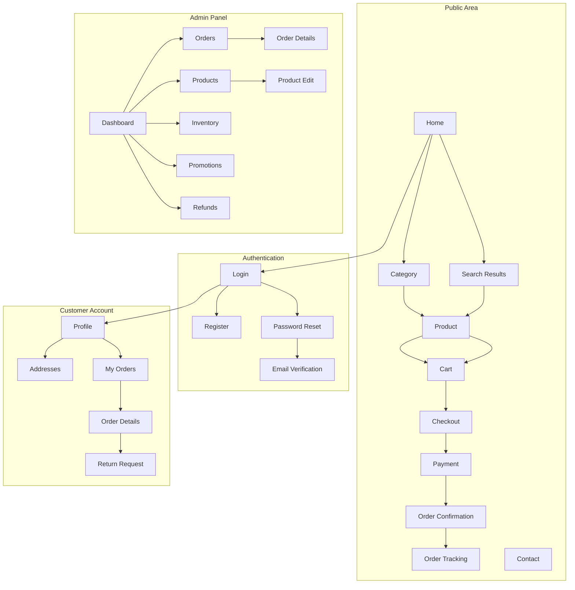

# Wireframes & Screen Inventory

**Document Status:** Draft — Pending Human Sign-off  
**Last Updated:** 2026-01-18  
**Version:** 1.0

---

## Overview

This document defines all screens required for the TrustCart Kenya e-commerce platform MVP. It establishes:

- Complete screen inventory by user type
- Purpose and key components for each screen
- Navigation flows and data requirements
- Critical UX considerations
- Screens with high operational/financial risk

---

## 1. Screen Inventory Summary

### 1.1 Screen Count by Category

| Category              | Screen Count | Screens                                                                                                       |
| --------------------- | ------------ | ------------------------------------------------------------------------------------------------------------- |
| **Public / Customer** | 10           | Home, Category, Product, Search Results, Cart, Checkout, Payment, Order Confirmation, Order Tracking, Contact |
| **Authentication**    | 4            | Login, Register, Password Reset, Email Verification                                                           |
| **Customer Account**  | 5            | Profile, Addresses, Orders, Order Details, Return Request                                                     |
| **Admin**             | 8            | Dashboard, Orders, Order Details, Products, Product Edit, Inventory, Promotions, Refunds                      |
| **Shared Components** | 4            | Header, Footer, Mobile Nav, Error Pages                                                                       |
| **Total**             | **31**       | —                                                                                                             |

### 1.2 Navigation Architecture



---

## 2. Shared Components

### 2.1 Header (Desktop)

| Component             | Description                                                     |
| --------------------- | --------------------------------------------------------------- |
| **Logo**              | TrustCart logo, links to Home                                   |
| **Search Bar**        | Keyword search with autocomplete                                |
| **Category Dropdown** | Mega menu with categories                                       |
| **Cart Icon**         | Shows item count, links to Cart                                 |
| **Account Menu**      | Login/Register for guests; Profile dropdown for logged-in users |
| **Phone Number**      | Support contact number displayed                                |

### 2.2 Header (Mobile)

| Component          | Description                    |
| ------------------ | ------------------------------ |
| **Hamburger Menu** | Opens mobile navigation drawer |
| **Logo**           | Centered, links to Home        |
| **Search Icon**    | Opens search overlay           |
| **Cart Icon**      | Shows item count               |

### 2.3 Footer

| Section              | Content                                           |
| -------------------- | ------------------------------------------------- |
| **About**            | Company info, mission statement                   |
| **Categories**       | Quick links to main categories                    |
| **Customer Service** | Contact, FAQs, Shipping Info, Returns             |
| **Legal**            | Terms & Conditions, Privacy Policy                |
| **Trust Badges**     | SSL secure, MPesa accepted, Business registration |
| **Social Links**     | Facebook, Instagram, Twitter, WhatsApp            |
| **Copyright**        | © 2026 TrustCart Kenya                            |

### 2.4 Mobile Navigation Drawer

| Component         | Description                             |
| ----------------- | --------------------------------------- |
| **User Section**  | Login/Register or user name with avatar |
| **Categories**    | Expandable category tree                |
| **Account Links** | My Orders, Profile, Addresses           |
| **Support**       | Contact, FAQs                           |
| **Logout**        | For logged-in users                     |

### 2.5 Error Pages

| Page                 | Purpose               |
| -------------------- | --------------------- |
| **404 Not Found**    | Page doesn't exist    |
| **500 Server Error** | System error occurred |
| **Maintenance**      | Scheduled downtime    |

---

## 3. Public / Customer Screens

### 3.1 Home Page

| Attribute        | Details                                                           |
| ---------------- | ----------------------------------------------------------------- |
| **Route**        | `/`                                                               |
| **Purpose**      | First impression; showcase products; build trust; drive discovery |
| **Target Users** | All visitors                                                      |

#### Layout

```
┌─────────────────────────────────────────────────────────┐
│                        HEADER                           │
├─────────────────────────────────────────────────────────┤
│                     HERO BANNER                         │
│          (Promotional carousel, 3-5 slides)             │
├─────────────────────────────────────────────────────────┤
│  🔥 FEATURED CATEGORIES (4-6 category cards with icons) │
├─────────────────────────────────────────────────────────┤
│  💻 NEW ARRIVALS (Product carousel, 8+ products)        │
├─────────────────────────────────────────────────────────┤
│  ⭐ BEST SELLERS (Product grid, 4-8 products)           │
├─────────────────────────────────────────────────────────┤
│  🎯 WHY TRUST US (Trust badges: Warranty, Delivery,     │
│      Secure Payment, Customer Service)                  │
├─────────────────────────────────────────────────────────┤
│  📦 BRANDS WE CARRY (Brand logo carousel)               │
├─────────────────────────────────────────────────────────┤
│                        FOOTER                           │
└─────────────────────────────────────────────────────────┘
```

#### Key Components

| Component      | Description                     | Data Required                       |
| -------------- | ------------------------------- | ----------------------------------- |
| Hero Banner    | Rotating promotional banners    | Banner images, links, text          |
| Category Cards | Visual navigation to categories | Category name, icon, image          |
| Product Cards  | Compact product display         | Image, name, price, condition badge |
| Trust Section  | Why choose us messaging         | Static content                      |
| Brand Logos    | Brands carried                  | Brand images                        |

#### Primary Actions

| Action         | Behavior                   |
| -------------- | -------------------------- |
| Click category | Navigate to Category page  |
| Click product  | Navigate to Product page   |
| Click hero CTA | Navigate to target URL     |
| Search         | Navigate to Search Results |

#### Critical UX Considerations

- ✅ Page load < 3 seconds on mobile
- ✅ Hero images optimized (WebP, lazy loading)
- ✅ Above-the-fold content prioritized
- ✅ Trust messaging visible without scrolling
- ✅ Mobile-first responsive design

---

### 3.2 Category / Product Listing Page

| Attribute        | Details                                            |
| ---------------- | -------------------------------------------------- |
| **Route**        | `/category/{slug}` or `/category/{parent}/{child}` |
| **Purpose**      | Browse and filter products within a category       |
| **Target Users** | Shoppers looking for specific product types        |

#### Layout

```
┌─────────────────────────────────────────────────────────┐
│                        HEADER                           │
├─────────────────────────────────────────────────────────┤
│  Breadcrumb: Home > Laptops > HP Laptops               │
├──────────────┬──────────────────────────────────────────┤
│   FILTERS    │  SORT BY: [Dropdown] | VIEW: Grid/List  │
│              ├──────────────────────────────────────────┤
│  □ Brand     │  ┌──────┐ ┌──────┐ ┌──────┐ ┌──────┐    │
│    ☑ HP      │  │ Prod │ │ Prod │ │ Prod │ │ Prod │    │
│    ☐ Dell    │  │  1   │ │  2   │ │  3   │ │  4   │    │
│    ☐ Lenovo  │  └──────┘ └──────┘ └──────┘ └──────┘    │
│              │  ┌──────┐ ┌──────┐ ┌──────┐ ┌──────┐    │
│  □ Condition │  │ Prod │ │ Prod │ │ Prod │ │ Prod │    │
│    ☑ New     │  │  5   │ │  6   │ │  7   │ │  8   │    │
│    ☐ Ex-UK   │  └──────┘ └──────┘ └──────┘ └──────┘    │
│              │                                          │
│  □ Price     │  [  1  ] [ 2 ] [ 3 ] ... [ Next → ]     │
│    Min [   ] │         PAGINATION                       │
│    Max [   ] │                                          │
│              │                                          │
│  [Apply]     │                                          │
├──────────────┴──────────────────────────────────────────┤
│                        FOOTER                           │
└─────────────────────────────────────────────────────────┘
```

#### Key Components

| Component     | Description     | Data Required                           |
| ------------- | --------------- | --------------------------------------- |
| Breadcrumb    | Navigation path | Category hierarchy                      |
| Filter Panel  | Faceted search  | Brands, conditions, price ranges, specs |
| Sort Dropdown | Order products  | Price (low/high), newest, popularity    |
| Product Grid  | Product cards   | Products with images, names, prices     |
| Pagination    | Navigate pages  | Total count, current page               |

#### Filter Options

| Filter            | Type            | Values                                          |
| ----------------- | --------------- | ----------------------------------------------- |
| Brand             | Multi-select    | HP, Dell, Lenovo, Apple, Samsung...             |
| Condition         | Multi-select    | Brand New, Open Box, Ex-UK, Ex-USA, Refurbished |
| Price Range       | Slider / inputs | Min KES, Max KES                                |
| RAM (laptops)     | Multi-select    | 4GB, 8GB, 16GB, 32GB                            |
| Storage (laptops) | Multi-select    | 128GB, 256GB, 512GB, 1TB                        |
| Screen Size       | Multi-select    | 13", 14", 15", 17"                              |

#### Primary Actions

| Action        | Behavior                      |
| ------------- | ----------------------------- |
| Apply filters | Reload with filtered products |
| Clear filters | Reset to unfiltered           |
| Click product | Navigate to Product page      |
| Change sort   | Reload with new sort          |
| Change page   | Load next page                |

#### Mobile Considerations

- Filters in slide-out drawer (not sidebar)
- Sticky filter/sort bar at top
- Infinite scroll option vs pagination

---

### 3.3 Product Details Page

| Attribute        | Details                                 |
| ---------------- | --------------------------------------- |
| **Route**        | `/product/{slug}`                       |
| **Purpose**      | View complete product info; add to cart |
| **Target Users** | Shoppers evaluating a specific product  |

> [!IMPORTANT]
> **High-Trust Screen:** This screen must convey trust through clear product information, visible warranty, and transparent pricing.

#### Layout

```
┌─────────────────────────────────────────────────────────┐
│                        HEADER                           │
├─────────────────────────────────────────────────────────┤
│  Breadcrumb: Home > Laptops > HP > HP EliteBook 840    │
├─────────────────────────────────────────────────────────┤
│  ┌─────────────────┐  PRODUCT NAME                      │
│  │                 │  ★★★★☆ (24 reviews)                │
│  │   MAIN IMAGE    │                                    │
│  │                 │  Condition: [Ex-UK Grade A] ⓘ      │
│  │                 │                                    │
│  └─────────────────┘  KES 45,990  (VAT inclusive)       │
│  ┌───┐┌───┐┌───┐┌───┐                                   │
│  │ 1 ││ 2 ││ 3 ││ 4 │  ✓ In Stock (3 available)         │
│  └───┘└───┘└───┘└───┘                                   │
│   (thumbnails)        Quantity: [ 1 ] [−] [+]           │
│                                                         │
│                       [ 🛒 ADD TO CART ]                │
│                       [ ❤️ Add to Wishlist ]            │
│                                                         │
│  ┌─────────────────────────────────────────────────────┐│
│  │ ✓ 6-Month Warranty  | ✓ Free Delivery >15K | 📞 24h ││
│  └─────────────────────────────────────────────────────┘│
├─────────────────────────────────────────────────────────┤
│  TABS: [ Description ] [ Specifications ] [ Reviews ]   │
├─────────────────────────────────────────────────────────┤
│  DESCRIPTION CONTENT                                    │
│  - Detailed product description                         │
│  - Key features and benefits                            │
├─────────────────────────────────────────────────────────┤
│  📦 RELATED PRODUCTS (carousel)                         │
├─────────────────────────────────────────────────────────┤
│                        FOOTER                           │
└─────────────────────────────────────────────────────────┘
```

#### Key Components

| Component         | Description                   | Data Required             |
| ----------------- | ----------------------------- | ------------------------- |
| Image Gallery     | Main image + thumbnails, zoom | Product images            |
| Product Title     | Name with category            | Product name              |
| Rating            | Stars + review count          | Average rating, count     |
| Condition Badge   | Visual indicator of condition | Condition enum            |
| Price             | Large, prominent              | Price, VAT status         |
| Stock Status      | Available quantity            | Stock count               |
| Quantity Selector | Choose quantity               | —                         |
| Add to Cart       | Primary CTA                   | —                         |
| Trust Bar         | Warranty, delivery, support   | Static + product-specific |
| Tabs              | Description, Specs, Reviews   | Product data              |
| Specifications    | Table of key specs            | ProductAttribute data     |
| Reviews           | Customer reviews              | Review data               |
| Related Products  | Recommended items             | Related products          |

#### Condition Explanations (Tooltip/Modal)

| Condition     | Explanation                                             |
| ------------- | ------------------------------------------------------- |
| Brand New     | Factory sealed, never used, full warranty               |
| Open Box      | Opened but unused, all accessories included             |
| Ex-UK Grade A | Imported from UK, minimal wear, fully tested            |
| Ex-USA        | Imported from USA, fully tested, cosmetic wear possible |
| Refurbished   | Professionally restored, new parts where needed         |

#### Primary Actions

| Action          | Behavior                                             |
| --------------- | ---------------------------------------------------- |
| Add to Cart     | Add product with quantity to cart; show confirmation |
| Change quantity | Update quantity (max = stock)                        |
| View image      | Open lightbox gallery                                |
| Switch tabs     | Load tab content                                     |
| Write review    | Navigate to review form (if eligible)                |

#### Critical UX Considerations

- ✅ High-quality images with zoom
- ✅ Clear condition explanation
- ✅ Stock visibility (builds urgency and trust)
- ✅ Warranty clearly stated
- ✅ Price includes VAT note

---

### 3.4 Search Results Page

| Attribute        | Details                             |
| ---------------- | ----------------------------------- |
| **Route**        | `/search?q={query}`                 |
| **Purpose**      | Show products matching search query |
| **Target Users** | Shoppers searching by keyword       |

#### Layout

Same as Category page with:

- Search query shown in header
- "Showing X results for '{query}'"
- "Did you mean?" suggestions for typos
- Empty state with suggestions if no results

---

### 3.5 Cart Page

| Attribute        | Details                      |
| ---------------- | ---------------------------- |
| **Route**        | `/cart`                      |
| **Purpose**      | Review items before checkout |
| **Target Users** | Shoppers ready to purchase   |

#### Layout

```
┌─────────────────────────────────────────────────────────┐
│                        HEADER                           │
├─────────────────────────────────────────────────────────┤
│  🛒 YOUR CART (3 items)                                 │
├─────────────────────────────────────────────────────────┤
│  ┌────────────────────────────────────────────────────┐ │
│  │ [IMG] HP EliteBook 840 G6        Qty: [1] [−][+]   │ │
│  │       Condition: Ex-UK                              │ │
│  │       KES 45,990              [Remove]  KES 45,990 │ │
│  └────────────────────────────────────────────────────┘ │
│  ┌────────────────────────────────────────────────────┐ │
│  │ [IMG] Logitech Mouse             Qty: [2] [−][+]   │ │
│  │       Condition: Brand New                          │ │
│  │       KES 1,500 × 2           [Remove]  KES 3,000  │ │
│  └────────────────────────────────────────────────────┘ │
├─────────────────────────────────────────────────────────┤
│  PROMO CODE: [____________] [Apply]                     │
│                                                         │
│                           Subtotal:     KES 48,990      │
│                           Delivery:     KES 300         │
│                           Discount:    -KES 0           │
│                           ─────────────────────         │
│                           TOTAL:        KES 49,290      │
│                                                         │
│                  [ 🔒 PROCEED TO CHECKOUT ]             │
│                                                         │
│            ← Continue Shopping                          │
├─────────────────────────────────────────────────────────┤
│                        FOOTER                           │
└─────────────────────────────────────────────────────────┘
```

#### Key Components

| Component        | Description                         | Data Required     |
| ---------------- | ----------------------------------- | ----------------- |
| Cart Items       | List of line items                  | CartItem data     |
| Quantity Editor  | Change quantity per item            | —                 |
| Remove Button    | Delete item from cart               | —                 |
| Promo Code Input | Apply discount code                 | —                 |
| Order Summary    | Subtotal, delivery, discount, total | Calculated values |
| Checkout Button  | Primary CTA                         | —                 |

#### Promo Code States

| State        | Display                         |
| ------------ | ------------------------------- |
| Valid        | Green checkmark, discount shown |
| Invalid      | Red error message               |
| Expired      | "This code has expired"         |
| Already used | "You've already used this code" |

#### Primary Actions

| Action              | Behavior                           |
| ------------------- | ---------------------------------- |
| Update quantity     | Recalculate totals; check stock    |
| Remove item         | Remove from cart with confirmation |
| Apply promo         | Validate and apply discount        |
| Proceed to checkout | Navigate to Checkout               |
| Continue shopping   | Navigate to Home or last category  |

#### Edge Cases

- Empty cart: Show empty state with "Start shopping" CTA
- Out of stock item: Mark item, disable checkout until resolved
- Price changed since add: Show notification

---

### 3.6 Checkout Page

| Attribute        | Details                                           |
| ---------------- | ------------------------------------------------- |
| **Route**        | `/checkout`                                       |
| **Purpose**      | Collect delivery and payment info; complete order |
| **Target Users** | Customers ready to pay                            |

> [!CAUTION]
> **High-Risk Screen:** Financial transaction. All inputs must be validated. Clear error messages required.

#### Layout

```
┌─────────────────────────────────────────────────────────┐
│                  HEADER (simplified)                    │
├─────────────────────────────────────────────────────────┤
│  🔒 SECURE CHECKOUT                                     │
│  Step: [1 Delivery] ─── [2 Payment] ─── [3 Confirm]    │
├───────────────────────────────────┬─────────────────────┤
│  DELIVERY INFORMATION             │  ORDER SUMMARY      │
│                                   │                     │
│  Contact Details                  │  HP EliteBook...    │
│  Full Name: [________________]    │  × 1    KES 45,990  │
│  Phone:     [________________]    │                     │
│  Email:     [________________]    │  Logitech Mouse     │
│                                   │  × 2    KES 3,000   │
│  Delivery Address                 │                     │
│  ☐ Use saved address              │  ─────────────────  │
│  County:    [Dropdown_______ ▼]   │  Subtotal: 48,990   │
│  City/Town: [________________]    │  Delivery:    300   │
│  Address:   [________________]    │  Discount:      0   │
│  Building:  [________________]    │  ─────────────────  │
│  Landmark:  [________________]    │  TOTAL: KES 49,290  │
│                                   │                     │
│  Delivery Notes (optional):       │  🔒 Secure checkout │
│  [________________________]       │  ✓ SSL encrypted    │
│                                   │                     │
│  ☐ Save address for future orders │                     │
│                                   │                     │
│  [ Continue to Payment → ]        │                     │
├───────────────────────────────────┴─────────────────────┤
│                        FOOTER                           │
└─────────────────────────────────────────────────────────┘
```

#### Step 2: Payment Method

```
┌─────────────────────────────────────────────────────────┐
│  PAYMENT METHOD                   │  ORDER SUMMARY      │
│                                   │  (same as above)    │
│  ○ MPesa (Recommended)            │                     │
│    Pay via M-Pesa on your phone   │                     │
│    Phone: [+254 _____________]    │                     │
│                                   │                     │
│  ○ Pay on Delivery (Cash)         │                     │
│    Pay when you receive           │                     │
│    [Available for orders <30K,    │                     │
│     Nairobi area only]            │                     │
│                                   │                     │
│  ○ Card Payment (Coming Soon)     │                     │
│    [Disabled]                     │                     │
│                                   │                     │
│  [ ← Back ]    [ Place Order ]    │                     │
└───────────────────────────────────┴─────────────────────┘
```

#### Key Components

| Component          | Description                    | Data Required      |
| ------------------ | ------------------------------ | ------------------ |
| Progress Indicator | Current step                   | Step number        |
| Contact Form       | Name, phone, email             | Customer data      |
| Address Form       | Full delivery address          | Address fields     |
| Saved Addresses    | Dropdown of previous addresses | Customer addresses |
| Order Summary      | Sticky on desktop              | Cart data          |
| Payment Options    | Radio selection                | Available methods  |
| Place Order        | Final CTA                      | —                  |

#### Validation Rules

| Field       | Validation                               |
| ----------- | ---------------------------------------- |
| Name        | Required, 2+ characters                  |
| Phone       | Required, valid Kenyan format (+254...)  |
| Email       | Required for guests, valid format        |
| County      | Required, from dropdown                  |
| City        | Required                                 |
| Address     | Required, 5+ characters                  |
| MPesa Phone | Required if MPesa selected, valid format |

#### Pay-on-Delivery Conditions Displayed

- "Available for orders under KES 30,000"
- "Nairobi and surrounding areas only"
- "Cash payment required at delivery"

#### Primary Actions

| Action              | Behavior                                      |
| ------------------- | --------------------------------------------- |
| Continue to Payment | Validate delivery, proceed                    |
| Back                | Go to previous step                           |
| Place Order (MPesa) | Initiate STK push, navigate to Payment screen |
| Place Order (PoD)   | Create order, navigate to Confirmation        |

---

### 3.7 Payment Processing Page

| Attribute        | Details                            |
| ---------------- | ---------------------------------- |
| **Route**        | `/checkout/payment/{orderId}`      |
| **Purpose**      | Process MPesa payment; show status |
| **Target Users** | Customers completing payment       |

> [!CAUTION]
> **High-Risk Screen:** Real money transaction. Must handle all edge cases.

#### Layout

```
┌─────────────────────────────────────────────────────────┐
│                  HEADER (simplified)                    │
├─────────────────────────────────────────────────────────┤
│                                                         │
│           📱 COMPLETE YOUR PAYMENT                      │
│                                                         │
│     ┌─────────────────────────────────────────────┐     │
│     │                                             │     │
│     │    An M-Pesa prompt has been sent to        │     │
│     │                                             │     │
│     │         +254 712 345 678                    │     │
│     │                                             │     │
│     │    Enter your M-Pesa PIN to complete        │     │
│     │    payment of KES 49,290                    │     │
│     │                                             │     │
│     │         ⏱ Waiting for confirmation...       │     │
│     │              [Spinner Animation]            │     │
│     │                                             │     │
│     └─────────────────────────────────────────────┘     │
│                                                         │
│     Didn't receive the prompt?                          │
│     [Resend] | [Use different number] | [Cancel]        │
│                                                         │
│     ─────────────────────────────────────────────       │
│     Having trouble? Call +254 xxx xxx xxx               │
│                                                         │
├─────────────────────────────────────────────────────────┤
│                        FOOTER                           │
└─────────────────────────────────────────────────────────┘
```

#### Payment States

| State         | Display                                   |
| ------------- | ----------------------------------------- |
| **Pending**   | Spinner, waiting message                  |
| **Success**   | Green checkmark, redirect to confirmation |
| **Failed**    | Red X, error message, retry option        |
| **Timeout**   | Warning, retry or cancel options          |
| **Cancelled** | User cancelled, return to checkout        |

#### Primary Actions

| Action               | Behavior                     |
| -------------------- | ---------------------------- |
| Resend               | Trigger new STK push         |
| Use different number | Return to payment step       |
| Cancel               | Cancel order, return to cart |

---

### 3.8 Order Confirmation Page

| Attribute        | Details                           |
| ---------------- | --------------------------------- |
| **Route**        | `/order/confirmation/{orderId}`   |
| **Purpose**      | Confirm order placed successfully |
| **Target Users** | Customers who completed checkout  |

#### Layout

```
┌─────────────────────────────────────────────────────────┐
│                        HEADER                           │
├─────────────────────────────────────────────────────────┤
│                                                         │
│              ✅ ORDER PLACED SUCCESSFULLY!              │
│                                                         │
│     Order Number: #TC-2026-001234                       │
│     A confirmation email has been sent to               │
│     john@example.com                                    │
│                                                         │
│     ─────────────────────────────────────────────       │
│                                                         │
│     ORDER SUMMARY                                       │
│     ┌─────────────────────────────────────────────┐     │
│     │ HP EliteBook 840 G6         × 1   KES 45,990│     │
│     │ Logitech Mouse              × 2   KES 3,000 │     │
│     ├─────────────────────────────────────────────┤     │
│     │ Subtotal                        KES 48,990  │     │
│     │ Delivery                        KES 300     │     │
│     │ TOTAL                           KES 49,290  │     │
│     └─────────────────────────────────────────────┘     │
│                                                         │
│     DELIVERY ADDRESS                                    │
│     John Doe                                            │
│     +254 712 345 678                                    │
│     123 Moi Avenue, Westlands, Nairobi                  │
│                                                         │
│     WHAT'S NEXT?                                        │
│     • We're preparing your order                        │
│     • You'll receive SMS updates                        │
│     • Expected delivery: 2-3 business days              │
│                                                         │
│     [ Track Your Order ] [ Continue Shopping ]          │
│                                                         │
├─────────────────────────────────────────────────────────┤
│                        FOOTER                           │
└─────────────────────────────────────────────────────────┘
```

#### Key Components

| Component        | Description            | Data Required  |
| ---------------- | ---------------------- | -------------- |
| Success Message  | Confirmation           | —              |
| Order Number     | Reference for tracking | Order ID       |
| Order Summary    | Items and totals       | Order data     |
| Delivery Address | Where order ships      | Address        |
| Next Steps       | Set expectations       | Static content |
| Track Order      | CTA to tracking        | —              |

---

### 3.9 Order Tracking Page

| Attribute        | Details                                 |
| ---------------- | --------------------------------------- |
| **Route**        | `/order/track/{orderId}`                |
| **Purpose**      | View order status and delivery progress |
| **Target Users** | Customers tracking their orders         |

#### Layout

```
┌─────────────────────────────────────────────────────────┐
│                        HEADER                           │
├─────────────────────────────────────────────────────────┤
│  ORDER #TC-2026-001234                                  │
│  Placed: Jan 18, 2026                                   │
├─────────────────────────────────────────────────────────┤
│                                                         │
│   STATUS: 🚚 OUT FOR DELIVERY                           │
│                                                         │
│   ────●────●────●────◐────○                            │
│   Confirmed  Packed  Shipped  Delivery  Delivered       │
│                                                         │
│   TRACKING UPDATES                                      │
│   ┌─────────────────────────────────────────────┐       │
│   │ Jan 18, 10:30 AM                            │       │
│   │ Out for delivery - Your package is on its   │       │
│   │ way with our delivery partner.              │       │
│   ├─────────────────────────────────────────────┤       │
│   │ Jan 18, 8:00 AM                             │       │
│   │ Package arrived at local hub - Westlands    │       │
│   ├─────────────────────────────────────────────┤       │
│   │ Jan 17, 4:30 PM                             │       │
│   │ Package shipped                             │       │
│   └─────────────────────────────────────────────┘       │
│                                                         │
│   DELIVERY DETAILS                                      │
│   John Doe | +254 712 345 678                           │
│   123 Moi Avenue, Westlands, Nairobi                    │
│                                                         │
│   [ Contact Support ] [ Request Return ]                │
│                                                         │
├─────────────────────────────────────────────────────────┤
│                        FOOTER                           │
└─────────────────────────────────────────────────────────┘
```

#### Status Timeline

| Status           | Icon | Description            |
| ---------------- | ---- | ---------------------- |
| Confirmed        | ✓    | Order confirmed        |
| Packed           | 📦   | Being prepared         |
| Shipped          | 🚛   | Handed to courier      |
| Out for Delivery | 🚚   | With local agent       |
| Delivered        | ✅   | Successfully delivered |

---

### 3.10 Contact / Support Page

| Attribute        | Details                           |
| ---------------- | --------------------------------- |
| **Route**        | `/contact`                        |
| **Purpose**      | Provide support channels and FAQs |
| **Target Users** | Customers needing help            |

#### Key Components

- Contact form (name, email, subject, message)
- Phone number (WhatsApp enabled)
- Email address
- Business hours
- FAQ accordion
- Physical location (if applicable)

---

## 4. Authentication Screens

### 4.1 Login Page

| Attribute   | Details                         |
| ----------- | ------------------------------- |
| **Route**   | `/login`                        |
| **Purpose** | Authenticate existing customers |

#### Layout

```
┌─────────────────────────────────────────────────────────┐
│                  HEADER (minimal)                       │
├─────────────────────────────────────────────────────────┤
│                                                         │
│              Welcome Back to TrustCart                  │
│                                                         │
│     ┌─────────────────────────────────────────────┐     │
│     │ Email                                       │     │
│     │ [____________________________________]      │     │
│     │                                             │     │
│     │ Password                                    │     │
│     │ [____________________________________] 👁   │     │
│     │                                             │     │
│     │ ☐ Remember me         Forgot password?     │     │
│     │                                             │     │
│     │ [ Login ]                                   │     │
│     │                                             │     │
│     │ ─────────── or ───────────                 │     │
│     │                                             │     │
│     │ Don't have an account? [Create one]         │     │
│     └─────────────────────────────────────────────┘     │
│                                                         │
├─────────────────────────────────────────────────────────┤
│                        FOOTER                           │
└─────────────────────────────────────────────────────────┘
```

#### Error States

| Error               | Message                                               |
| ------------------- | ----------------------------------------------------- |
| Invalid credentials | "Email or password is incorrect"                      |
| Account locked      | "Account temporarily locked. Try again in 15 minutes" |
| Email not verified  | "Please verify your email first. [Resend link]"       |

---

### 4.2 Register Page

| Attribute   | Details                     |
| ----------- | --------------------------- |
| **Route**   | `/register`                 |
| **Purpose** | Create new customer account |

#### Fields

| Field            | Required | Validation                         |
| ---------------- | -------- | ---------------------------------- |
| Full Name        | Yes      | 2+ characters                      |
| Email            | Yes      | Valid email format                 |
| Phone            | Yes      | Valid Kenyan format                |
| Password         | Yes      | Min 8 chars, 1 number, 1 uppercase |
| Confirm Password | Yes      | Must match                         |
| Terms Checkbox   | Yes      | Must accept                        |

---

### 4.3 Password Reset Page

| Attribute   | Details                     |
| ----------- | --------------------------- |
| **Route**   | `/forgot-password`          |
| **Purpose** | Request password reset link |

#### Flow

1. Enter email → 2. Receive email with link → 3. Set new password → 4. Login

---

### 4.4 Email Verification Page

| Attribute   | Details                 |
| ----------- | ----------------------- |
| **Route**   | `/verify-email/{token}` |
| **Purpose** | Confirm email ownership |

#### States

- Success: "Email verified! You can now login"
- Invalid/Expired: "This link is invalid or expired. [Request new link]"

---

## 5. Customer Account Screens

### 5.1 Profile / Account Settings

| Attribute   | Details                     |
| ----------- | --------------------------- |
| **Route**   | `/account/profile`          |
| **Purpose** | Manage personal information |

#### Sections

| Section        | Fields                          |
| -------------- | ------------------------------- |
| Personal Info  | Name, email (read-only), phone  |
| Password       | Change password form            |
| Preferences    | Email notifications, SMS alerts |
| Delete Account | Request account deletion        |

---

### 5.2 Address Book

| Attribute   | Details                         |
| ----------- | ------------------------------- |
| **Route**   | `/account/addresses`            |
| **Purpose** | Manage saved delivery addresses |

#### Key Components

- List of saved addresses
- Add new address button
- Edit/Delete per address
- Set default address

---

### 5.3 My Orders

| Attribute   | Details            |
| ----------- | ------------------ |
| **Route**   | `/account/orders`  |
| **Purpose** | View order history |

#### Layout

| Column  | Content                   |
| ------- | ------------------------- |
| Order # | Clickable link            |
| Date    | Order date                |
| Items   | Product names (truncated) |
| Total   | Order total               |
| Status  | Current status badge      |
| Action  | View, Track, Return       |

---

### 5.4 Order Details (Customer)

| Attribute   | Details                     |
| ----------- | --------------------------- |
| **Route**   | `/account/orders/{orderId}` |
| **Purpose** | View full order details     |

Similar to Order Tracking but with:

- Full order history
- Line item details
- Payment information
- Options: Track, Return, Contact Support

---

### 5.4a Orders Login Prompt (Amendment 2026-02-08)

| Attribute        | Details                                                  |
| ---------------- | -------------------------------------------------------- |
| **Route**        | `/orders` (unauthenticated), `/orders/{orderId}` (unauthenticated) |
| **Purpose**      | Prompt unauthenticated users to login to view orders     |
| **Target Users** | Guests or logged-out users attempting to access orders   |

> [!IMPORTANT]
> **Amendment:** Added in Phase 8.6 to handle auth-only order viewing. Session-based guest order access deferred to Phase 8.7.

#### Layout

```
┌─────────────────────────────────────────────────────────┐
│                        HEADER                           │
├─────────────────────────────────────────────────────────┤
│  YOUR ORDERS                                            │
│  Track and manage your orders                           │
├─────────────────────────────────────────────────────────┤
│                                                         │
│              ┌─────────────────────────┐                │
│              │         👤              │                │
│              │    (User icon)          │                │
│              └─────────────────────────┘                │
│                                                         │
│         Sign in to view your orders                     │
│                                                         │
│  Track your orders, view order history, and manage      │
│  deliveries by signing in to your account.              │
│                                                         │
│         [ Sign In ]  [ Create Account ]                 │
│                                                         │
│  ─────────────────────────────────────────────          │
│                                                         │
│  Checked out as a guest?                                │
│  Your order confirmation was sent to your email.        │
│                                                         │
├─────────────────────────────────────────────────────────┤
│                        FOOTER                           │
└─────────────────────────────────────────────────────────┘
```

#### Key Components

| Component         | Description                            | Data Required |
| ----------------- | -------------------------------------- | ------------- |
| User Icon         | Visual indicator for login state       | —             |
| Heading           | "Sign in to view your orders"          | Static        |
| Subtext           | Explanation of benefits                | Static        |
| Sign In Button    | Primary CTA, links to `/login`         | —             |
| Create Account    | Secondary CTA, links to `/register`    | —             |
| Guest Note        | "Order confirmation sent to email"     | Static        |

#### Primary Actions

| Action         | Behavior                                    |
| -------------- | ------------------------------------------- |
| Sign In        | Navigate to `/login?redirect=/orders`       |
| Create Account | Navigate to `/register?redirect=/orders`    |

#### UX Considerations

- ✅ Clear messaging explaining why login is required
- ✅ Preserve redirect URL so user returns to orders after login
- ✅ Guest checkout users reminded their confirmation was emailed
- ✅ No error styling - this is an expected state, not an error

---

### 5.5 Return Request Form

| Attribute   | Details                            |
| ----------- | ---------------------------------- |
| **Route**   | `/account/orders/{orderId}/return` |
| **Purpose** | Submit return request              |

#### Fields

| Field           | Required | Options                                             |
| --------------- | -------- | --------------------------------------------------- |
| Items to return | Yes      | Checkbox per item                                   |
| Return reason   | Yes      | Dropdown: Defective, Wrong item, Changed mind, etc. |
| Description     | Yes      | Text area                                           |
| Photos          | Optional | Upload up to 3 images                               |

---

## 6. Admin Screens

### 6.1 Admin Dashboard

| Attribute   | Details                                 |
| ----------- | --------------------------------------- |
| **Route**   | `/admin`                                |
| **Purpose** | Overview of business metrics and alerts |

> [!NOTE]
> Admin screens require authentication with appropriate role permissions.

#### Layout

```
┌─────────────────────────────────────────────────────────┐
│  ADMIN SIDEBAR          │  DASHBOARD                    │
│                         │                               │
│  📊 Dashboard           │  TODAY'S METRICS              │
│  📦 Orders              │  ┌────┐ ┌────┐ ┌────┐ ┌────┐  │
│  🛍️ Products            │  │ 24 │ │ 18 │ │85K │ │ 3  │  │
│  📦 Inventory           │  │Ordr│ │Ship│ │Rev │ │Pend│  │
│  🏷️ Promotions          │  └────┘ └────┘ └────┘ └────┘  │
│  💰 Refunds             │                               │
│  👥 Customers           │  ORDERS NEEDING ATTENTION     │
│  ⚙️ Settings            │  • 3 pending payment >2hrs    │
│                         │  • 2 ready for pickup         │
│                         │  • 1 delivery failed          │
│                         │                               │
│                         │  RECENT ORDERS                │
│                         │  [Order table with 10 rows]   │
│                         │                               │
│                         │  LOW STOCK ALERTS            │
│                         │  • HP EliteBook 840: 2 left   │
│                         │  • MacBook Air M2: 1 left     │
└─────────────────────────┴───────────────────────────────┘
```

#### Key Metrics

| Metric          | Description                        |
| --------------- | ---------------------------------- |
| Orders Today    | Count of orders placed today       |
| Shipped Today   | Count of orders dispatched         |
| Revenue Today   | Total revenue (confirmed payments) |
| Pending Actions | Orders needing attention           |

---

### 6.2 Order Management (Admin)

| Attribute   | Details                    |
| ----------- | -------------------------- |
| **Route**   | `/admin/orders`            |
| **Purpose** | View and manage all orders |

#### Features

- Filterable order list (status, date range, customer)
- Quick status update
- Bulk actions (export, update status)
- Search by order number, customer name, phone

---

### 6.3 Order Details (Admin)

| Attribute   | Details                   |
| ----------- | ------------------------- |
| **Route**   | `/admin/orders/{orderId}` |
| **Purpose** | Full order management     |

> [!CAUTION]
> **Contains Approval Gates:** Status changes and refunds require appropriate permissions.

#### Actions Available

| Action                    | Permission Required            |
| ------------------------- | ------------------------------ |
| Update status             | Staff                          |
| Add order note            | Staff                          |
| Cancel order              | Manager (if post-confirmation) |
| Process refund            | Manager + Finance              |
| Override delivery address | Manager                        |

---

### 6.4 Product Management

| Attribute   | Details                         |
| ----------- | ------------------------------- |
| **Route**   | `/admin/products`               |
| **Purpose** | View and manage product catalog |

#### Features

- Product list with filters (category, status, stock)
- Add new product
- Edit product
- Deactivate product
- Bulk import/export

---

### 6.5 Product Edit Form

| Attribute   | Details                                                     |
| ----------- | ----------------------------------------------------------- |
| **Route**   | `/admin/products/{productId}/edit` or `/admin/products/new` |
| **Purpose** | Create or edit product                                      |

#### Form Sections

| Section        | Fields                                  |
| -------------- | --------------------------------------- |
| Basic Info     | Name, SKU, description, category, brand |
| Pricing        | Price (KES), VAT included checkbox      |
| Condition      | Condition dropdown, condition notes     |
| Images         | Upload multiple, set primary, reorder   |
| Specifications | Key-value pairs                         |
| Inventory      | Initial stock (on create)               |
| Status         | Active/Inactive                         |

---

### 6.6 Inventory Management

| Attribute   | Details                       |
| ----------- | ----------------------------- |
| **Route**   | `/admin/inventory`            |
| **Purpose** | Track and adjust stock levels |

#### Features

- Stock levels per product
- Low stock alerts (highlight <5 units)
- Stock adjustment form (add/remove with reason)
- Adjustment history log

---

### 6.7 Promotions Management

| Attribute   | Details                          |
| ----------- | -------------------------------- |
| **Route**   | `/admin/promotions`              |
| **Purpose** | Create and manage discount codes |

#### Promo Code Form

| Field       | Description                        |
| ----------- | ---------------------------------- |
| Code        | Unique code (auto-generate option) |
| Type        | Percentage / Fixed / Free Delivery |
| Value       | Discount amount or percentage      |
| Min Order   | Minimum order value                |
| Usage Limit | Total uses / Per customer          |
| Date Range  | Start and end dates                |
| Status      | Active / Inactive                  |

---

### 6.8 Refund Approvals

| Attribute   | Details                            |
| ----------- | ---------------------------------- |
| **Route**   | `/admin/refunds`                   |
| **Purpose** | Review and process refund requests |

> [!WARNING]
> **Human Approval Gate:** All refunds require manager approval.

#### Workflow

1. View pending refund requests
2. Review order details and return reason
3. Approve or reject with notes
4. If approved, process refund (Finance triggers actual money movement)

---

## 7. Screen Risk Assessment

| Screen                    | Risk Level  | Key Risks                                   | Mitigations                                 |
| ------------------------- | ----------- | ------------------------------------------- | ------------------------------------------- |
| **Checkout**              | 🔴 Critical | Invalid data, stock issues, session timeout | Validation, stock reserve, session handling |
| **Payment Processing**    | 🔴 Critical | Payment failure, double charge, fraud       | Idempotency, timeouts, callbacks only       |
| **Order Details (Admin)** | 🔴 Critical | Unauthorized status changes, refund fraud   | Permission checks, audit logs               |
| **Refund Approvals**      | 🔴 Critical | Incorrect refunds, fraud                    | Manager approval, amount validation         |
| **Product Edit**          | 🟠 High     | Pricing errors, incorrect info              | Required fields, price change alerts        |
| **Inventory**             | 🟠 High     | Stock discrepancies                         | Adjustment reasons, audit trail             |
| **Cart**                  | 🟡 Medium   | Expired items, price changes                | Stock re-validation, price notifications    |

---

## Document Approval

| Role           | Name | Status  | Date |
| -------------- | ---- | ------- | ---- |
| Product Owner  | —    | Pending | —    |
| UX Designer    | —    | Pending | —    |
| Technical Lead | —    | Pending | —    |

---

_This document defines the screen inventory and serves as the foundation for UI/UX design and frontend development. All screens must implement the components and behaviors specified here._
